<div align="center">
  
  


Universidad Peruana de Ciencias Aplicadas

Carrera de Ingeniería de Software

**1ASI0732**

**Diseño de Experimentos de Ingeniería de Software**

NRC

**9112**

**Informe del Trabajo Final**

Docente

**Lennin Percy Cenas Vasquez**

Equipo

**HuariApp**

Proyecto

**PuntoSabor**

**Integrantes**

| Código | Apellidos y Nombres |
| --- | --- |
| u20241d995 | Cesar Jair Contreras Rojas |
| u202321843 | Delgado Carrasco, Schneider |
| u202312700 | Lopez Goitia, Carlos Alberto |
| u202411282 | Montalván Palomino, Bruno Rodolfo |
| u202410772 | Razuri Alvarez, Matias Francesco |

**Período 202602**

**Setiembre 2026**

</div>

---

# Registro de versiones del informe

| Versión | Fecha | Autor | Descripción de modificación |
| --- | --- | --- | --- |
| 0.1.0 | 09/09/206 | @CesarJrCR | docs: Agregar todos los puntos del informe |
| 0.1.1 | 13/09/206 | @CesarJrCR | docs: Agregar contenido para todos los capitulos |
| 0.1.2 | 13/09/206 | @CarlosAlb101 | docs: Agregar diagramas de clase de base de datos |
| 0.1.3 | 13/09/206 | @u202410772 | docs: Agregar userflows |
| 0.1.4 | 15/09/206 | @br1rodolfo| docs: Agragar style guidelines |

# Project Report Collaboration Insights

**Repositorio de la documentación del proyecto:** https://github.com/HuariApp/puntosabor-report.git

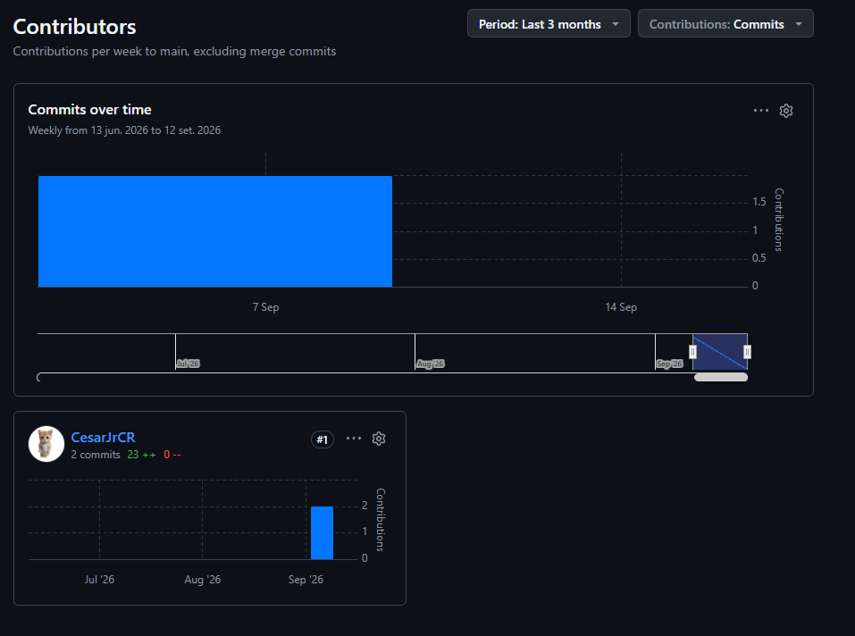

# Contenido

- [Capítulo I: Introducción](#capítulo-i-introducción)
    - [1.1. Startup Profile](#11-startup-profile)
        - [1.1.1. Descripción de la Startup](#111-descripción-de-la-startup)
        - [1.1.2. Perfiles de integrantes del equipo](#112-perfiles-de-integrantes-del-equipo)
    - [1.2. Solution Profile](#12-solution-profile)
        - [1.2.1. Antecedentes y problemática](#121-antecedentes-y-problemática)
        - [1.2.2. Lean UX Process](#122-lean-ux-process)
            - [1.2.2.1. Lean UX Problem Statements](#1221-lean-ux-problem-statements)
            - [1.2.2.2. Lean UX Assumptions](#1222-lean-ux-assumptions)
            - [1.2.2.3. Lean UX Hypothesis Statements](#1223-lean-ux-hypothesis-statements)
            - [1.2.2.4. Lean UX Canvas](#1224-lean-ux-canvas)
    - [1.3. Segmentos objetivo](#13-segmentos-objetivo)
- [Capítulo II: Requirements Elicitation & Analysis](#capítulo-ii-requirements-elicitation--analysis)
    - [2.1. Competidores](#21-competidores)
        - [2.1.1. Análisis competitivo](#211-análisis-competitivo)
        - [2.1.2. Estrategias y tácticas frente a competidores](#212-estrategias-y-tácticas-frente-a-competidores)
    - [2.2. Entrevistas](#22-entrevistas)
        - [2.2.1. Diseño de entrevistas](#221-diseño-de-entrevistas)
        - [2.2.2. Registro de entrevistas](#222-registro-de-entrevistas)
        - [2.2.3. Análisis de entrevistas](#223-análisis-de-entrevistas)
    - [2.3. Needfinding](#23-needfinding)
        - [2.3.1. User Personas](#231-user-personas)
        - [2.3.2. User Task Matrix](#232-user-task-matrix)
        - [2.3.3. User Journey Mapping](#233-user-journey-mapping)
        - [2.3.4. Empathy Mapping](#234-empathy-mapping)
        - [2.3.5. As-is Scenario Mapping](#235-as-is-scenario-mapping)
    - [2.4. Ubiquitous Language](#24-ubiquitous-language)
- [Capítulo III: Requirements Specification](#capítulo-iii-requirements-specification)
    - [3.1. To-Be Scenario Mapping](#31-to-be-scenario-mapping)
    - [3.2. User Stories](#32-user-stories)
    - [3.3. Product Backlog](#33-product-backlog)
    - [3.4. Impact Mapping](#34-impact-mapping)
- [Capítulo IV: Product Design](#capítulo-iv-product-design)
    - [4.1. Style Guidelines](#41-style-guidelines)
        - [4.1.1. General Style Guidelines](#411-general-style-guidelines)
        - [4.1.2. Web Style Guidelines](#412-web-style-guidelines)
        - [4.1.3. Mobile Style Guidelines](#413-mobile-style-guidelines)
            - [4.1.3.1. iOS Mobile Style Guidelines](#4131-ios-mobile-style-guidelines)
            - [4.1.3.2. Android Mobile Style Guidelines](#4132-android-mobile-style-guidelines)
    - [4.2. Information Architecture](#42-information-architecture)
        - [4.2.1. Organization Systems](#421-organization-systems)
        - [4.2.2. Labeling Systems](#422-labeling-systems)
        - [4.2.3. SEO Tags and Meta Tags](#423-seo-tags-and-meta-tags)
        - [4.2.4. Searching Systems](#424-searching-systems)
        - [4.2.5. Navigation Systems](#425-navigation-systems)
    - [4.3. Landing Page UI Design](#43-landing-page-ui-design)
        - [4.3.1. Landing Page Wireframe](#431-landing-page-wireframe)
        - [4.3.2. Landing Page Mock-up](#432-landing-page-mock-up)
    - [4.4. Mobile Applications UX/UI Design](#44-mobile-applications-uxui-design)
        - [4.4.1. Mobile Applications Wireframes](#441-mobile-applications-wireframes)
        - [4.4.2. Mobile Applications Wireflow Diagrams](#442-mobile-applications-wireflow-diagrams)
        - [4.4.3. Mobile Applications Mock-ups](#443-mobile-applications-mock-ups)
        - [4.4.4. Mobile Applications User Flow Diagrams](#444-mobile-applications-user-flow-diagrams)
    - [4.5. Mobile Applications Prototyping](#45-mobile-applications-prototyping)
        - [4.5.1. Android Mobile Applications Prototyping](#451-android-mobile-applications-prototyping)
        - [4.5.2. iOS Mobile Applications Prototyping](#452-ios-mobile-applications-prototyping)
    - [4.6. Web Applications UX/UI Design](#46-web-applications-uxui-design)
        - [4.6.1. Web Applications Wireframes](#461-web-applications-wireframes)
        - [4.6.2. Web Applications Wireflow Diagrams](#462-web-applications-wireflow-diagrams)
        - [4.6.3. Web Applications Mock-ups](#463-web-applications-mock-ups)
        - [4.6.4. Web Applications User Flow Diagrams](#464-web-applications-user-flow-diagrams)
    - [4.7. Web Applications Prototyping](#47-web-applications-prototyping)
    - [4.8. Domain-Driven Software Architecture](#48-domain-driven-software-architecture)
        - [4.8.1. Software Architecture Context Diagram](#481-software-architecture-context-diagram)
        - [4.8.2. Software Architecture Container Diagrams](#482-software-architecture-container-diagrams)
        - [4.8.3. Software Architecture Components Diagrams](#483-software-architecture-components-diagrams)
    - [4.9. Software Object-Oriented Design](#49-software-object-oriented-design)
        - [4.9.1. Class Diagrams](#491-class-diagrams)
        - [4.9.2. Class Dictionary](#492-class-dictionary)
    - [4.10. Database Design](#410-database-design)
        - [4.10.1. Relational/Non-Relational Database Diagram](#4101-relationalnon-relational-database-diagram)
- [Capítulo V: Product Implementation](#capítulo-v-product-implementation)
    - [5.1. Software Configuration Management](#51-software-configuration-management)
        - [5.1.1. Software Development Environment Configuration](#511-software-development-environment-configuration)
        - [5.1.2. Source Code Management](#512-source-code-management)
        - [5.1.3. Source Code Style Guide & Conventions](#513-source-code-style-guide--conventions)
        - [5.1.4. Software Deployment Configuration](#514-software-deployment-configuration)
    - [5.2. Product Implementation & Deployment](#52-product-implementation--deployment)
        - [5.2.1. Sprint Backlogs](#521-sprint-backlogs)
        - [5.2.2. Implemented Landing Page Evidence](#522-implemented-landing-page-evidence)
        - [5.2.3. Implemented Frontend-Web Application Evidence](#523-implemented-frontend-web-application-evidence)
        - [5.2.4. Acuerdo de Servicio - SaaS](#524-acuerdo-de-servicio---saas)
        - [5.2.5. Implemented Native-Mobile Application Evidence](#525-implemented-native-mobile-application-evidence)
        - [5.2.6. Implemented RESTful API and/or Serverless Backend Evidence](#526-implemented-restful-api-andor-serverless-backend-evidence)
        - [5.2.7. RESTful API documentation](#527-restful-api-documentation)
        - [5.2.8. Team Collaboration Insights](#528-team-collaboration-insights)
    - [5.3. Video About-the-Product](#53-video-about-the-product)
- [Capítulo VI: Product Verification & Validation](#capítulo-vi-product-verification--validation)
    - [6.1. Testing Suites & Validation](#61-testing-suites--validation)
        - [6.1.1. Core Entities Unit Tests](#611-core-entities-unit-tests)
        - [6.1.2. Core Integration Tests](#612-core-integration-tests)
        - [6.1.3. Core Behavior-Driven Development](#613-core-behavior-driven-development)
        - [6.1.4. Core System Tests](#614-core-system-tests)
    - [6.2. Static testing & Verification](#62-static-testing--verification)
        - [6.2.1. Static Code Analysis](#621-static-code-analysis)
            - [6.2.1.1. Coding standard & Code conventions](#6211-coding-standard--code-conventions)
            - [6.2.1.2. Code Quality & Code Security](#6212-code-quality--code-security)
        - [6.2.2. Reviews](#622-reviews)
    - [6.3. Validation Interviews](#63-validation-interviews)
        - [6.3.1. Diseño de Entrevistas](#631-diseño-de-entrevistas)
        - [6.3.2. Registro de Entrevistas](#632-registro-de-entrevistas)
        - [6.3.3. Evaluaciones según heurísticas](#633-evaluaciones-según-heurísticas)
    - [6.4. Auditoría de Experiencias de Usuario](#64-auditoría-de-experiencias-de-usuario)
        - [6.4.1. Auditoría realizada](#641-auditoría-realizada)
            - [6.4.1.1. Información del grupo auditado](#6411-información-del-grupo-auditado)
            - [6.4.1.2. Cronograma de auditoría realizada](#6412-cronograma-de-auditoría-realizada)
            - [6.4.1.3. Contenido de auditoría realizada](#6413-contenido-de-auditoría-realizada)
        - [6.4.2. Auditoría recibida](#642-auditoría-recibida)
            - [6.4.2.1. Información del grupo auditor](#6421-información-del-grupo-auditor)
            - [6.4.2.2. Cronograma de auditoría recibida](#6422-cronograma-de-auditoría-recibida)
            - [6.4.2.3. Contenido de auditoría recibida](#6423-contenido-de-auditoría-recibida)
            - [6.4.2.4. Resumen de modificaciones para subsanar hallazgos](#6424-resumen-de-modificaciones-para-subsanar-hallazgos)
- [Capítulo VII: DevOps Practices](#capítulo-vii-devops-practices)
    - [7.1. Continuous Integration](#71-continuous-integration)
        - [7.1.1. Tools and Practices](#711-tools-and-practices)
        - [7.1.2. Build & Test Suite Pipeline Components](#712-build--test-suite-pipeline-components)
    - [7.2. Continuous Delivery](#72-continuous-delivery)
        - [7.2.1. Tools and Practices](#721-tools-and-practices)
        - [7.2.2. Stages Deployment Pipeline Components](#722-stages-deployment-pipeline-components)
    - [7.3. Continuous deployment](#73-continuous-deployment)
        - [7.3.1. Tools and Practices](#731-tools-and-practices)
        - [7.3.2. Production Deployment Pipeline Components](#732-production-deployment-pipeline-components)
    - [7.4. Continuous Monitoring](#74-continuous-monitoring)
        - [7.4.1. Tools and Practices](#741-tools-and-practices)
        - [7.4.2. Monitoring Pipeline Components](#742-monitoring-pipeline-components)
        - [7.4.3. Alerting Pipeline Components](#743-alerting-pipeline-components)
        - [7.4.4. Notification Pipeline Components](#744-notification-pipeline-components)
- [Capítulo VIII: Experiment-Driven Development](#capítulo-viii-experiment-driven-development)
    - [8.1. Experiment Planning](#81-experiment-planning)
        - [8.1.1. As-Is Summary](#811-as-is-summary)
        - [8.1.2. Raw Material: Assumptions, Knowledge Gaps, Ideas, Claims](#812-raw-material-assumptions-knowledge-gaps-ideas-claims)
        - [8.1.3. Experiment-Ready Questions](#813-experiment-ready-questions)
        - [8.1.4. Question Backlog](#814-question-backlog)
        - [8.1.5. Experiment Cards](#815-experiment-cards)
    - [8.2. Experiment Design](#82-experiment-design)
        - [8.2.1. Hypotheses](#821-hypotheses)
        - [8.2.2. Domain Business Metrics](#822-domain-business-metrics)
        - [8.2.3. Measures](#823-measures)
        - [8.2.4. Conditions](#824-conditions)
        - [8.2.5. Scale Calculations and Decisions](#825-scale-calculations-and-decisions)
        - [8.2.6. Methods Selection](#826-methods-selection)
        - [8.2.7. Data Analytics: Goals, KPIs and Metrics Selection](#827-data-analytics-goals-kpis-and-metrics-selection)
        - [8.2.8. Web and Mobile Tracking Plan](#828-web-and-mobile-tracking-plan)
    - [8.3. Experimentation](#83-experimentation)
        - [8.3.1. To-Be User Stories](#831-to-be-user-stories)
        - [8.3.2. To-Be Product Backlog](#832-to-be-product-backlog)
        - [8.3.3. Pipeline-supported, Experiment-Driven To-Be Software Platform Lifecycle](#833-pipeline-supported-experiment-driven-to-be-software-platform-lifecycle)
            - [8.3.3.1. To-Be Sprint Backlogs](#8331-to-be-sprint-backlogs)
            - [8.3.3.2. Implemented To-Be Landing Page Evidence](#8332-implemented-to-be-landing-page-evidence)
            - [8.3.3.3. Implemented To-Be Frontend-Web Application Evidence](#8333-implemented-to-be-frontend-web-application-evidence)
            - [8.3.3.4. Implemented To-Be Native-Mobile Application Evidence](#8334-implemented-to-be-native-mobile-application-evidence)
            - [8.3.3.5. Implemented To-Be RESTful API and/or Serverless Backend Evidence](#8335-implemented-to-be-restful-api-andor-serverless-backend-evidence)
            - [8.3.3.6. Team Collaboration Insights](#8336-team-collaboration-insights)
            - [Matriz de Evaluación Ética y de Impacto](#matriz-de-evaluación-ética-y-de-impacto)
        - [8.3.4. To-Be Validation Interviews](#834-to-be-validation-interviews)
            - [8.3.4.1. Diseño de Entrevistas](#8341-diseño-de-entrevistas)
            - [8.3.4.2. Registro de Entrevistas](#8342-registro-de-entrevistas)
    - [8.4. Experiment Aftermath & Analysis](#84-experiment-aftermath--analysis)
        - [8.4.1. Analysis and Interpretation of Results](#841-analysis-and-interpretation-of-results)
        - [8.4.2. Re-scored and Re-prioritized Question Backlog](#842-re-scored-and-re-prioritized-question-backlog)
    - [8.5. Continuous Learning](#85-continuous-learning)
        - [8.5.1. Shareback Session Artifacts: Learning Workflow](#851-shareback-session-artifacts-learning-workflow)
    - [8.6. To-Be Software Platform Pre-launch](#86-to-be-software-platform-pre-launch)
        - [8.6.1. About-the-Product Intro Video](#861-about-the-product-intro-video)
        - [8.6.2. Resumen usando Gees FrameWork](#862-resumen-usando-gees-framework)
- [Conclusiones](#conclusiones)

# Student Outcome

| Criterio específico | Acciones realizadas | Conclusiones |
| --- | --- | --- |
| Reconoce responsabilidad ética y profesional en situaciones de ingeniería de software | **Cesar Jair Contreras Rojas:** Realicé el procesamiento y análisis sistemático de las entrevistas a los segmentos objetivo (Exploradores Gastronómicos y Dueños de Huariques), garantizando el tratamiento confidencial y transparente de los datos recolectados, así como la interpretación objetiva de los puntos de dolor reportados por los usuarios.<br><br>**Bruno Rodolfo Montalván Palomino:** Redacté el Acuerdo de Servicio - SaaS (5.2.4), estableciendo de forma transparente los derechos y obligaciones de los usuarios, incluyendo la política de cancelación de membresías sin cláusulas ambiguas ni abusivas. También verifiqué que la documentación de Style Guidelines (4.1) reflejara con precisión el código real de las cuatro plataformas, corrigiendo datos (colores, tipografías, radios de componentes) que no coincidían con la implementación real.<br><br>**Matias Francesco Razuri Alvarez:** Se elaboraron los Wireframes, Wireflow Diagrams, Mock-ups y User Flow Diagrams de la aplicación web PuntoSabor, aplicando principios de diseño inclusivo y asegurando que las interfaces reflejen información veraz y accesible para los usuarios. Se respetaron convenciones de usabilidad y se documentaron los flujos con happy paths y unhappy paths, reconociendo que un diseño incorrecto puede generar experiencias engañosas o perjudiciales para el usuario final. Asimismo, se mejoró la documentación de secciones previas del informe para garantizar mayor claridad y coherencia en la información presentada.<br><br>**Lopez Goitia, Carlos Alberto:** Elaboré el apartado de seguridad y privacidad para la gestión de usuarios, garantizando que el almacenamiento de credenciales y datos sensibles de los dueños de huariques cumpla con estándares de encriptación y protección de datos personales.<br><br>**Delgado Carrasco, Schneider:** Diseñé los modelos de base de datos relacionales y no relacionales asegurando la integridad referencial y estableciendo restricciones de acceso éticas para proteger las métricas comerciales internas de cada negocio frente a terceros. | **AV1:** En conjunto, el equipo ha definido la problemática del negocio y los perfiles de solución garantizando el manejo ético y confidencial de la información obtenida en las entrevistas a los segmentos objetivo, delimitando con honestidad técnica el alcance de la plataforma. |
| Emite juicios informados considerando el impacto de las soluciones de ingeniería de software en contextos globales, económicos, ambientales y sociales | **Cesar Jair Contreras Rojas:** Sinteticé las necesidades, frustraciones y expectativas clave identificadas en el análisis de entrevistas para evaluar el impacto socioeconómico que genera la plataforma en la visibilización de pequeños huariques y en la mejora de la experiencia de descubrimiento gastronómico.<br><br>**Bruno Rodolfo Montalván Palomino:** Al definir la política de cancelación y reembolsos en el Acuerdo de Servicio, evalué su impacto económico sobre los dueños de huarique, un segmento con recursos limitados, buscando que la condición fuera razonable y no perjudicara a los pequeños emprendedores que el proyecto busca beneficiar.<br><br>**Matias Francesco Razuri Alvarez:** Al diseñar los User Flow Diagrams y Wireflow Diagrams, se consideró el impacto social de la plataforma PuntoSabor en comunidades locales, dado que la solución busca visibilizar y apoyar a pequeños negocios gastronómicos (huariques) que operan en contextos económicos vulnerables. Se diseñaron flujos para el segmento propietario que facilitan el acceso a herramientas digitales sin requerir conocimientos técnicos avanzados, contribuyendo a la inclusión digital de emprendedores locales.<br><br>**Lopez Goitia, Carlos Alberto:** Evalué el impacto de la latencia y el consumo de datos móviles en la app, optimizando las peticiones al servidor para que los usuarios finales con planes de datos limitados puedan navegar por el catálogo sin un consumo excesivo de recursos.<br><br>**Delgado Carrasco, Schneider:** Analicé la viabilidad técnica y el costo de infraestructura en la nube para el despliegue del backend, asegurando que los costos operativos permitan mantener tarifas accesibles para los microempresarios gastronómicos. | **AV1:** De forma colaborativa, el equipo evaluó el impacto socioeconómico y ambiental de la solución mediante el análisis competitivo, el desarrollo del Lean UX Canvas y la definición de escenarios As-Is y To-Be orientados a optimizar recursos. |
| Participa en equipos multidisciplinarios con eficacia, eficiencia y objetividad, en el marco de un proyecto en soluciones de sistemas de información | **Cesar Jair Contreras Rojas:** Elaboré los diagramas de componentes de la arquitectura del sistema para definir la estructura modular de la solución y colaboré en la gestión organizada de los entregables técnicos requeridos por el equipo.<br><br>**Bruno Rodolfo Montalván Palomino:** Colaboré en el repositorio compartido de GitHub aportando en secciones de Style Guidelines, To-Be Scenario Mapping y el Acuerdo de Servicio, coordinando con commits siguiendo Conventional Commits y validando la información contra el trabajo ya entregado por otros integrantes antes de escribir contenido nuevo.<br><br>**Matias Francesco Razuri Alvarez:** Se colaboró activamente con el equipo en la definición del diseño de la aplicación web, asumiendo la responsabilidad de las secciones 4.6.1 (Wireframes), 4.6.2 (Wireflow Diagrams), 4.6.3 (Mock-ups) y 4.6.4 (User Flow Diagrams). Se coordinó con los demás integrantes para que los flujos diseñados fueran consistentes con los User Stories y Epics definidos por el equipo, asegurando coherencia entre el diseño y los requisitos funcionales establecidos colectivamente.<br><br>**Lopez Goitia, Carlos Alberto:** Coordiné la integración de la API REST del backend con los componentes de la interfaz móvil, asegurando que las respuestas de los endpoints coincidan con la estructura de datos requerida por el equipo de frontend.<br><br>**Delgado Carrasco, Schneider:** Participé en la estructuración del Product Backlog técnico, desglosando los requerimientos del sistema en User Stories orientadas a la arquitectura e implementando pruebas de rendimiento para validar el backend. | **AV1:** El grupo trabajó de manera coordinada organizando el Product Backlog, definiendo la arquitectura del sistema (DDD), los diagramas de base de datos y la gestión del código fuente en entornos compartidos para garantizar entregables técnicos eficientes. |
| Conoce al menos un sector empresarial o dominio de aplicación de soluciones de tecnologías de la información. | **Cesar Jair Contreras Rojas:** Modelé los wireflows de la aplicación conectando las pantallas clave de la experiencia de usuario y traduciendo directamente los requerimientos del dominio de los huariques y exploradores gastronómicos en un flujo de navegación intuitivo.<br><br>**Bruno Rodolfo Montalván Palomino:** Profundicé en el dominio de la gastronomía local informal (huariques) al redactar el Acuerdo de Servicio y validar la documentación de diseño, familiarizándome con dinámicas del sector como los modelos de membresía para pequeños negocios y sus limitaciones tecnológicas típicas.<br><br>**Matias Francesco Razuri Alvarez:** A través del diseño de los flujos y pantallas de PuntoSabor, se profundizó en el dominio de la gastronomía local peruana, específicamente en el ecosistema de los huariques como tipo de negocio con características propias: informalidad, dependencia de la clientela local, ausencia de presencia digital y necesidad de herramientas simples. Se diseñaron flujos diferenciados para dos segmentos: el explorador (usuario consumidor) y el propietario (dueño del huarique), reflejando un entendimiento claro de sus necesidades y comportamientos dentro de este dominio.<br><br>**Lopez Goitia, Carlos Alberto:** Modelé el subdominio de geolocalización y búsqueda por cercanía, traduciendo las reglas de negocio del sector gastronómico sobre radio de alcance y disponibilidad de platos en tiempo real.<br><br>**Delgado Carrasco, Schneider:** Estructuré el Bounded Context de gestión de menús y promociones, alineando el esquema de datos a la dinámica operativa real de los huariques y su constante cambio de oferta diaria. | **AV1:** El equipo investigó a fondo el dominio del mercado mediante el levantamiento de requerimientos, la construcción del Ubiquitous Language, el perfilado de User Personas y la estructuración del Impact Mapping adaptado a las necesidades del sector. |
| Conocimientos de nuevos métodos de colaboración y comunicación | **Cesar Jair Contreras Rojas:** Utilicé herramientas modernas de diseño y maquetación colaborativa para la creación iterativa de los wireflows y coordiné la integración del análisis de entrevistas en la documentación del repositorio.<br><br>**Bruno Rodolfo Montalván Palomino:** Utilicé GitHub para control de versiones y commits siguiendo buenas prácticas de gestión para asegurar que la documentación se mantenga precisa.<br><br>**Matias Francesco Razuri Alvarez:** Se utilizaron herramientas modernas de diseño y documentación para elaborar los artefactos de UX/UI de la entrega, incluyendo la generación de Mock-ups en HTML para facilitar su importación a Figma mediante la técnica "HTML to Figma", optimizando los tiempos de trabajo colaborativo. Se aplicaron convenciones de nomenclatura y estructura acordadas con el equipo para mantener consistencia en los archivos entregados. Además, se mejoró la documentación de secciones previas del informe aplicando las convenciones de Markdown y GitFlow definidas por el equipo en el repositorio de GitHub.<br><br>**Lopez Goitia, Carlos Alberto:** Implementé flujos de integración continua (CI/CD) utilizando GitHub Actions para automatizar las pruebas unitarias y la validación de código antes de mergear ramas a la producción.<br><br>**Delgado Carrasco, Schneider:** Utilicé herramientas de documentación de APIs como Postman y Swagger para mantener un catálogo de endpoints actualizado y accesible de forma transparente para todo el equipo de desarrollo. | **AV1:** En conjunto, el equipo adoptó metodologías ágiles e innovadoras como Lean UX Process, diagramado UI/UX en herramientas colaborativas, y flujos de trabajo basados en Source Code Management y DevOps para asegurar una comunicación fluida e integrada. |

# Capítulo I: Introducción

## 1.1. Startup Profile

HuariApp es una startup dedicada a la creación de soluciones tecnológicas diseñadas para impulsar la competitividad y el crecimiento de pequeños comercios locales, con un énfasis particular en el rubro gastronómico. Su propuesta central, PuntoSabor, consiste en una plataforma móvil que vincula a los comensales con "huariques", establecimientos de cocina tradicional que destacan por su autenticidad y calidad, pero que suelen carecer de exposición en el entorno digital.

El proyecto surge para resolver la brecha de visibilidad que enfrentan estos negocios frente a las grandes cadenas en las aplicaciones convencionales. 

Mediante una interfaz intuitiva, la herramienta permite a la comunidad descubrir y recomendar estos locales, validando un modelo de negocio sostenible basado en planes de visibilidad y membresías que fortalecen el ecosistema emprendedor local.

### 1.1.1. Descripción de la Startup

### 1.1.2. Perfiles de integrantes del equipo
<table border="1">
  <thead>
    <tr>
      <th>Foto</th>
      <th>Nombre completo</th>
      <th>Código</th>
      <th>Carrera</th>
      <th>Habilidades técnicas</th>
    </tr>
  </thead>
  <tbody>
    <tr>
      <td></td>
      <td></td>
      <td></td>
      <td></td>
      <td></td>
    </tr>
    <tr>
      <td></td>
      <td>Matias Francesco Razuri Alvarez</td>
      <td>u202410772</td>
      <td>Ingeniería de Software</td>
      <td>Soy un estudiante de Ingeniería de Software, tengo conocimientos en lenguaje C++, Python, tecnologías web (HTML/CSS), bases de datos SQL y NoSQL (MongoDB), integración de APIs, patrones de diseño de software y metodologías ágiles (Scrum). Tengo varias habilidades en trabajo en equipo, resolución de problemas, organización orientada a entregas anticipadas y apertura para incorporar diversos aportes en proyectos de software.</td>
    </tr>
    <tr>
      <td></td>
      <td>Bruno Rodolfo Montalván Palomino</td>
      <td>u202411282</td>
      <td>Ingeniería de Software</td>
      <td>Soy un estudiante de Ingeniería de Software, con conocimientos en programación con Python, desarrollo Full Stack, bases de datos SQL y MongoDB, diseño y consumo de APIs, arquitectura de software, Git y control de versiones. Habilidades en análisis y resolución de problemas, diseño de soluciones, desarrollo de aplicaciones y trabajo colaborativo.</td>
    </tr>
    <tr>
      <td>
  
</td>
      <td>Schneider Carlos Alberto Delgado Carrasco</td>
      <td>u202321843</td>
      <td>Ingeniería de Software</td>
      <td>Soy estudiante de Ingeniería de Software en la UPC, con conocimientos en programación y bases de datos. Me interesa la tecnología, la innovación y el desarrollo de soluciones digitales que mejoren la vida de las personas. Estoy comprometido con mi formación y busco nuevos retos que me permitan crecer a nivel académico y personal.</td>
    </tr>
            <tr>
      <td>
  
</td>
      <td>Cesar Jair Contreras Rojas</td>
      <td>u20241d995</td>
      <td>Ingeniería de Software</td>
      <td>Soy un estudiante de ing. de software de la UPC, tengo conocimientos de programación al igual que todos mis compañeros. Me gusta encontrar soluciones tecnológicas a problemas de mundo real</td>
    </tr>
        <tr>
      <td></td>
      <td>Carlos Alberto Lopez Goitia</td>
      <td>u202312700</td>
      <td>Ingeniería de Software</td>
      <td>Soy un estudiante de Ingeniería de Software en la UPC, con conocimientos en desarrollo móvil (Flutter, Kotlin/Jetpack Compose), .NET, Python y bases de datos SQL. Me interesa el desarrollo de soluciones completas de software, desde el diseño de la arquitectura hasta la implementación, y disfruto trabajar en equipo para resolver problemas técnicos.</td>
    </tr>
  </tbody>
</table>


## 1.2. Solution Profile

### 1.2.1. Antecedentes y problemática

#### Las 5W's y 2H's

#### What? (¿Qué?)
El problema central radica en que los huariques, negocios gastronómicos pequeños y poco conocidos que ofrecen comida tradicional, tienen una presencia casi nula en el entorno digital, lo que impide que los consumidores puedan acceder fácilmente a alternativas de comida auténtica y a precios razonables más allá de los restaurantes con mayor popularidad.

#### Why? (¿Por qué?)
Los grandes establecimientos y cadenas dominan las plataformas de comida digitales gracias a su mayor capacidad de inversión y volumen de operaciones, desplazando a los huariques que no disponen de los recursos para competir en ese terreno. Esto crea un vacío importante: los usuarios no logran encontrar estos lugares con facilidad, y los huariques pierden potenciales oportunidades de crecimiento.

#### Where? (¿Dónde?)
El fenómeno ocurre principalmente en zonas urbanas y comunidades donde los huariques tienen presencia física, pero carecen de representación digital. Se hace especialmente evidente en mercados hispanohablantes, donde la gastronomía local es culturalmente rica, pero aún escasamente digitalizada.

#### When? (Cuándo?)
Se trata de una problemática persistente, cuya gravedad ha aumentado con la acelerada transformación digital del mercado gastronómico en los últimos años.

#### Who? (¿Quién?)
Existen dos grupos directamente perjudicados:

1. Los propietarios de huariques, quienes enfrentan dificultades para captar clientes y sostenerse frente a la competencia de restaurantes y cadenas con mayor presencia en medios digitales.

2. Los usuarios que buscan experiencias gastronómicas locales, económicas y genuinas, pero no cuentan con herramientas digitales adecuadas para encontrarlas.

#### How? (¿Cómo?)
El problema se expresa en la escasa o inexistente promoción digital de estos negocios, su ausencia en aplicaciones y mapas de referencia, la poca interacción con posibles clientes y la carencia de una comunidad que los recomiende y divulgue.

#### How much? (¿Cuánto?)
Esta brecha representa no solo una oportunidad económica sin aprovechar para los dueños de huariques, sino también una pérdida del patrimonio gastronómico cultural. A escala de mercado, miles de negocios pequeños y millones de usuarios permanecen al margen del ecosistema digital gastronómico.

### 1.2.2. Lean UX Process

#### 1.2.2.1. Lean UX Problem Statements

Cada enunciado sigue la estructura estandarizada de Lean UX: **situación actual → problema observado → consecuencia para el segmento → reencuadre como oportunidad**. De esta forma el problema queda delimitado, asociado a un segmento concreto y verificable, en lugar de presentarse como una necesidad general.

**Problem Statement 1 — Explorador gastronómico**

Las plataformas gastronómicas actuales (Google Maps, delivery, redes sociales) fueron diseñadas para conectar a las personas con lugares para comer. Sin embargo, hemos observado que estas plataformas priorizan restaurantes y cadenas con mayor inversión publicitaria, por lo que los huariques auténticos, cercanos y económicos quedan poco visibles o con información incompleta y desactualizada. Esto provoca que el explorador gastronómico invierta tiempo y no confíe en lo que encuentra al momento de elegir dónde comer. **¿Cómo podríamos ayudar a los exploradores gastronómicos a descubrir huariques auténticos y cercanos, con información confiable que respalde su decisión?**

**Problem Statement 2 — Dueño o administrador de huarique**

Las herramientas de promoción digital existentes fueron pensadas para negocios con presupuesto y experiencia técnica. Hemos observado que la mayoría de los dueños de huariques cuenta con recursos limitados y poca familiaridad con estas herramientas, por lo que no logran mantener su negocio visible ni actualizado en el entorno digital. Esto provoca que pierdan oportunidades de captar nuevos clientes frente a competidores con mayor presencia. **¿Cómo podríamos permitir que los dueños de huariques publiquen y gestionen su negocio de forma sencilla, sin procesos técnicos complejos, para aumentar su visibilidad?**

**Problem Statement 3 — Plataforma PuntoSabor (negocio)**

El mercado de aplicaciones gastronómicas está dominado por propuestas generalistas centradas en restaurantes y cadenas conocidas. Hemos observado que ningún actor relevante se especializa en huariques ni construye comunidad alrededor de la comida local auténtica, por lo que existe un segmento desatendido tanto de usuarios como de pequeños negocios. Esto representa una oportunidad de diferenciación y de generación de ingresos recurrentes que hoy nadie está capturando. **¿Cómo podríamos posicionar a PuntoSabor como la plataforma de referencia para descubrir huariques, mediante comunidad, visibilidad local y un modelo de membresías accesible?**

#### 1.2.2.2. Lean UX Assumptions

#### Business Assumptions
- Se estima que PuntoSabor logrará convocar a un número considerable de dueños de huariques que buscan mayor visibilidad digital a través de membresías o planes publicitarios.

- Se prevé que la implementación de planes de membresía o publicidad genere ingresos recurrentes y estables para la startup.

- Se considera que el mercado gastronómico local está preparado para adoptar soluciones digitales accesibles que impulsen a los pequeños negocios y mejoren la experiencia de descubrimiento para los usuarios.

- Se parte del supuesto de que una comunidad activa de usuarios y propietarios de huariques favorecerá el crecimiento orgánico y la fidelización dentro de la plataforma.

#### User Assumptions
- Se estima que los usuarios priorizan hallar opciones de comida local genuina, económica y diferente a las que ofrecen las grandes aplicaciones.

- Se espera que los usuarios no solo exploren huariques a través de la app, sino que también contribuyan con calificaciones y reseñas que orienten a otros.

- Se considera que una interfaz sencilla, combinada con acceso a fotografías, especialidades del lugar, rangos de precios y mapas integrados, motivará un uso frecuente de la plataforma.

- Se supone que funciones como guardar favoritos y consultar rankings impulsarán a los usuarios a volver y recomendar PuntoSabor en su entorno cercano.

- Se asume que los propietarios o administradores de huariques valorarán y encontrarán sencillo el proceso de registrar y gestionar su negocio dentro de la app, con miras a aumentar su visibilidad.

- Se espera que estos usuarios proporcionen información completa y actualizada-fotos, especialidades, precios-para enriquecer la experiencia de quienes los visiten.

- Se estima que beneficios como la membresía y la dinámica comunitaria fomentarán que los propietarios mantengan su perfil activo y atractivo.

#### 1.2.2.3. Lean UX Hypothesis Statements

- Creemos que ofrecer una plataforma fácil e intuitiva para descubrir huariques auténticos y económicos aumentará la cantidad de usuarios que visitan estos negocios. Sabremos que esto es cierto cuando al menos el 60% de los usuarios activos reporten haber visitado un huarique recomendado en la plataforma durante el primer mes de uso.

- Creemos que permitir a los dueños de huariques registrar y gestionar su negocio con fotos, especialidades y precios incentivará su participación activa y mejorará la calidad del contenido disponible. Sabremos que esto es cierto cuando al menos el 50% de los huariques registrados actualicen su información o respondan a reseñas dentro de los primeros tres meses tras su registro.

- Creemos que la integración de mapas y funciones de geolocalización facilitará a los usuarios encontrar huariques cercanos, aumentando la interacción y el uso recurrente de la app. Sabremos que esto es cierto cuando al menos el 70% de las búsquedas y accesos diarios incluyan el uso del mapa durante el primer mes de lanzamiento.

- Creemos que un sistema confiable de reseñas y calificaciones incentivará la confianza en los usuarios y motivará a más personas a utilizar PuntoSabor como su app de referencia para descubrir huariques. Sabremos que esto es cierto cuando el 80% de los huariques tengan al menos cinco reseñas activas y una valoración promedio superior a 4 estrellas en los primeros tres meses.

- Creemos que la oferta de planes de membresía y publicidad atraerá a suficientes dueños de huariques para generar ingresos recurrentes sostenibles. Sabremos que esto es cierto cuando el 30% de los huariques registrados contraten al menos un plan pago durante los primeros seis meses.

#### 1.2.2.4. Lean UX Canvas


## 1.3. Segmentos objetivo

### Exploradores Gastronómicos

- Edad: 18 a 40 años.

- Estilo de vida: Activos, curiosos, buscan descubrir comida auténtica y económica.

- Uso de tecnología: Frecuente, usuarios habituales de apps móviles y web para buscar lugares para comer.

- Necesidad principal: Encontrar huariques poco conocidos con buena sazón y precios accesibles.

- Beneficios buscados: Acceso a recomendaciones confiables, mapas con ubicación cercana, y sistema de reseñas para tomar decisiones informadas.

### Dueños y Administradores de Huariques

- Perfil: Emprendedores y pequeños negocios de comida tradicional o casera.

- Necesidad principal: Promocionar su negocio, aumentar la visibilidad y atraer nuevos clientes de manera sencilla, accesible y rentable.

- Beneficios buscados: Herramienta accesible para gestionar su información en la plataforma, recibir retroalimentación valiosa y utilizar planes de membresía o publicidad para crecer.

# Capítulo II: Requirements Elicitation & Analysis

## 2.1. Competidores

### 2.1.1. Análisis competitivo

### 2.1.2. Estrategias y tácticas frente a competidores

## 2.2. Entrevistas

### 2.2.1. Diseño de entrevistas

### 2.2.2. Registro de entrevistas

### 2.2.3. Análisis de entrevistas

## 2.3. Needfinding

### 2.3.1. User Personas

### 2.3.2. User Task Matrix

### 2.3.3. User Journey Mapping

### 2.3.4. Empathy Mapping

### 2.3.5. As-is Scenario Mapping

## 2.4. Ubiquitous Language

# Capítulo III: Requirements Specification

## 3.1. To-Be Scenario Mapping

Para la elaboración del To-Be Scenario Mapping, el equipo siguió un proceso estructurado en cuatro etapas. Primero, en la etapa de **preparación**, se revisaron los As-Is Scenario Mapping ya construidos para ambos segmentos, identificando los puntos de fricción marcados en las filas de Thinking y Feeling como los elementos prioritarios a transformar. Luego, en la **lluvia de ideas individual**, cada integrante propuso de forma independiente cómo debería sentirse y pensar el usuario en cada fase si PuntoSabor ya existiera y resolviera esas fricciones, apoyándose en las funcionalidades definidas en el Solution Profile. Posteriormente, en la etapa de **revisión**, el equipo consolidó las propuestas individuales, descartando duplicados y unificando el lenguaje. Finalmente, se procedió a la **identificación y nombramiento de fases como columnas**, manteniendo la misma cantidad y secuencia de fases del As-Is para facilitar la comparación directa entre ambos mapas.

Acá se muestran las capturas del To-Be Scenario Mapping de cada segmento objetivo.

#### To-Be Scenario Mapping — Segmento 1: Exploradores Gastronómicos

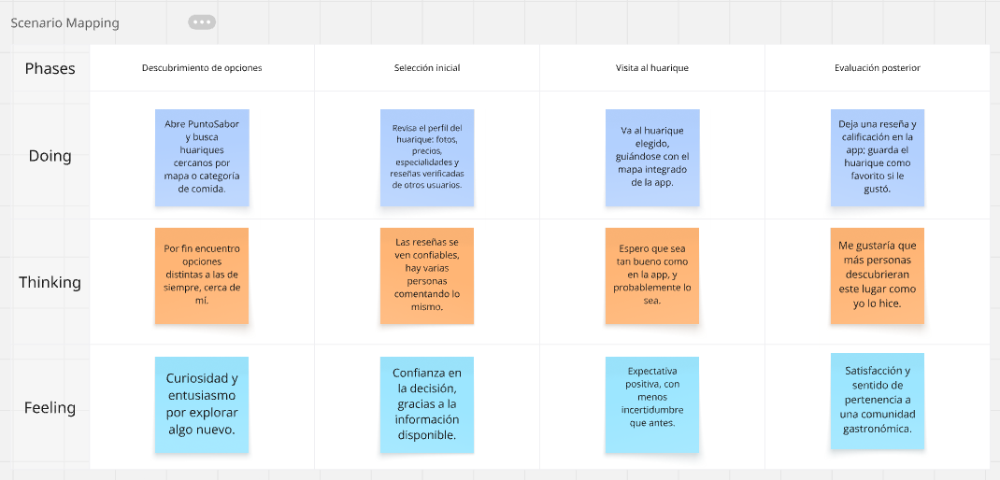  

**Comparación con el As-Is y cambios que ofrece el To-Be:**
- En **Descubrimiento**, el As-Is mostraba frustración por no encontrar nada distinto a las cadenas grandes; el To-Be elimina esa fricción mediante un buscador especializado exclusivamente en huariques.
- En **Selección inicial**, la desconfianza hacia reseñas potencialmente falsas se transforma en confianza, gracias a un sistema de reseñas verificadas propio de la plataforma (no disperso entre redes sociales).
- En **Visita**, la duda de "ojalá sea tan bueno como en las fotos" disminuye porque la información proviene de una comunidad especializada y no de publicidad pagada de grandes cadenas.
- En **Evaluación posterior**, el deseo insatisfecho de "un espacio especializado solo para huariques" pasa a estar resuelto: PuntoSabor es exactamente ese espacio, y el usuario ahora contribuye activamente a él.

#### To-Be Scenario Mapping — Segmento 2: Dueños de Huariques

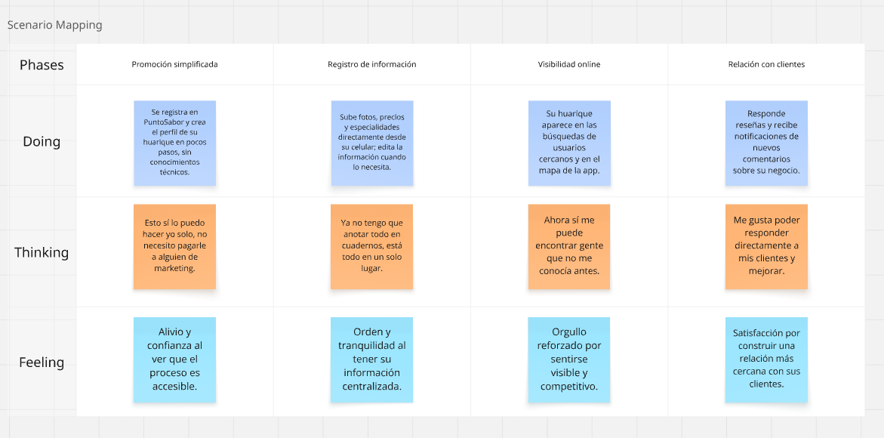

**Comparación con el As-Is y cambios que ofrece el To-Be:**
- En **Promoción**, la sensación de no poder competir con restaurantes grandes se reemplaza por una herramienta diseñada específicamente para negocios pequeños, sin costos ni complejidad técnica.
- En **Registro de información**, el proceso manual en cuadernos/Excel (que generaba estrés y cansancio) se sustituye por un registro digital simple desde el propio celular del propietario.
- En **Visibilidad online**, la frustración de "casi nadie me sigue" se transforma en aparición activa dentro de las búsquedas de usuarios reales interesados en huariques, sin depender de saber usar redes sociales.
- En **Relación con clientes**, la impotencia por falta de herramientas da paso a una comunicación directa y bidireccional mediante reseñas y notificaciones, algo que antes no existía en su proceso.

**Resumen de fases:**

| Segmento | Fases As-Is | Fases To-Be |
|---|---|---|
| Exploradores Gastronómicos | Descubrimiento de opciones, Selección inicial, Visita al huarique, Evaluación posterior | Se mantienen las mismas 4 fases; cambia la experiencia dentro de cada una |
| Dueños de Huariques | Promoción tradicional, Registro de información, Visibilidad online, Relación con clientes, | Se mantienen las mismas 4 fases |


## 3.2. User Stories

En esta sección se presentan los requisitos definidos para PuntoSabor, expresados mediante User Stories y Epics. La tabla sigue la **plantilla oficial del enunciado**, dedicando una fila a cada Epic y a cada User Story, con las columnas **Story ID, Usuario, Prioridad, Epic, Título, Descripción y Criterios de Aceptación**. Cada User Story incluye criterios de aceptación claros y comprobables, redactados en tiempo presente y tercera persona, siguiendo la estructura Gherkin (Given-When-Then). Se consideran User Stories de la aplicación móvil, del sitio web estático (Landing Page, rol *Visitante*) y **Technical Stories** para el RESTful API (rol *Developer*).

La prioridad se expresa como **Alta / Media / Baja** según el valor para el negocio y su contribución al flujo principal, criterio que se mantiene coherente con el orden del Product Backlog (sección [3.3](#33-product-backlog)).

**Definición de Epics**

| Story ID | Usuario | Prioridad | Epic | Título | Descripción | Criterios de Aceptación |
|---|---|---|---|---|---|---|
| EP01 | Usuario | Alta | EP01 | Descubrimiento de huariques | Agrupa las funcionalidades que permiten a los usuarios buscar, ubicar y guardar huariques. | N/A (Epic) |
| EP02 | Dueño | Alta | EP02 | Gestión de huariques | Permite a los dueños registrar, actualizar y enriquecer la información de sus huariques. | N/A (Epic) |
| EP03 | Usuario, Sistema | Alta | EP03 | Reseñas y calificaciones | Reúne la publicación, calificación y moderación de reseñas sobre los huariques. | N/A (Epic) |
| EP04 | Visitante | Alta | EP04 | Landing Page | Sitio web estático que presenta la propuesta de valor y permite el contacto con el equipo. | N/A (Epic) |
| EP05 | Usuario, Dueño | Baja | EP05 | Notificaciones | Gestión de alertas y preferencias de notificación para usuarios y dueños. | N/A (Epic) |
| EP06 | Developer | Alta | EP06 | API RESTful (Technical Stories) | Servicios backend que exponen las operaciones para los productos digitales. | N/A (Epic) |
| EP07 | Usuario | Alta | EP07 | Autenticación y gestión de cuenta | Registro, inicio de sesión y recuperación de credenciales de forma segura. | N/A (Epic) |
| EP08 | Usuario | Media | EP08 | Recomendaciones y preferencias | Personalización de la experiencia a partir de preferencias e historial del usuario. | N/A (Epic) |
| EP09 | Usuario, Sistema | Media | EP09 | Información y estado del huarique | Mantiene actualizada y confiable la información operativa (horarios, estado, reportes). | N/A (Epic) |
| EP10 | Dueño, DueñoPro | Media | EP10 | Membresías, pagos y promociones | Modelo de ingresos: planes, pagos, comprobantes y promociones destacadas. | N/A (Epic) |

**User Stories y Technical Stories**

| Story ID | Usuario | Prioridad | Epic | Título | Descripción | Criterios de Aceptación |
|---|---|---|---|---|---|---|
| US01 | Usuario | Alta | EP01 | Filtrar huariques | Como usuario, quiero filtrar huariques por ubicación, tipo de comida y precio para encontrar opciones acordes a mis preferencias. | **Escenario 1:** Dado que el usuario selecciona filtros válidos, Cuando ejecuta la búsqueda, Entonces el sistema muestra solo los huariques que coinciden con los filtros aplicados. <br><br> **Escenario 2:** Dado que no existen huariques que coincidan con los filtros, Cuando el usuario ejecuta la búsqueda, Entonces el sistema muestra un mensaje indicando que no se encontraron resultados. <br><br> **Escenario 3:** Dado que el usuario no selecciona filtros, Cuando ejecuta la búsqueda, Entonces el sistema muestra la lista general de huariques disponibles. |
| US02 | Usuario | Alta | EP01 | Visualizar huariques en mapa | Como usuario, quiero visualizar la ubicación de los huariques en un mapa para identificar fácilmente cómo llegar a ellos. | **Escenario 1:** Dado que el usuario accede a la vista de mapa, Cuando la pantalla termina de cargar, Entonces el sistema muestra los huariques mediante marcadores de ubicación. <br><br> **Escenario 2:** Dado que el usuario selecciona un marcador del mapa, Cuando pulsa sobre este, Entonces el sistema muestra un resumen con nombre, dirección y calificación del huarique. |
| US03 | Usuario | Media | EP01 | Guardar huariques favoritos | Como usuario, quiero guardar huariques como favoritos para consultarlos nuevamente de forma rápida. | **Escenario 1:** Dado que el usuario selecciona la opción de favorito en un huarique, Cuando confirma la acción, Entonces el sistema agrega el huarique a su lista de favoritos. <br><br> **Escenario 2:** Dado que el usuario accede a la sección de favoritos, Cuando la pantalla carga, Entonces el sistema muestra los huariques guardados previamente. |
| US04 | Dueño | Alta | EP02 | Registrar un nuevo huarique | Como dueño, quiero registrar un nuevo huarique con información básica para que aparezca en la plataforma. | **Escenario 1:** Dado que el dueño completa todos los campos obligatorios con datos válidos, Cuando envía el formulario, Entonces el sistema registra el huarique correctamente. <br><br> **Escenario 2:** Dado que el dueño deja campos obligatorios vacíos, Cuando intenta registrar el huarique, Entonces el sistema solicita completar los datos faltantes. |
| US05 | Dueño | Media | EP02 | Actualizar información del huarique | Como dueño, quiero actualizar la información de mi huarique para mantener sus datos correctos y vigentes. | **Escenario 1:** Dado que el dueño modifica datos válidos del huarique, Cuando guarda los cambios, Entonces el sistema actualiza la información correctamente. <br><br> **Escenario 2:** Dado que el dueño ingresa información incompleta o inválida, Cuando intenta guardar los cambios, Entonces el sistema muestra un mensaje de validación. |
| US06 | Dueño | Media | EP02 | Gestionar contenido multimedia | Como dueño, quiero subir fotos y videos de mi huarique para mostrar mejor mi negocio a los usuarios. | **Escenario 1:** Dado que el dueño selecciona un archivo permitido, Cuando lo sube al perfil del huarique, Entonces el sistema almacena y muestra el contenido multimedia. <br><br> **Escenario 2:** Dado que el dueño selecciona un archivo no permitido, Cuando intenta subirlo, Entonces el sistema muestra un mensaje indicando los formatos aceptados. |
| US07 | Usuario | Alta | EP03 | Publicar reseñas | Como usuario, quiero publicar una reseña y calificación sobre un huarique para compartir mi experiencia con otros usuarios. | **Escenario 1:** Dado que el usuario completa la reseña y selecciona una calificación válida, Cuando confirma el envío, Entonces el sistema publica la reseña en el perfil del huarique. <br><br> **Escenario 2:** Dado que el usuario ya publicó una reseña sobre el mismo huarique, Cuando intenta publicar otra, Entonces el sistema impide el registro duplicado. |
| US08 | Sistema | Media | EP03 | Moderar reseñas inapropiadas | Como sistema, quiero detectar reseñas inapropiadas para evitar contenido ofensivo dentro de la plataforma. | **Escenario 1:** Dado que una reseña contiene lenguaje ofensivo, Cuando el usuario intenta publicarla, Entonces el sistema bloquea la publicación o la marca para revisión. |
| US09 | Visitante | Alta | EP04 | Mostrar beneficios en la landing page | Como visitante, quiero ver los beneficios de PuntoSabor en la landing page para comprender el valor de la plataforma. | **Escenario 1:** Dado que el visitante accede a la landing page, Cuando la página termina de cargar, Entonces el sistema muestra los beneficios principales para usuarios y dueños de huariques. |
| US10 | Visitante | Media | EP04 | Enviar consultas desde el formulario de contacto | Como visitante, quiero enviar consultas mediante un formulario de contacto para comunicarme con el equipo de PuntoSabor. | **Escenario 1:** Dado que el visitante completa correctamente todos los campos requeridos, Cuando envía el formulario, Entonces el sistema registra la consulta y muestra una confirmación. <br><br> **Escenario 2:** Dado que el visitante deja campos obligatorios vacíos, Cuando intenta enviar el formulario, Entonces el sistema solicita completar los datos faltantes. |
| US11 | Usuario | Baja | EP05 | Configurar notificaciones | Como usuario, quiero activar o desactivar notificaciones para recibir solo la información que me interesa. | **Escenario 1:** Dado que el usuario modifica sus preferencias de notificación, Cuando guarda los cambios, Entonces el sistema actualiza la configuración seleccionada. |
| US12 | Dueño | Baja | EP05 | Recibir notificaciones de nuevas reseñas | Como dueño, quiero recibir alertas cuando mi huarique reciba nuevas reseñas para responder oportunamente a los usuarios. | **Escenario 1:** Dado que un usuario publica una reseña aprobada, Cuando la reseña queda registrada, Entonces el sistema notifica al dueño del huarique. |
| US13 | Developer | Alta | EP06 | Consultar huariques mediante API | Como developer, quiero consultar huariques mediante filtros en la API para integrar la búsqueda con la aplicación móvil. | **Escenario 1:** Dado que la petición contiene parámetros válidos, Cuando la API procesa la solicitud, Entonces devuelve los huariques que cumplen los criterios enviados. <br><br> **Escenario 2:** Dado que la petición contiene parámetros inválidos, Cuando la API procesa la solicitud, Entonces devuelve un mensaje de error claro. |
| US14 | Developer | Alta | EP06 | Registrar y actualizar huariques mediante API | Como developer, quiero crear y actualizar huariques mediante la API para gestionar la información desde los productos digitales. | **Escenario 1:** Dado que la petición contiene datos válidos, Cuando la API procesa el registro, Entonces crea el huarique y devuelve una respuesta exitosa. <br><br> **Escenario 2:** Dado que la petición contiene datos válidos de actualización, Cuando la API procesa la solicitud, Entonces actualiza la información del huarique. |
| US15 | Usuario | Alta | EP07 | Registrar e iniciar sesión de forma segura | Como usuario, quiero crear una cuenta e iniciar sesión con credenciales seguras para acceder a mi perfil. | **Escenario 1:** Dado que el usuario ingresa datos válidos de registro, Cuando envía el formulario, Entonces el sistema crea la cuenta correctamente. <br><br> **Escenario 2:** Dado que el usuario ingresa credenciales válidas, Cuando inicia sesión, Entonces el sistema le permite acceder a su cuenta. <br><br> **Escenario 3:** Dado que el usuario ingresa credenciales incorrectas, Cuando intenta iniciar sesión, Entonces el sistema muestra un mensaje de error. <br><br> **Escenario 4:** Dado que el usuario deja campos vacíos, Cuando intenta continuar, Entonces el sistema solicita completar los datos requeridos. |
| US16 | Usuario | Media | EP07 | Recuperar contraseña | Como usuario, quiero recuperar mi contraseña para volver a acceder a mi cuenta en caso de olvido. | **Escenario 1:** Dado que el usuario ingresa un correo registrado, Cuando solicita la recuperación, Entonces el sistema envía instrucciones para restablecer la contraseña. <br><br> **Escenario 2:** Dado que el usuario ingresa un correo no registrado, Cuando solicita la recuperación, Entonces el sistema muestra un mensaje informativo. |
| US17 | Usuario | Media | EP08 | Guardar preferencias del usuario | Como usuario, quiero guardar mis preferencias de cocina, presupuesto y ubicación para recibir recomendaciones personalizadas. | **Escenario 1:** Dado que el usuario ingresa preferencias válidas, Cuando confirma la configuración, Entonces el sistema guarda las preferencias en su perfil. <br><br> **Escenario 2:** Dado que el usuario tiene preferencias guardadas, Cuando accede a recomendaciones, Entonces el sistema muestra huariques relacionados con esos criterios. |
| US18 | Usuario | Baja | EP08 | Sugerir huariques automáticamente | Como usuario, quiero recibir sugerencias de huariques basadas en mi historial para descubrir opciones relacionadas con mis intereses. | **Escenario 1:** Dado que el usuario tiene historial de búsquedas o favoritos, Cuando accede a recomendaciones, Entonces el sistema muestra huariques similares. <br><br> **Escenario 2:** Dado que el usuario no tiene historial, Cuando accede a recomendaciones, Entonces el sistema muestra huariques populares de la zona. |
| US19 | Usuario | Media | EP08 | Recomendar huariques cercanos | Como usuario, quiero recibir recomendaciones de huariques cercanos a mi ubicación para encontrar opciones próximas. | **Escenario 1:** Dado que el usuario concede permiso de ubicación, Cuando accede a la sección “Cerca de mí”, Entonces el sistema muestra huariques dentro del radio definido. <br><br> **Escenario 2:** Dado que el usuario no concede permiso de ubicación, Cuando accede a la sección, Entonces el sistema solicita permisos o permite una búsqueda manual. |
| US20 | Usuario | Baja | EP09 | Verificar horarios de huariques | Como usuario, quiero ver si el horario de un huarique fue confirmado recientemente para evitar información desactualizada. | **Escenario 1:** Dado que el dueño actualizó el horario recientemente, Cuando el usuario entra al perfil del huarique, Entonces el sistema muestra la etiqueta “Horario verificado”. <br><br> **Escenario 2:** Dado que no existen actualizaciones recientes, Cuando el usuario entra al perfil, Entonces el sistema muestra la etiqueta “Horario no verificado”. |
| US21 | Usuario | Baja | EP09 | Reportar información incorrecta | Como usuario, quiero reportar datos incorrectos de un huarique para contribuir a mantener actualizada la información. | **Escenario 1:** Dado que el usuario detecta información incorrecta, Cuando envía un reporte, Entonces el sistema registra el reporte para revisión. <br><br> **Escenario 2:** Dado que el reporte fue revisado y corregido, Cuando el usuario consulta el huarique, Entonces el sistema muestra la información actualizada. |
| US22 | Sistema | Media | EP09 | Mostrar estado abierto o cerrado | Como sistema, quiero mostrar si un huarique está abierto o cerrado para orientar mejor la decisión del usuario. | **Escenario 1:** Dado que el sistema cuenta con información reciente del horario, Cuando el usuario accede al perfil, Entonces muestra el estado “Abierto ahora” o “Cerrado”. <br><br> **Escenario 2:** Dado que no hay datos suficientes para validar el estado, Cuando el usuario accede al perfil, Entonces muestra el aviso “Estado no confirmado”. |
| US23 | Dueño | Media | EP10 | Seleccionar planes de membresía | Como dueño, quiero elegir entre planes de membresía con distintos beneficios para aumentar la visibilidad de mi huarique. | **Escenario 1:** Dado que el dueño selecciona un plan disponible, Cuando confirma la elección, Entonces el sistema activa la membresía correspondiente. <br><br> **Escenario 2:** Dado que el dueño solicita cambiar de plan, Cuando confirma la modificación, Entonces el sistema programa el cambio para el siguiente periodo disponible. |
| US24 | Dueño | Media | EP10 | Pagar suscripción | Como dueño, quiero pagar mi membresía mediante tarjeta o billetera digital para mantener activo mi plan. | **Escenario 1:** Dado que el dueño ingresa datos de pago válidos, Cuando confirma la operación, Entonces el sistema registra el pago y activa la suscripción. <br><br> **Escenario 2:** Dado que el dueño ingresa datos de pago inválidos, Cuando confirma la operación, Entonces el sistema muestra un mensaje de error y no activa la suscripción. |
| US25 | Dueño | Baja | EP10 | Descargar comprobantes de pago | Como dueño, quiero descargar comprobantes mensuales de mis pagos para llevar control contable de mi membresía. | **Escenario 1:** Dado que el dueño accede a la sección de facturación, Cuando selecciona un mes con pago registrado, Entonces el sistema permite descargar el comprobante correspondiente. <br><br> **Escenario 2:** Dado que existe un pago pendiente o fallido, Cuando el dueño revisa la facturación, Entonces el sistema muestra un aviso de pago pendiente. |
| US26 | Dueño Pro | Media | EP10 | Publicar promociones destacadas | Como dueño Pro, quiero publicar promociones destacadas para aumentar la visibilidad de mi huarique en los listados. | **Escenario 1:** Dado que el dueño Pro configura una promoción con fechas y cupos válidos, Cuando la publica, Entonces el sistema la muestra como destacada en los listados. <br><br> **Escenario 2:** Dado que la promoción alcanza su fecha de finalización, Cuando el usuario revisa los listados, Entonces el sistema deja de mostrarla como promoción activa. |
| US27 | Usuario | Media | EP07 | Gestionar cuenta y perfil | Como usuario, quiero ver mi perfil, actualizar mi nombre y eliminar mi cuenta para tener control sobre mis datos personales. | **Escenario 1:** Dado que el usuario accede a su perfil, Cuando la pantalla carga, Entonces el sistema muestra su nombre, correo y rol. <br><br> **Escenario 2:** Dado que el usuario edita su nombre con un valor válido, Cuando guarda los cambios, Entonces el sistema actualiza el nombre y lo refleja en la sesión. <br><br> **Escenario 3:** Dado que el usuario confirma la eliminación de su cuenta, Cuando acepta la acción, Entonces el sistema elimina la cuenta y cierra la sesión. |

## 3.3. Product Backlog

El Product Backlog reúne las User Stories de la sección [3.1](#31-user-stories) con su estimación en Story Points y su priorización. El orden lo determina el **valor para el negocio** y la contribución al flujo principal de descubrimiento de huariques; por ello, las historias de descubrimiento y presentación del producto (incluida la Landing Page, considerada desde el primer sprint) se ubican antes que las de seguridad o configuración, evitando el error de iniciar el backlog con autenticación.

**Documento del Product Backlog y herramienta de gestión del avance.** El backlog se mantiene de forma viva en **Trello**, herramienta indicada para el control del proyecto, donde cada User Story es una tarjeta con su estimación, prioridad, responsable y estado (To-Do / In-Process / To-Review / Done). La tabla siguiente es la exportación de referencia de ese tablero al informe.

- **Tablero de Trello (Product Backlog y control de sprints):** 
https://trello.com/invite/b/6a3b6709fd34f6edb2cc21af/ATTI7be4b37d5e727ef6f2e8092804bf2c3192D51CB7/puntosabor-app
- **Repositorio del informe (documento del backlog en Markdown):** <https://github.com/HuariApp/puntosabor-report>

## 3.4. Impact Mapping

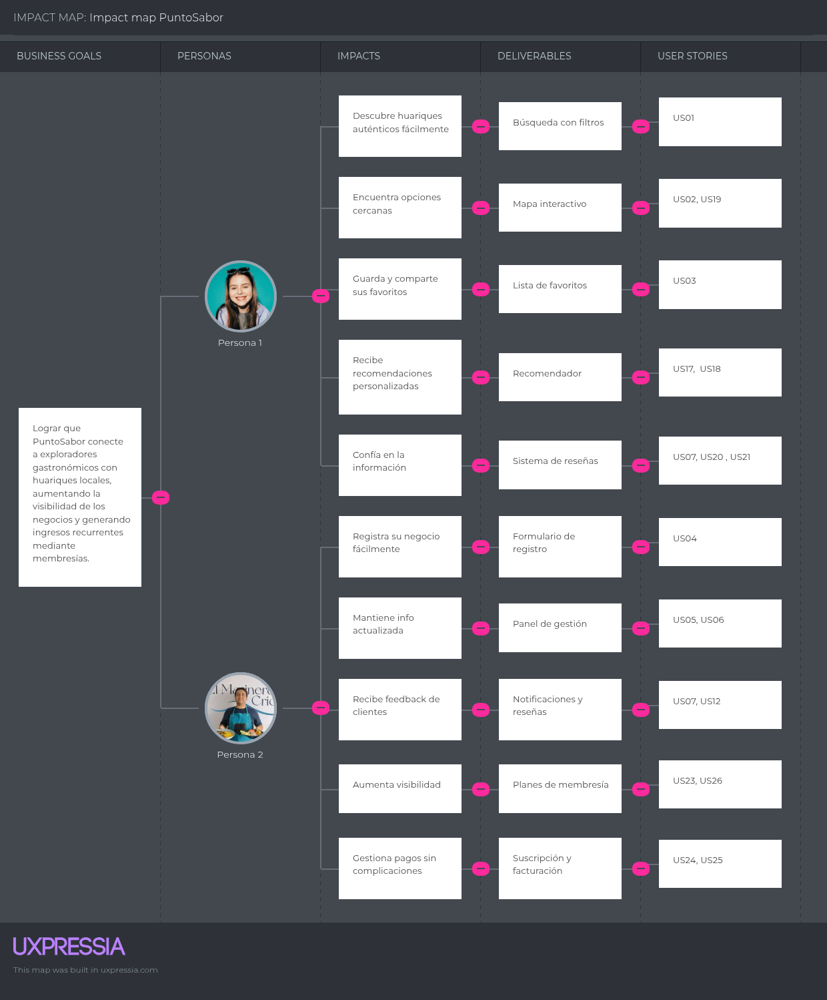

# Capítulo IV: Product Design

## 4.1. Style Guidelines

Los "Style Guidelines" de la aplicación móvil PuntoSabor definen las directrices visuales y de diseño que permiten mantener una experiencia coherente, clara y fácil de usar en todas las pantallas de la app. Estos lineamientos establecen criterios sobre colores, tipografía, espaciado, componentes visuales e identidad gráfica, asegurando que la aplicación sea intuitiva tanto para los usuarios que buscan huariques como para los propietarios que gestionan sus negocios.

### 4.1.1. General Style Guidelines

##### Branding

Para el desarrollo de la identidad visual de PuntoSabor, se definió un estilo orientado a transmitir cercanía, autenticidad y confianza. La marca busca reflejar el valor de los huariques dentro de la gastronomía local, destacándolos como espacios accesibles, tradicionales y con identidad propia.

El logotipo de PuntoSabor representa la idea de descubrimiento gastronómico mediante elementos asociados a la ubicación y la comida local. Su propuesta visual permite que los usuarios relacionen rápidamente la aplicación con la búsqueda de huariques cercanos, recomendaciones confiables y experiencias culinarias auténticas.

La identidad gráfica utiliza una apariencia cálida, amigable y moderna, pensada para conectar tanto con los exploradores gastronómicos como con los propietarios de huariques. De esta manera, PuntoSabor mantiene una imagen coherente con su propósito: facilitar la visibilidad de pequeños negocios gastronómicos mediante una aplicación móvil sencilla y accesible.


##### Typography

Cada plataforma de PuntoSabor adopta una combinación tipográfica acorde a su contexto de uso:

| Plataforma | Fuente de títulos | Fuente de cuerpo | Fuente: verificado en |
|---|---|---|---|
| Landing (web marketing) | Fraunces (serif editorial) | DM Sans | `css/style.css`, `index.html` (Google Fonts) |
| Front (web app / dashboard) | Inter (Poppins referenciado en el CSS del logo, pero no cargado como recurso - cae en fallback) | Inter | `src/style.css` |
| App Android nativo (Kotlin) | System Serif (equivalente a Fraunces/Instrument Serif) | Roboto (sistema) | `ui/theme/Type.kt` |
| AppFlutter (iOS + Android) | Roboto | Roboto | `core/theme/app_theme.dart` (`fontFamily: 'Roboto'`) |

El par **Fraunces + DM Sans** se usa en superficies "editoriales" orientadas a storytelling de marca como (Landing), mientras que las apps operativas (Front, AppFlutter, App nativo) priorizan **tipografías de sistema (Roboto/Inter)** por rendimiento, legibilidad en pantallas pequeñas y consistencia con los componentes nativos de cada plataforma.

##### Colors

La paleta de PuntoSabor se basa en una **familia de colores cálidos (naranja/marrón/terracota)**, con una variación tonal propia en cada plataforma:
 
| Uso | Landing | Front | App Android nativo | AppFlutter |
|---|---|---|---|---|
| Acento primario | Cocoa `#CA6527` | Naranja `#E3891B` | Naranja `#C5481E` | Naranja `#E8571A` |
| Acento secundario/oscuro | Russet `#914C23` | Marrón `#6F4228` | Marrón `#382B1F` | Naranja oscuro `#C04010` |
| Texto/marca oscura | Seal Brown `#57331F` | — (texto `#1D1D1F`) | Marrón `#382B1F` | Marrón `#3B1F0A` |
| Fondo principal | Light `#FAFAF8` | Verde oliva claro `#E4F0BD` | Crema `#FAF7F2` | Blanco cálido `#FAF7F4` |
| Estado de alerta/error | — | — | Rojo `#B84028` | Rojo `#D32F2F` |
| Estado destacado (rating/estrellas) | Saffron `#F6C553` | — | Amarillo `#FFC107` | Amarillo `#FFC107` |

##### Spacing

El sistema de espaciado de PuntoSabor está diseñado para mantener una interfaz móvil limpia, ordenada y fácil de navegar. La separación entre elementos permite mejorar la lectura, evitar la saturación visual y facilitar la interacción táctil del usuario.

Para conservar consistencia en las pantallas de la aplicación, se utiliza una escala modular basada en 8dp, adecuada para interfaces móviles. Esta escala permite definir márgenes, paddings y separaciones entre componentes de manera uniforme.

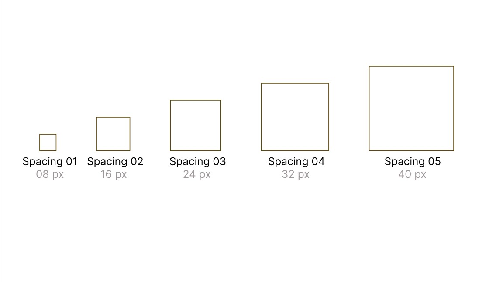

### 4.1.2. Web Style Guidelines

Para las interfaces web responsive de PuntoSabor, definimos un sistema de diseño adaptable que se ajusta de forma fluida entre dispositivos móviles y de escritorio, diferenciando dos contextos: la landing page de marketing y la plataforma/dashboard web.

En la landing page trabajamos con un enfoque mobile-first, escalonando el diseño en cinco puntos de quiebre (1200px, 1024px, 900px, 768px y 480px) para asegurar una lectura cómoda en cualquier tamaño de pantalla, sobre un ancho máximo de contenido de 1400px. En la plataforma web (dashboard), en cambio, optamos por un grid de 12 columnas con tres puntos de quiebre estructurales principales (1024px, 920px y 640px) -complementados con algunos ajustes puntuales por componente en otros anchos intermedios-, sobre un ancho máximo de 1200px. En ambos casos el contenido se centra en pantalla para evitar líneas de texto o layouts demasiado extendidos en monitores grandes. En la plataforma web además incorporamos espaciado fluido mediante clamp(), de modo que los márgenes y separaciones entre elementos crecen o se reducen suavemente según el ancho de pantalla, sin saltos bruscos entre breakpoints.

A nivel de componentes, en la plataforma web (dashboard) usamos un radio de borde estándar de 18px para cards, paneles y botones grandes, reforzando una apariencia suave y moderna. Aplicamos sombras en dos niveles de profundidad: una sutil para el estado de reposo y una más pronunciada para hover o elevación, lo que ayuda a comunicar interactividad. La barra de navegación se mantiene fija en la parte superior con un efecto de desenfoque de fondo sobre un color marrón semitransparente, y las transiciones de hover en botones, enlaces y cards son rápidas (entre 0.12s y 0.3s) para que la interfaz se sienta ágil.

En la landing page, en cambio, los radios de borde varían según el tipo de elemento: 8px en cards, 12px en inputs, y formas tipo píldora (50px/999px) en botones - una decisión que refuerza el carácter más editorial y cálido de esta superficie. Las sombras también se trabajan en tres niveles de intensidad, pero con un tinte cálido (en tonos marrón) en lugar de negro puro, coherente con la identidad visual de la marca. La iconografía se resuelve con FontAwesome, y se respeta la preferencia de accesibilidad prefers-reduced-motion, reduciendo animaciones para usuarios que así lo configuren en su sistema.


### 4.1.3. Mobile Style Guidelines

Para las aplicaciones móviles, la app desarrollada en Flutter es la que concentra el desarrollo activo del producto, ya que cubre iOS y Android desde una sola base de código. De forma complementaria, existe un prototipo nativo en Android (Kotlin + Jetpack Compose) que documentamos como referencia histórica del proceso de diseño, aunque no es la versión que se sigue desarrollando.

#### 4.1.3.1. iOS Mobile Style Guidelines

Para iOS, decidimos no implementar componentes Cupertino: mantenemos **Material Design 3 de forma consistente tanto en iOS como en Android**, priorizando que la marca se vea y se sienta igual en ambos sistemas operativos por sobre replicar al detalle las convenciones nativas de Apple (Human Interface Guidelines).

Aun así, cuidamos que los elementos se sientan naturales dentro de ese entorno: usamos bordes redondeados generosos (`12px` en botones e inputs, hasta `20-24px` en elementos destacados), botones de ancho completo con una altura mínima de `52px` -que cumple holgadamente el mínimo táctil recomendado de 44pt de Apple- y dejamos que el manejo de las áreas seguras (safe areas) lo resuelva automáticamente el `Scaffold` de Flutter, sin necesidad de ajustes manuales adicionales. En cuanto a tipografía, optamos por Roboto en lugar de San Francisco, un trade-off consciente en favor de mantener una única fuente cross-platform.

#### 4.1.3.2. Android Mobile Style Guidelines

Para Android trabajamos sobre Material Design 3, generando todo el esquema de color de forma dinámica a partir de un color semilla (el naranja de marca), de modo que la escala tonal completa de la app se deriva automáticamente de esa decisión inicial. La barra superior (AppBar) usa un fondo marrón oscuro con texto blanco y sin elevación, buscando una estética flat y moderna.

En los componentes, mantenemos consistencia con el resto del sistema: botones con radio de 12px y altura mínima de 52px, texto en 16sp con peso semibold; cards con elevación baja (2) y radio de 14px; e inputs con bordes de 12px de radio, que cambian a color naranja primario con mayor grosor cuando están enfocados.

El prototipo nativo en Kotlin/Compose sigue esta misma lógica de diseño para sus componentes base (inputs con 12dp de radio, igual que en Flutter), aunque con su propia variación tonal (más hacia terracota y marrón oscuro, según se detalla en la tabla de colores del apartado 4.1.1), tipografía serif en los títulos, y un contenedor tipo card que envuelve todo el formulario de login/registro con un radio mayor (24dp) y elevación propia — un patrón visual que la versión en Flutter no replica, ya que esta última presenta los campos directamente sobre el fondo de la pantalla, sin card contenedora. Mantenemos esta documentación como referencia del proceso exploratorio de diseño, dado que el desarrollo activo del producto continúa en la app Flutter.

## 4.2. Information Architecture

La arquitectura de información de PuntoSabor se diseñó para que los usuarios puedan encontrar fácilmente las funciones principales de la aplicación móvil, como buscar huariques, revisar información del local, consultar reseñas, guardar favoritos y gestionar un negocio.

La organización del contenido busca reducir la carga cognitiva y facilitar una navegación intuitiva, clara y rápida. De esta manera, la aplicación mantiene una experiencia coherente con su propuesta de valor: conectar a los usuarios con huariques auténticos y ayudar a los propietarios a mejorar su visibilidad digital.

### 4.2.1. Organization Systems

En PuntoSabor se aplican distintos sistemas de organización para que la información dentro de la aplicación móvil sea clara, ordenada y fácil de encontrar.

**Organización jerárquica (Visual Hierarchy):**  
En las pantallas principales de la app se prioriza la información más importante para el usuario, como el buscador de huariques, las recomendaciones destacadas, la ubicación cercana y las reseñas. Esto permite que el usuario identifique rápidamente las acciones principales.

**Organización secuencial (Step-by-step):**  
Procesos como el registro de un huarique, la edición de información del negocio o la publicación de datos del local siguen una secuencia paso a paso. De esta manera, los propietarios pueden completar sus tareas sin dificultad.

**Organización por tópicos:**  
Los huariques se agrupan según criterios como tipo de comida, ubicación, rango de precios, valoraciones y promociones. Esto facilita que los usuarios filtren y encuentren opciones según sus preferencias.

**Organización según audiencia:**  
La aplicación considera dos tipos principales de usuarios: exploradores gastronómicos y dueños de huariques. Por ello, las funciones y contenidos se organizan de acuerdo con sus necesidades: búsqueda y descubrimiento para los comensales, y gestión de negocio para los propietarios.

### 4.2.2. Labeling Systems

El sistema de etiquetado de **PuntoSabor** prioriza la claridad, simplicidad y consistencia dentro de la aplicación móvil. Para ello, se utilizan palabras cortas y directas que permiten al usuario comprender rápidamente cada sección o acción disponible.

En la aplicación móvil se consideran etiquetas principales como:

- Inicio
- Explorar
- Huariques
- Favoritos
- Reseñas
- Promociones
- Perfil

Además, los botones de acción utilizan textos claros con verbos directos, como:

- Buscar huariques
- Ver detalles
- Guardar favorito
- Dejar reseña
- Registrar negocio
- Editar información

Estas etiquetas permiten que tanto los exploradores gastronómicos como los propietarios de huariques interactúen con la aplicación de manera sencilla, manteniendo coherencia con los objetivos de la plataforma.

### 4.2.3. SEO Tags and Meta Tags

Para PuntoSabor se han definido elementos SEO orientados principalmente a la Landing Page, ya que esta será el punto de entrada público para atraer usuarios y propietarios interesados en la plataforma. Estos elementos ayudan a mejorar la visibilidad del producto en motores de búsqueda y mantienen coherencia con la propuesta de valor de la marca.

**SEO Tags para Landing Page:**

- **Title:** PuntoSabor | Descubre huariques auténticos cerca de ti.
- **Meta Description:** PuntoSabor conecta a exploradores gastronómicos con huariques auténticos y económicos, ofreciendo reseñas confiables, mapas interactivos y promociones exclusivas.
- **Meta Keywords:** huariques, comida peruana, gastronomía local, reseñas, recomendaciones, restaurantes pequeños, comida auténtica.
- **Author:** HuariqueHub - Startup PuntoSabor.

**ASO Elements para aplicación móvil:**

- **App Title:** PuntoSabor
- **App Subtitle:** Descubre huariques auténticos cerca de ti.
- **App Keywords:** huariques, comida local, restaurantes, comida peruana, reseñas, promociones, gastronomía.
- **App Description:** PuntoSabor es una aplicación móvil que permite descubrir huariques cercanos, consultar reseñas, guardar favoritos y conocer promociones de pequeños negocios gastronómicos locales.

### 4.2.4. Searching Systems

La aplicación móvil de HuariqueHub ofrece sistemas de búsqueda diseñados para que el usuario encuentre lo que necesita sin esfuerzo:

- **Búsqueda en catálogo:** localización de huariques por nombre, tipo de comida o distrito.  
- **Filtros avanzados:** por rango de precios, valoración de usuarios, ubicación geográfica y promociones activas.  
- **Mapa interactivo:** permite aplicar filtros visuales y seleccionar huariques desde su ubicación exacta.  
- **Búsqueda en reseñas:** posibilidad de filtrar comentarios por calificación (positivas/negativas) o por temas (precio, atención, sabor).  
De esta manera se evita que el usuario se sienta perdido entre la cantidad de opciones disponibles y se mejora la eficiencia en la exploración.

### 4.2.5. Navigation Systems

La navegación de PuntoSabor combina claridad, consistencia y adaptabilidad:

- **Landing Page (Desktop):** menú superior con navegación horizontal que permite acceder rápidamente a las secciones principales. Desplegada en GitHub Pages.  
- **Landing Page (Móvil):** menú tipo hamburguesa con navegación vertical, optimizado para pantallas pequeñas.  
- **Aplicación Móvil (Android/Kotlin):** navegación entre pantallas mediante Jetpack Compose Navigation, con acceso a Login, Registro, Home, Detalle de Huarique y otras pantallas core.  
- **CTAs estratégicos:** botones prominentes en el color primario de la paleta para guiar al usuario a acciones críticas como buscar huariques, registrar un negocio o activar una promoción.  

En conjunto, estos sistemas garantizan que los usuarios puedan recorrer la plataforma de forma intuitiva, cumpliendo sus metas sin obstáculos.

## 4.3. Landing Page UI Design

La interfaz de la landing page es clave para el proyecto, pues constituye la primera impresión del producto. Debe ofrecer una experiencia estética y funcional que atraiga de inmediato a los visitantes y los impulse a seguir explorando

### 4.3.1. Landing Page Wireframe

Landing Page para Desktop Web Browser


Landing Page para Mobile Web Browse

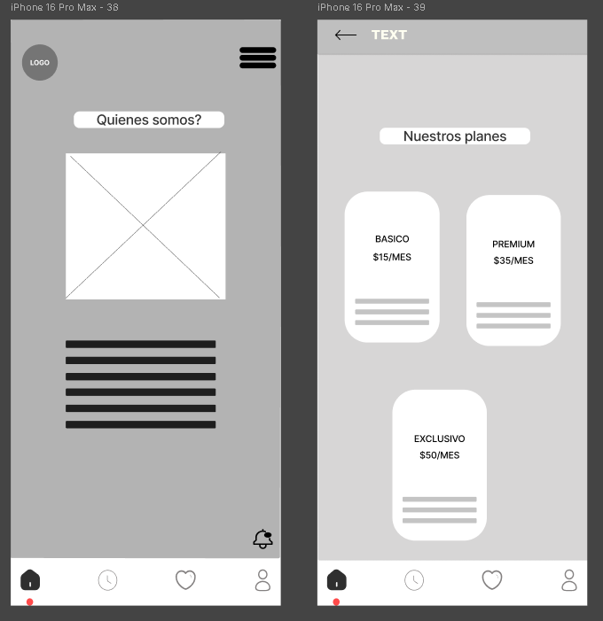


### 4.3.2. Landing Page Mock-up

Esta sección presenta y explica los Mock-ups del Landing Page, tanto en su versión para Desktop Web Browser como Mobile Web Browser. En la propuesta y la explicación debe evidenciarse la aplicación de los principios, elementos de diseño, diseño inclusivo y arquitectura de información, así como el Design System establecido para los productos digitales.
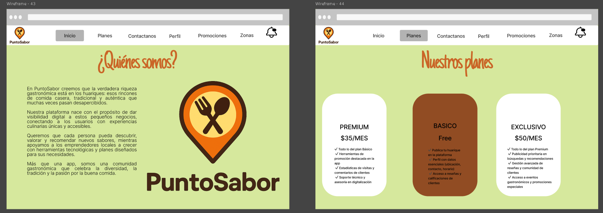

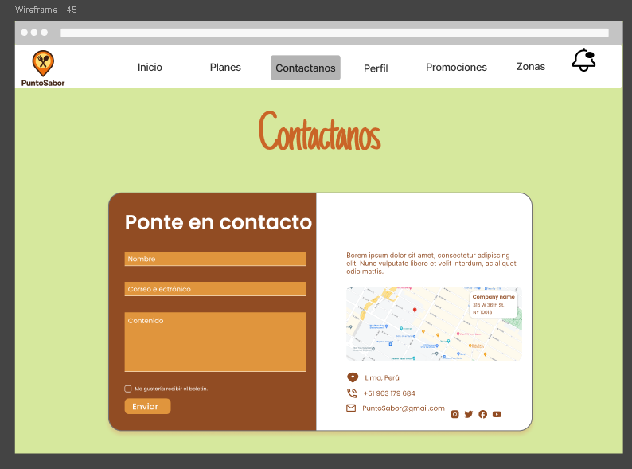

## 4.4. Mobile Applications UX/UI Design

El diseño de experiencia de usuario (UX) e interfaz de usuario (UI) en aplicaciones móviles se centra en crear una interacción fluida y optimizada para entornos táctiles y dispositivos portátiles. La UX prioriza la usabilidad en movimiento, diseñando arquitecturas de información y flujos de navegación simplificados que responden a los gestos naturales del usuario. Por otro lado, la UI define la identidad visual mediante la creación de componentes adaptables, tipografías legibles y una paleta de colores coherente que garantiza la claridad en pantallas de diversos tamaños. La integración de ambos aspectos permite desarrollar una aplicación intuitiva, estéticamente profesional y capaz de ofrecer una respuesta rápida y eficiente a las necesidades del usuario final.

### 4.4.1. Mobile Applications Wireframes

Representación esquemática de la estructura y flujo de navegación de la aplicación móvil, diseñada para definir la jerarquía de información y la disposición de los elementos antes de su implementación visual.


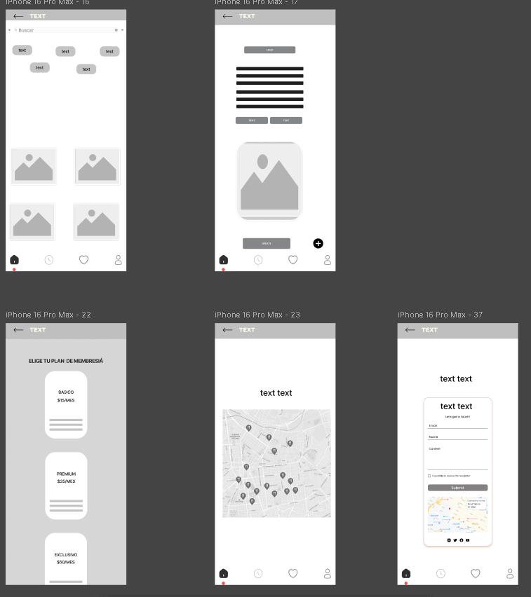

### 4.4.2. Mobile Applications Wireflow Diagrams

**Segmento 1**


**Segmento 2**


### 4.4.3. Mobile Applications Mock-ups

Representaciones visuales de alta fidelidad que integran la identidad de marca, incluyendo la paleta de colores, tipografía e iconografía final, para simular la apariencia real y estética de la interfaz en dispositivos móviles.


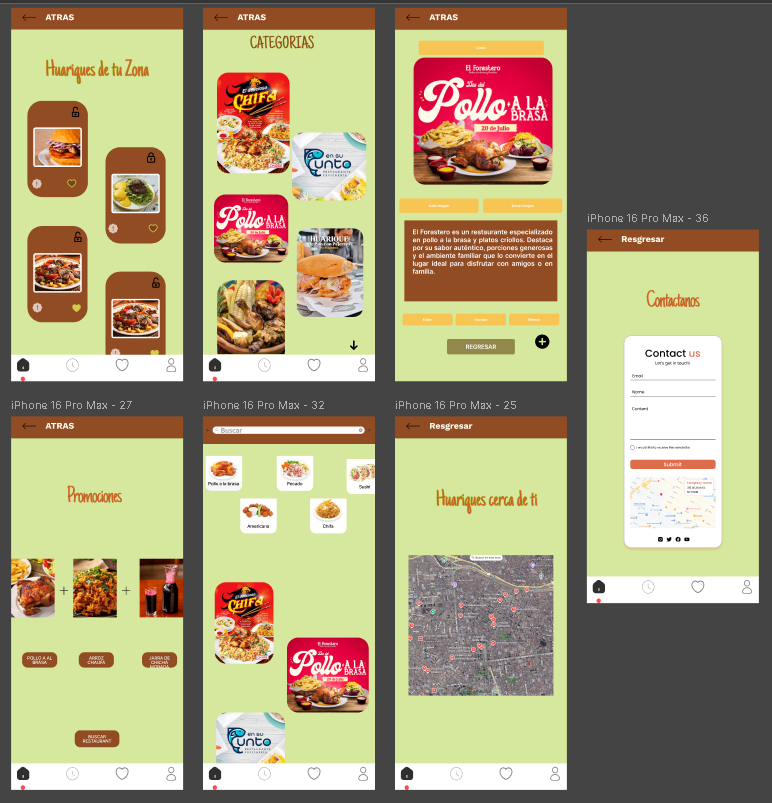

### 4.4.4. Mobile Applications User Flow Diagrams

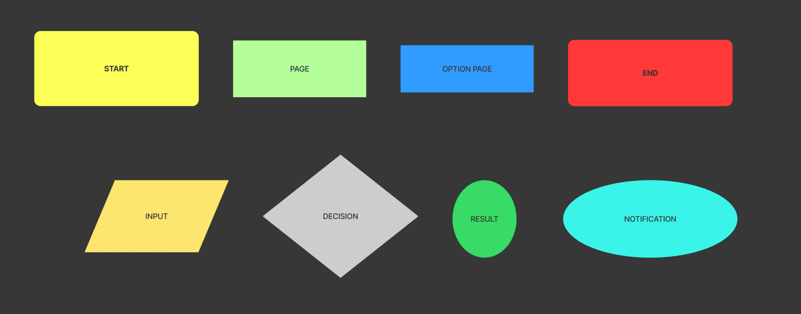


## 4.5. Mobile Applications Prototyping

### 4.5.1. Android Mobile Applications Prototyping

Prototipo de la aplicación móvil PuntoSabor en figma:
https://www.figma.com/proto/lT88eEZFP7G86QwYXq59Lc/PuntoSabor?node-id=570-2838&t=T0bd28Ud2NsPdeny-1&scaling=scale-down&content-scaling=fixed&page-id=0%3A1&starting-point-node-id=570%3A3528&show-proto-sidebar=1

### 4.5.2. iOS Mobile Applications Prototyping

Prototipo de la aplicación móvil PuntoSabor en figma: 
https://www.figma.com/proto/lT88eEZFP7G86QwYXq59Lc/PuntoSabor?node-id=483-3288&t=4X6zOIJLPjQSTqRs-1&scaling=scale-down&content-scaling=fixed&page-id=0%3A1&starting-point-node-id=479%3A3247&show-proto-sidebar=1

## 4.6. Web Applications UX/UI Design

El diseño de la aplicación web de PuntoSabor se desarrolló optimizando la experiencia de usuario para pantallas de escritorio, utilizando Vue con la biblioteca de componentes PrimeVue y siguiendo la identidad gráfica de la marca: tipografía Poppins/Inter, paleta marrón `#5C2E00` / naranja `#E8920A` / verde claro `#D8E8B0`, y espaciado modular de 8dp. Las decisiones de diseño responden a los dos segmentos objetivo: el **Explorador** (usuario que busca huariques) y el **Propietario** (dueño que gestiona su negocio).

**Figma — Web Applications UX/UI Design (Wireframes, Wireflows, Mock-ups y User Flows):** [https://www.figma.com/design/AKqMCrB8xN4vMEqAGNSIfO/Untitled?node-id=10-2271&t=AivyibA2a90zkzyR-1]


### 4.6.1. Web Applications Wireframes

Los wireframes representan la estructura y jerarquía visual de cada vista en escala de grises, sin aplicar color ni imágenes reales, con el fin de validar la arquitectura de información y la disposición de los componentes antes de la etapa de diseño visual.


### 4.6.2. Web Applications Wireflow Diagrams

**Segmento 1**


**Segmento 2**


### 4.6.3. Web Applications Mock-ups

Los mock-ups de alta fidelidad aplican la paleta de color oficial, la tipografía Poppins/Inter, los componentes de PrimeVue y contenido visual representativo, reflejando la apariencia final de la aplicación web tal como fue implementada.


### 4.6.4. Web Applications User Flow Diagrams

Los User Flow Diagrams presentan los mock-ups de alta fidelidad conectados mediante rutas de navegación, especificando el **happy path** (ruta esperada en azul/negro) y los **unhappy paths** (rutas alternativas en rojo ante errores o condiciones distintas). Se elaboró un User Flow por cada uno de los 15 User Goals identificados.

**User Flow 01 — Registro y Sign In de usuario (US15 / EP07)**
User goal: El usuario se autentica o crea una cuenta nueva para acceder a funciones personalizadas de PuntoSabor.

| Paso | Pantalla | Acción | Resultado |
|------|----------|--------|-----------|
| 1 | Home | Clic en "Sign in" del navbar | Navega a Sign In |
| 2 | Sign In | Ingresa credenciales válidas → clic "Sign in" | Redirige a Home con sesión activa y toast "Bienvenido" |
| 2b | Sign In | Credenciales incorrectas | Muestra error en el formulario, permite reintentar |
| 3 | Sign In | Clic en "Sign up" | Navega a Register |
| 4 | Register | Completa datos → "Create account" | Cuenta creada, redirige a Home autenticado |
| 4b | Register | Datos inválidos o email ya registrado | Error por campo, formulario no se envía |

---

**User Flow 02 — Búsqueda y filtrado de huariques (US01 / EP01)**
User goal: El usuario explorador aplica filtros de categoría, precio y distrito para obtener la lista de huariques que coinciden.

| Paso | Pantalla | Acción | Resultado |
|------|----------|--------|-----------|
| 1 | Home | Clic en "Explore" del navbar | Navega a Explore |
| 2 | Explore | Selecciona chip de categoría | Lista y mapa se actualizan filtrando esa categoría |
| 2b | Explore | Categoría sin resultados | Estado vacío "No results found" con sugerencia de ampliar filtro |
| 3 | Explore | Escribe en el buscador | Lista se filtra en tiempo real por nombre |
| 4 | Explore | Clic en ítem de la lista | Tarjeta de detalle aparece en zona inferior |


**User Flow 03 — Visualizar huarique en mapa e ir al detalle (US02 / EP01)**
User goal: El usuario hace clic en un marcador del mapa, ve el popup con info básica y navega al perfil completo del huarique.

| Paso | Pantalla | Acción | Resultado |
|------|----------|--------|-----------|
| 1 | Explore | Visualiza mapa con marcadores | Marcadores visibles por categoría |
| 2 | Explore | Clic en marcador del mapa | Popup flotante con nombre, categoría y rating |
| 3 | Explore | Clic en popup | Tarjeta de detalle aparece en zona inferior |
| 3b | Explore | Marcador sin datos disponibles | Popup con mensaje "Info no disponible" |
| 4 | Explore | Clic en "View menu" o "Directions" | Abre menú o dirección en mapa externo |

---

**User Flow 04 — Ver detalle de huarique y publicar reseña (US07 / EP03)**
User goal: El usuario autenticado lee las reseñas de un huarique y publica la suya con calificación por estrellas y comentario.

| Paso | Pantalla | Acción | Resultado |
|------|----------|--------|-----------|
| 1 | Explore | Selecciona un huarique | Tarjeta de detalle con rating, horario y descripción |
| 2 | Detalle | Clic en sección de reseñas | Despliega reseñas existentes |
| 3 | Detalle | Usuario autenticado escribe reseña y calificación → "Publicar" | Reseña publicada, rating actualizado |
| 3b | Detalle | Usuario no autenticado intenta publicar | Redirige a Sign In, luego retorna al detalle |
| 3c | Detalle | Reseña vacía o sin calificación | Error de validación, no se envía |


**User Flow 05 — Registro de huarique / propietario (US04 / EP02)**
User goal: El propietario registra su huarique con datos básicos (nombre, dirección, categoría, horario, foto) para aparecer en la plataforma.

| Paso | Pantalla | Acción | Resultado |
|------|----------|--------|-----------|
| 1 | Home (autenticado) | Accede al panel de propietario | Navega al dashboard del propietario |
| 2 | Panel propietario | Clic en "Registrar huarique" | Abre formulario de registro |
| 3 | Formulario | Completa todos los campos → "Guardar" | Huarique registrado y visible en Explore |
| 3b | Formulario | Campos inválidos o vacíos | Errores resaltados por campo, no se envía |
| 4 | Panel propietario | Confirmación exitosa | Toast de confirmación, huarique aparece en el panel |


**User Flow 06 — Ver planes y suscribirse (EP10 / EP02)**
User goal: El dueño del huarique compara los planes disponibles y se suscribe al que mejor se adapta a sus necesidades y presupuesto.

| Paso | Pantalla | Acción | Resultado |
|------|----------|--------|-----------|
| 1 | Cualquier vista | Clic en "Plans" del navbar | Navega a Membership Plans |
| 2 | Plans | Revisa las tres opciones (Basic, Premium, Exclusive) | Visualiza features y precios comparativos |
| 3 | Plans | Clic en CTA del plan elegido (autenticado) | Inicia flujo de suscripción |
| 3b | Plans | Usuario no autenticado hace clic en CTA | Redirige a Sign In, luego retorna a Plans |
| 4 | Plans | Clic en "Contact us →" | Navega a Contact para consulta personalizada |


**User Flow 07 — Guardar y gestionar huariques favoritos (EP01 / EP07)**
User goal: El usuario guarda un huarique como favorito desde su detalle y consulta después su lista personalizada de favoritos.

| Paso | Pantalla | Acción | Resultado |
|------|----------|--------|-----------|
| 1 | Detalle | Clic en ícono de favorito (autenticado) | Huarique guardado en favoritos, ícono activado |
| 1b | Detalle | Usuario no autenticado intenta guardar | Redirige a Sign In |
| 2 | Perfil | Accede a sección "Favoritos" | Lista de huariques guardados |
| 3 | Favoritos | Clic en un huarique | Navega al detalle |
| 3b | Favoritos | Lista vacía | Estado vacío con sugerencia de explorar |


**User Flow 08 — Ver y editar perfil de usuario (EP07)**
User goal: El usuario actualiza su nombre, foto de perfil y preferencias de cuenta desde la sección de perfil.

| Paso | Pantalla | Acción | Resultado |
|------|----------|--------|-----------|
| 1 | Navbar (autenticado) | Clic en avatar / nombre | Navega a perfil de usuario |
| 2 | Perfil | Clic en "Editar perfil" | Habilita campos editables |
| 3 | Perfil edición | Modifica datos → "Guardar" | Cambios guardados, toast de confirmación |
| 3b | Perfil edición | Datos inválidos | Error por campo, no se guarda |


**User Flow 09 — Crear y publicar promoción (EP10)**
User goal: El dueño crea una promoción (2x1, descuento, combo) que aparece en la sección Promos visible para todos los exploradores.

| Paso | Pantalla | Acción | Resultado |
|------|----------|--------|-----------|
| 1 | Panel propietario | Clic en "Crear promoción" | Abre formulario de promoción |
| 2 | Formulario | Completa título, descripción, imagen y vigencia → "Publicar" | Promo publicada y visible en Promos |
| 2b | Formulario | Campos incompletos | Error por campo, no se publica |
| 3 | Promos | Promo aparece en grid de exploradores | Acceso público a "See details" |


**User Flow 10 — Enviar mensaje de contacto (EP04)**
User goal: El visitante completa el formulario de la sección Contact y recibe confirmación de que su mensaje fue enviado correctamente.

| Paso | Pantalla | Acción | Resultado |
|------|----------|--------|-----------|
| 1 | Cualquier vista | Clic en "Contact" del navbar | Navega a Contact Us |
| 2 | Contact | Completa nombre, email y mensaje → "Send" | Mensaje enviado, toast de confirmación |
| 2b | Contact | Campos vacíos o email inválido | Error por campo, no se envía |


**User Flow 11 — Buscar huarique por nombre (US01 / EP01)**
User goal: El usuario escribe el nombre de un huarique en el buscador principal del Home y accede directamente a su perfil en Explore.

| Paso | Pantalla | Acción | Resultado |
|------|----------|--------|-----------|
| 1 | Home | Escribe nombre en buscador hero → "Explore" | Navega a Explore con resultados filtrados |
| 2 | Explore | Lista muestra huariques que coinciden con el nombre | Selecciona uno de la lista |
| 2b | Explore | Sin coincidencias | Estado vacío "No results found" |
| 3 | Explore | Clic en ítem | Tarjeta de detalle visible |


**User Flow 12 — Consultar horario y estado del huarique (EP09)**
User goal: El usuario verifica si el huarique está abierto en este momento y consulta su horario semanal completo antes de ir.

| Paso | Pantalla | Acción | Resultado |
|------|----------|--------|-----------|
| 1 | Explore | Selecciona huarique de la lista | Tarjeta de detalle con badge "Open now" o "Closed" |
| 2 | Detalle | Clic en "Ver horario" | Modal con horario completo Lun–Dom |
| 2b | Detalle | Horario no cargado | Mensaje "Horario no disponible" |


**User Flow 13 — Editar información del huarique / propietario (US04 / EP02)**
User goal: El propietario actualiza la descripción, foto u horario de su huarique ya publicado desde su panel de dueño.

| Paso | Pantalla | Acción | Resultado |
|------|----------|--------|-----------|
| 1 | Panel propietario | Clic en "Editar huarique" | Abre formulario pre-llenado con datos actuales |
| 2 | Formulario edición | Modifica campos → "Guardar" | Cambios guardados, toast "Información actualizada" |
| 2b | Formulario edición | Campos inválidos | Error por campo, no se guarda |
| 3 | Explore | Perfil del huarique refleja los cambios | Información actualizada visible para exploradores |


**User Flow 14 — Ver recomendaciones personalizadas (EP08)**
User goal: El usuario autenticado visualiza huariques sugeridos en el Home según sus preferencias e historial de visitas.

| Paso | Pantalla | Acción | Resultado |
|------|----------|--------|-----------|
| 1 | Home (autenticado) | Sección "Para ti" visible en el Home | Grid de huariques recomendados |
| 2 | Home | Clic en tarjeta recomendada | Navega al detalle del huarique con badge "Recomendado para ti" |
| 2b | Home | Sin preferencias configuradas | Sección muestra huariques populares generales |


**User Flow 15 — Cerrar sesión / Sign out (EP07)**
User goal: El usuario autenticado finaliza su sesión de forma segura desde cualquier pantalla confirmando la acción.

| Paso | Pantalla | Acción | Resultado |
|------|----------|--------|-----------|
| 1 | Cualquier vista | Clic en avatar → "Sign out" | Diálogo de confirmación de cierre de sesión |
| 2 | Diálogo | Confirma "Cerrar sesión" | Sesión cerrada, redirige a Home sin sesión |
| 2b | Diálogo | Clic en "Cancelar" | Diálogo se cierra, sesión sigue activa |

## 4.7. Web Applications Prototyping

## 4.8. Domain-Driven Software Architecture

Esta sección presenta la arquitectura de software de PuntoSabor utilizando el modelo C4, el cual permite representar el sistema en distintos niveles de abstracción. Se inicia con el diagrama de contexto, que ubica a PuntoSabor dentro de su entorno y sus principales actores, para luego profundizar en el diagrama de contenedores, que detalla los componentes tecnológicos (aplicación móvil, backend, base de datos) y cómo interactúan entre sí para soportar el modelo de negocio.

### 4.8.1. Software Architecture Context Diagram

El diagrama de contexto muestra a PuntoSabor como sistema central interactuando con sus dos tipos de usuarios principales:

- **PuntoSabor:** sistema principal que conecta a exploradores y dueños de huariques.
- **Explorador gastronómico:** usuario que busca y descubre huariques auténticos.
- **Dueño de restaurante:** usuario que publica su huarique y gestiona su membresía.

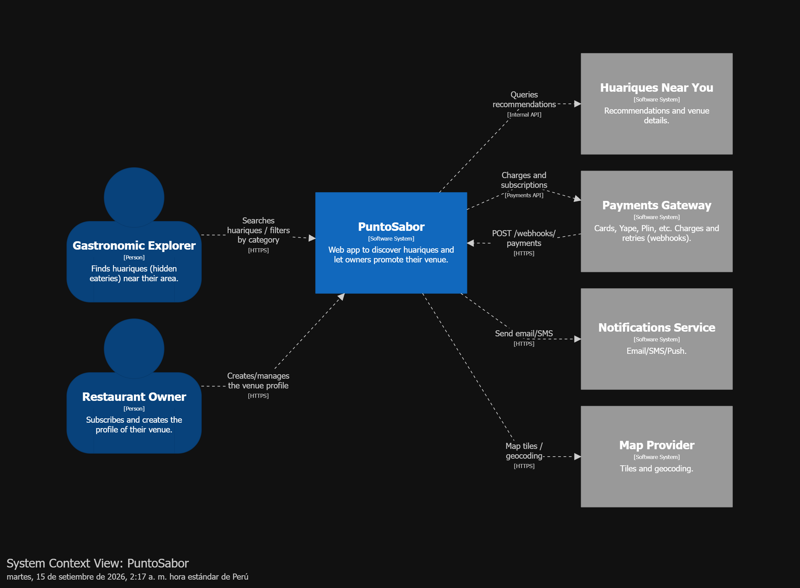

### 4.8.2. Software Architecture Container Diagrams

El diagrama de contenedores muestra los componentes internos del sistema PuntoSabor:

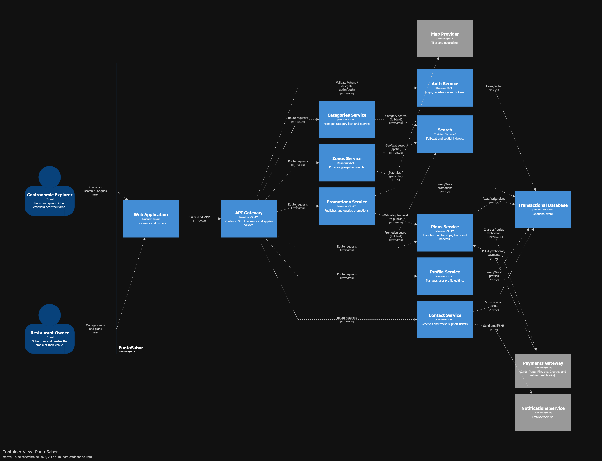

### 4.8.3. Software Architecture Components Diagrams

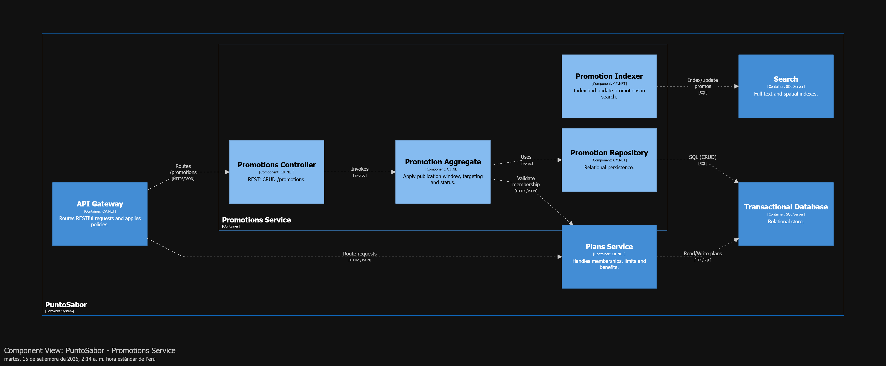

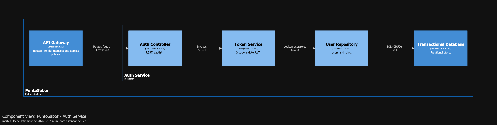

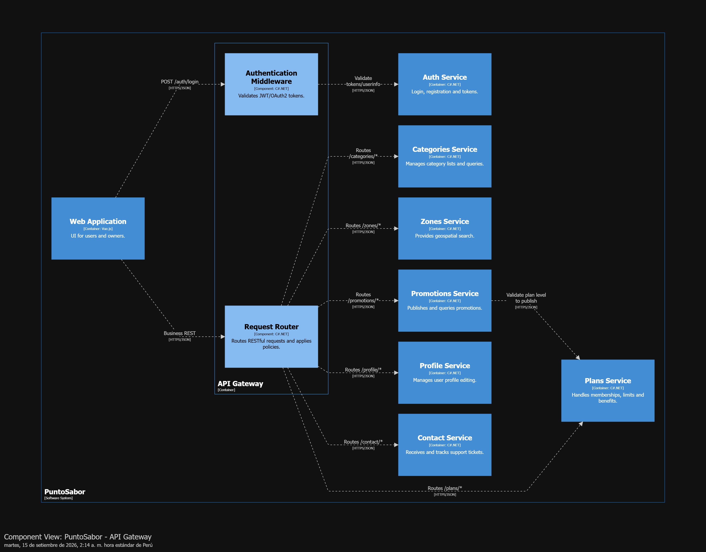

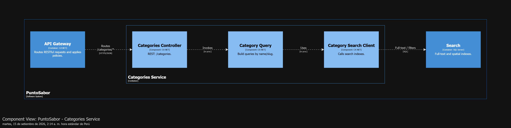

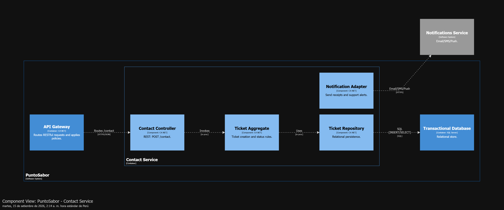

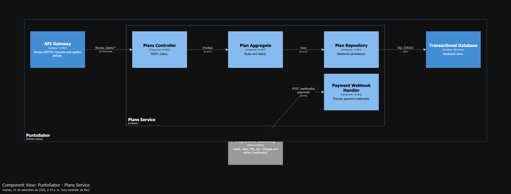

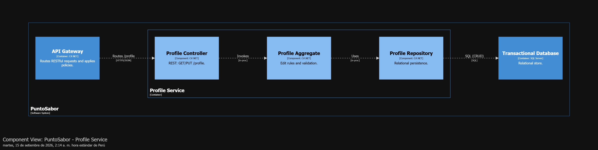

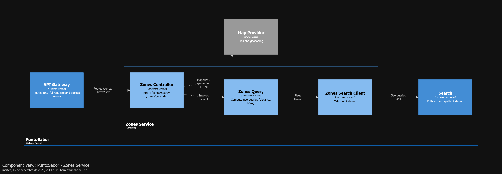

## 4.9. Software Object-Oriented Design

### 4.9.1. Class Diagrams

El siguiente diagrama de clases representa el modelo de dominio del backend de PuntoSabor, implementado en ASP.NET Core con Entity Framework Core. Todas las entidades principales heredan de la clase abstracta `AuditableEntity`, que centraliza los campos de auditoría (`Id`, `CreatedAt`, `UpdatedAt`). Se identifican las relaciones entre `User` (usuarios exploradores y dueños), `Huarique` (locales gastronómicos), `Category`, `Review`, `Favorite`, `Promo`, `Report`, `UserPreference`, y el módulo de membresías compuesto por `Plan` y `Subscription`.


```mermaid
classDiagram
    class AuditableEntity {
        <<abstract>>
        +int Id
        +DateTime CreatedAt
        +DateTime? UpdatedAt
    }

    class UserRole {
        <<enumeration>>
        Consumer
        Owner
    }

    class User {
        +string Name
        +string Email
        +string PasswordHash
        +UserRole Role
    }

    class Huarique {
        +string Name
        +string Category
        +int CategoryId
        +decimal Price
        +double Rating
        +string District
        +bool Near
        +double? Latitude
        +double? Longitude
        +int? OwnerId
        +string? Address
        +string? Phone
        +string? Description
        +string? ImageUrl
        +byte[]? ImageData
        +string? ImageContentType
        +string? OpenAt
        +string? CloseAt
        +bool DeliveryAvailable
        +bool TakeawayAvailable
        +bool DineInAvailable
    }

    class Category {
        +string Name
    }

    class Review {
        +int HuariqueId
        +int UserId
        +int Rating
        +string Comment
        +DateTime CreatedAtReview
    }

    class Favorite {
        +int UserId
        +int HuariqueId
    }

    class Plan {
        +string Id
        +string Name
        +decimal Price
    }

    class Subscription {
        +int UserId
        +string PlanId
        +DateTime StartDate
        +DateTime? EndDate
        +string Status
        +bool IsActive
    }

    class Promo {
        +string Title
        +string Note
        +string Type
        +int Discount
        +string? Code
        +DateTime? StartDate
        +DateTime? EndDate
        +int? MaxUses
        +int CurrentUses
        +int? HuariqueId
        +string? ImageUrl
        +bool IsActive
    }

    class Notification {
        +int UserId
        +string Title
        +string Body
        +bool IsRead
    }

    class Report {
        +int HuariqueId
        +int UserId
        +string Reason
        +string Status
    }

    class UserPreference {
        +int UserId
        +string? PreferredCategory
        +decimal? MaxBudget
        +string? PreferredDistrict
        +bool NotificationsEnabled
    }

    AuditableEntity <|-- User
    AuditableEntity <|-- Huarique
    AuditableEntity <|-- Category
    AuditableEntity <|-- Review
    AuditableEntity <|-- Favorite
    AuditableEntity <|-- Subscription
    AuditableEntity <|-- Promo
    AuditableEntity <|-- Notification
    AuditableEntity <|-- Report
    AuditableEntity <|-- UserPreference

    User "1" *-- "1" UserRole : role
    User "1" --> "0..*" Huarique : owns
    User "1" --> "0..*" Review : writes
    User "1" --> "0..*" Favorite : marks
    User "1" --> "0..*" Subscription : subscribes
    User "1" --> "0..*" Notification : receives
    User "1" --> "0..*" Report : submits
    User "1" --> "0..1" UserPreference : configures

    Huarique "1" --> "0..*" Review : receives
    Huarique "1" --> "0..*" Favorite : saved as
    Huarique "1" --> "0..*" Promo : offers
    Huarique "1" --> "0..*" Report : reported in
    Category "1" --> "0..*" Huarique : classifies

    Plan "1" --> "0..*" Subscription : subscribed via
```

**Notas sobre el diseño:**

- `User.Role` distingue entre dos tipos de usuario (`Consumer` y `Owner`) dentro de la misma entidad, en lugar de usar herencia, ya que un usuario puede cambiar de rol sin perder su historial (reseñas, favoritos, suscripciones).
- `Huarique.OwnerId` es opcional (`int?`) porque un huarique puede registrarse antes de asociarse formalmente a un dueño verificado.
- `Plan` no hereda de `AuditableEntity`: su identificador es un `string` (slug del plan, p. ej. `"premium"`) en lugar de un `int` autogenerado, ya que los planes son un catálogo fijo definido por el negocio, no registros creados dinámicamente por usuarios.
- `Subscription.IsActive` y `Promo.IsActive` son propiedades calculadas (no almacenadas en base de datos), derivadas de las fechas de vigencia y el estado, evitando inconsistencias entre el estado guardado y la fecha actual.

### 4.9.2. Class Dictionary

A continuación se describe cada clase del modelo de dominio junto con sus atributos, tipo de dato y una breve descripción de su propósito.

**AuditableEntity** *(clase abstracta)*

| Atributo | Tipo | Descripción |
| --- | --- | --- |
| Id | int | Identificador único autogenerado del registro. |
| CreatedAt | DateTime | Fecha y hora de creación del registro (UTC). |
| UpdatedAt | DateTime? | Fecha y hora de la última actualización del registro; nulo si nunca fue modificado. |

**User**

| Atributo | Tipo | Descripción |
| --- | --- | --- |
| Name | string | Nombre visible del usuario dentro de la plataforma. |
| Email | string | Correo electrónico único, utilizado como credencial de autenticación. |
| PasswordHash | string | Contraseña del usuario cifrada con BCrypt; nunca se almacena en texto plano. |
| Role | UserRole | Rol asignado al usuario: `Consumer` (explorador) u `Owner` (dueño de huarique). |

**UserRole** *(enumeración)*

| Valor | Descripción |
| --- | --- |
| Consumer | Usuario explorador que busca, reseña y guarda huariques como favoritos. |
| Owner | Usuario propietario que registra y gestiona uno o más huariques. |

**Huarique**

| Atributo | Tipo | Descripción |
| --- | --- | --- |
| Name | string | Nombre comercial del huarique mostrado a los exploradores. |
| Category | string | Nombre de la categoría gastronómica (denormalizado para lecturas rápidas). |
| CategoryId | int | Identificador de la categoría asociada (`Category`). |
| Price | decimal | Precio referencial o ticket promedio del huarique. |
| Rating | double | Calificación promedio calculada a partir de las reseñas recibidas. |
| District | string | Distrito donde se ubica el huarique. |
| Near | bool | Indica si el huarique se muestra como cercano según la ubicación del usuario. |
| Latitude | double? | Coordenada de latitud, usada para mapas y cálculo de rutas. |
| Longitude | double? | Coordenada de longitud, usada para mapas y cálculo de rutas. |
| OwnerId | int? | Identificador del usuario dueño del huarique; nulo si aún no fue reclamado. |
| Address | string? | Dirección textual del local. |
| Phone | string? | Número de contacto del huarique. |
| Description | string? | Descripción libre del negocio, redactada por el dueño. |
| ImageUrl | string? | URL externa de una imagen representativa del huarique. |
| ImageData | byte[]? | Contenido binario de una imagen almacenada directamente en la base de datos (LONGBLOB). |
| ImageContentType | string? | Tipo MIME de `ImageData` (p. ej. `image/jpeg`). |
| OpenAt | string? | Hora de apertura del local. |
| CloseAt | string? | Hora de cierre del local. |
| DeliveryAvailable | bool | Indica si el huarique ofrece servicio de delivery. |
| TakeawayAvailable | bool | Indica si el huarique ofrece servicio para llevar. |
| DineInAvailable | bool | Indica si el huarique permite consumo en el local. |

**Category**

| Atributo | Tipo | Descripción |
| --- | --- | --- |
| Name | string | Nombre de la categoría gastronómica (p. ej. "Pollería", "Marina"). |

**Review**

| Atributo | Tipo | Descripción |
| --- | --- | --- |
| HuariqueId | int | Identificador del huarique reseñado. |
| UserId | int | Identificador del usuario autor de la reseña. |
| Rating | int | Calificación numérica otorgada por el usuario (rango típico 1 a 5). |
| Comment | string | Comentario escrito describiendo la experiencia del usuario. |
| CreatedAtReview | DateTime | Fecha y hora en la que se registró la reseña. |

**Favorite**

| Atributo | Tipo | Descripción |
| --- | --- | --- |
| UserId | int | Identificador del usuario que marcó el huarique como favorito. |
| HuariqueId | int | Identificador del huarique guardado como favorito. |

**Plan**

| Atributo | Tipo | Descripción |
| --- | --- | --- |
| Id | string | Identificador del plan de membresía (slug fijo, p. ej. `"premium"`). |
| Name | string | Nombre comercial del plan. |
| Price | decimal | Precio del plan de membresía. |

**Subscription**

| Atributo | Tipo | Descripción |
| --- | --- | --- |
| UserId | int | Identificador del usuario suscrito. |
| PlanId | string | Identificador del plan contratado (`Plan`). |
| Plan | Plan? | Propiedad de navegación hacia el plan asociado. |
| StartDate | DateTime | Fecha de inicio de la suscripción. |
| EndDate | DateTime? | Fecha de finalización de la suscripción; nulo si no tiene vencimiento. |
| Status | string | Estado de la suscripción: `active`, `cancelled` o `expired`. |
| IsActive | bool | Propiedad calculada que indica si la suscripción está vigente según `Status` y `EndDate`. |

**Promo**

| Atributo | Tipo | Descripción |
| --- | --- | --- |
| Title | string | Título de la promoción mostrado al usuario. |
| Note | string | Nota o condición adicional de la promoción. |
| Type | string | Tipo de promoción: `2x1`, `descuento`, `menu`, `happy-hour` u `otro`. |
| Discount | int | Porcentaje de descuento; cero si no aplica. |
| Code | string? | Código de canje opcional de la promoción. |
| StartDate | DateTime? | Fecha desde la cual la promoción está activa. |
| EndDate | DateTime? | Fecha en la que la promoción expira. |
| MaxUses | int? | Número máximo de usos permitidos; nulo significa ilimitado. |
| CurrentUses | int | Número de veces que la promoción ha sido utilizada. |
| HuariqueId | int? | Identificador del huarique al que pertenece la promoción. |
| ImageUrl | string? | URL opcional del banner promocional. |
| IsActive | bool | Propiedad calculada que indica si la promoción está vigente según fechas y usos disponibles. |

**Notification**

| Atributo | Tipo | Descripción |
| --- | --- | --- |
| UserId | int | Identificador del usuario que recibe la notificación. |
| Title | string | Título breve que resume el contenido de la notificación. |
| Body | string | Mensaje detallado de la notificación. |
| IsRead | bool | Indica si el usuario ya leyó la notificación. |

**Report**

| Atributo | Tipo | Descripción |
| --- | --- | --- |
| HuariqueId | int | Identificador del huarique reportado. |
| UserId | int | Identificador del usuario que envía el reporte. |
| Reason | string | Descripción de la información incorrecta encontrada en el huarique. |
| Status | string | Estado del reporte: `pending` o `reviewed`. |

**UserPreference**

| Atributo | Tipo | Descripción |
| --- | --- | --- |
| UserId | int | Identificador del usuario propietario de las preferencias. |
| PreferredCategory | string? | Categoría de cocina preferida por el usuario. |
| MaxBudget | decimal? | Presupuesto máximo por persona que el usuario está dispuesto a gastar. |
| PreferredDistrict | string? | Distrito preferido para recibir recomendaciones. |
| NotificationsEnabled | bool | Indica si el usuario tiene activadas las notificaciones. |

## 4.10. Database Design

PuntoSabor utiliza una base de datos relacional MySQL, gestionada mediante Entity Framework Core con el enfoque `Database.EnsureCreated()` (sin migraciones formales). Debido a esto, la mayoría de las relaciones entre entidades se implementan como columnas enteras de referencia (p. ej. `HuariqueId`, `UserId`) sin claves foráneas físicas impuestas por el motor de base de datos, salvo en los casos donde el equipo definió explícitamente la relación mediante Fluent API. A continuación se presenta el diagrama relacional y el detalle de las restricciones aplicadas.

### 4.10.1. Relational/Non-Relational Database Diagram


```mermaid
erDiagram
    USERS ||--o{ HUARIQUES : owns
    USERS ||--o{ REVIEWS : writes
    USERS ||--o{ FAVORITES : marks
    USERS ||--o{ SUBSCRIPTIONS : subscribes
    USERS ||--o{ NOTIFICATIONS : receives
    USERS ||--o{ REPORTS : submits
    USERS ||--o| USER_PREFERENCES : configures

    CATEGORIES ||--o{ HUARIQUES : classifies
    HUARIQUES ||--o{ REVIEWS : receives
    HUARIQUES ||--o{ FAVORITES : "saved as"
    HUARIQUES ||--o{ PROMOS : offers
    HUARIQUES ||--o{ REPORTS : "reported in"

    PLANS ||--o{ SUBSCRIPTIONS : "subscribed via"

    USERS {
        int Id PK
        varchar Name
        varchar Email UK
        varchar PasswordHash
        int Role
        datetime CreatedAt
        datetime UpdatedAt
    }

    CATEGORIES {
        int Id PK
        varchar Name
        datetime CreatedAt
        datetime UpdatedAt
    }

    HUARIQUES {
        int Id PK
        varchar Name
        varchar Category
        int CategoryId FK
        decimal Price
        double Rating
        varchar District
        boolean Near
        double Latitude
        double Longitude
        int OwnerId FK
        varchar Address
        varchar Phone
        varchar Description
        varchar ImageUrl
        longblob ImageData
        varchar ImageContentType
        varchar OpenAt
        varchar CloseAt
        boolean DeliveryAvailable
        boolean TakeawayAvailable
        boolean DineInAvailable
        datetime CreatedAt
        datetime UpdatedAt
    }

    REVIEWS {
        int Id PK
        int HuariqueId FK
        int UserId FK
        int Rating
        varchar Comment
        datetime CreatedAtReview
        datetime CreatedAt
        datetime UpdatedAt
    }

    FAVORITES {
        int Id PK
        int UserId FK
        int HuariqueId FK
        datetime CreatedAt
        datetime UpdatedAt
    }

    PLANS {
        varchar Id PK
        varchar Name
        decimal Price
    }

    SUBSCRIPTIONS {
        int Id PK
        int UserId FK
        varchar PlanId FK
        datetime StartDate
        datetime EndDate
        varchar Status
        datetime CreatedAt
        datetime UpdatedAt
    }

    PROMOS {
        int Id PK
        varchar Title
        varchar Note
        varchar Type
        int Discount
        varchar Code
        datetime StartDate
        datetime EndDate
        int MaxUses
        int CurrentUses
        int HuariqueId FK
        varchar ImageUrl
        datetime CreatedAt
        datetime UpdatedAt
    }

    NOTIFICATIONS {
        int Id PK
        int UserId FK
        varchar Title
        varchar Body
        boolean IsRead
        datetime CreatedAt
        datetime UpdatedAt
    }

    REPORTS {
        int Id PK
        int HuariqueId FK
        int UserId FK
        varchar Reason
        varchar Status
        datetime CreatedAt
        datetime UpdatedAt
    }

    USER_PREFERENCES {
        int Id PK
        int UserId FK
        varchar PreferredCategory
        decimal MaxBudget
        varchar PreferredDistrict
        boolean NotificationsEnabled
        datetime CreatedAt
        datetime UpdatedAt
    }
```

**Restricciones e índices aplicados por EF Core (Fluent API):**

| Tabla | Restricción | Descripción |
| --- | --- | --- |
| `Plans` | Clave primaria `Id` (string, máx. 50 caracteres) | El plan usa un identificador tipo slug en lugar de un entero autoincremental. |
| `Subscriptions` | FK real `PlanId` → `Plans.Id`, `OnDelete: Restrict` | Es la única relación con clave foránea físicamente impuesta; impide eliminar un plan que tenga suscripciones asociadas. |
| `Favorites` | Índice único compuesto (`UserId`, `HuariqueId`) | Evita que un mismo usuario marque el mismo huarique como favorito más de una vez. |
| `UserPreferences` | Índice único en `UserId` | Garantiza una única fila de preferencias por usuario (relación 1 a 1 con `Users`). |
| `Huariques.ImageData` | Tipo de columna `LONGBLOB` | Permite almacenar la imagen del huarique directamente en la base de datos en lugar de un storage externo. |

**Nota sobre integridad referencial:** columnas como `Huariques.OwnerId`, `Huariques.CategoryId`, `Reviews.HuariqueId`, `Reviews.UserId`, `Reports.HuariqueId`, `Reports.UserId`, `Promos.HuariqueId` y `Notifications.UserId` se comportan como claves foráneas a nivel lógico/de negocio, pero **no** están declaradas como Foreign Key constraints en el motor MySQL, ya que el modelo de dominio no define propiedades de navegación (`ICollection<T>` u objetos relacionados) para esas entidades, y el proyecto no usa migraciones formales de EF Core. La consistencia de estos datos depende de la lógica de validación en los Controllers del backend, no de restricciones a nivel de base de datos.

# Capítulo V: Product Implementation

## 5.1. Software Configuration Management

En esta sección se detalla cómo se implementa, organiza y publica HuariApp, compuesto por tres componentes principales:

1. **Landing Page (HTML/CSS/JS estático):** publicada en GitHub Pages.
2. **Backend (C#/.NET 8):** API REST desplegada en Railway.
3. **Aplicación Móvil (Android/Kotlin con Jetpack Compose):** la interfaz principal del usuario, con las pantallas core de la plataforma.

El objetivo es mantener la consistencia del desarrollo entre los tres componentes y documentar las convenciones de código para futuras iteraciones.

### 5.1.1. Software Development Environment Configuration

**Landing Page (HuariqueHub-Landing)**
- Tecnologías: HTML5, CSS3, JavaScript (vanilla).
- Responsive Web Design: CSS (Flexbox/Grid + media queries).
- Editor: Visual Studio Code.
- Control de versiones: Git + GitHub.
- Plataforma de despliegue: GitHub Pages.

Estructura:
- `index.html` (página principal)
- `css/style.css` (hoja de estilos)
- `img/` (recursos de imágenes)

**Backend (HuariqueHub-Backend)**
- Framework: .NET 8
- Lenguaje: C#
- IDE: Visual Studio 2022 o Visual Studio Code con extensión C#.
- Control de versiones: Git + GitHub.
- Plataforma de despliegue: Railway (contenedor Docker + base de datos MySQL 8).
- **URL pública del backend:** <[https://huariquehub-backend.up.railway.app](https://puntosabor-backend-production-91fb.up.railway.app)>
- **Documentación de la API (Swagger / OpenAPI):** <[https://huariquehub-backend.up.railway.app/swagger](https://puntosabor-backend-production-91fb.up.railway.app/swagger/index.html)>

**Aplicación Móvil (HuariqueHub-App)**
- Lenguaje: Kotlin
- Framework UI: Jetpack Compose
- Nombre del proyecto: `HuariqueHub-Mobile`
- IDE: Android Studio.
- Control de versiones: Git + GitHub.

### 5.1.2. Source Code Management

**Repositorios GitHub (actual)**
- `HuariqueHub-Landing` (Landing Page estática HTML/CSS/JS, desplegada en GitHub Pages).
- `HuariqueHub-Backend` (API REST en C#/.NET 8, desplegada en Railway).
- `HuariqueHub-App` (Aplicación móvil Android/Kotlin con Jetpack Compose).

**Flujo de trabajo (GitFlow ligero)**
- **Ramas principales**
  - `main`: versión estable publicada.
  - `develop`: integración previa a publicación.
- **Ramas de apoyo**
  - `feature/*`: nuevas funcionalidades o mejoras (p. ej., `feature/US01-home-screen`, `feature/auth-login`).
  - `hotfix/*`: correcciones urgentes sobre `main`.

**Versionado Semántico**
- **X (major)**: cambios incompatibles (reestructura global de navegación/archivos).
- **Y (minor)**: nuevas secciones o funcionalidades compatibles.
- **Z (patch)**: correcciones menores (estilos, textos, enlaces).
- Ejemplos: `v1.0`, `v1.1`.

**Conventional Commits**

Formato general:
```
<type>[scope]: <descripción>
```
Ejemplos:
- `feat: agregar pantalla de home con lista de huariques`
- `feat(auth): implementar pantalla de login con Jetpack Compose`
- `fix(api): corregir endpoint de búsqueda por distrito`
- `docs: actualizar pasos de despliegue en README`

### 5.1.3. Source Code Style Guide & Conventions

**Landing Page -HTML**
- Estructura semántica: `<header>`, `<nav>`, `<main>`, `<section>`, `<footer>`.
- Imágenes siempre con `alt`.
- Enlaces relativos y consistentes entre páginas.
- Scripts JS al final del `body` cuando corresponda.

**Landing Page -CSS**
- Uso de variables CSS (`:root { --color... }`) para colores y espaciados.
- Convención de clases en kebab-case (ej.: `.hero-title`, `.card-grid`).
- Layout con Flexbox y/o Grid.
- Media queries para puntos de quiebre (ej.: 960px, 760px, 560px).
- Estados y accesibilidad: `:hover`, `:focus-visible`, contraste adecuado.

**Landing Page -JavaScript**
- `const` / `let` (evitar `var`), funciones pequeñas y claras.
- Separar lógica de interacción del DOM cuando sea posible.
- Uso moderado de `localStorage` solo para preferencias/estado del cliente (si aplica).

**Backend -C# / .NET 8**
- Nombres en PascalCase para clases, métodos y propiedades.
- Estructura de capas: Domain, Application, Infrastructure, Presentation.
- Inyección de dependencias mediante el contenedor DI nativo de .NET.
- Métodos asíncronos con `async/await` (Task/Task<T>) para operaciones I/O.
- Documentación con comentarios XML (`///`) en métodos y clases públicas.

**Aplicación Móvil -Kotlin / Jetpack Compose**
- Variables y funciones en camelCase; clases y Composables en PascalCase.
- Composables pequeños, reutilizables y sin estado cuando sea posible.
- Navegación centralizada mediante `AppNavigation.kt` con Jetpack Compose Navigation.
- Corrutinas de Kotlin para operaciones asíncronas.
- Separación clara entre UI (`ui/screens/`) y datos (`data/model/`).

### 5.1.4. Software Deployment Configuration

Para la configuración del despliegue de PuntoSabor, se consideraron los entornos necesarios para publicar y ejecutar tanto la landing page como la aplicación móvil. El objetivo de esta configuración es permitir que el producto pueda ser probado por los usuarios y revisado por el equipo durante el avance del proyecto.

En esta etapa, la landing page se despliega como un sitio web estático, mientras que la aplicación móvil se ejecuta desde el entorno de desarrollo utilizando Android Studio. Esto permite validar la navegación, las pantallas principales y las funcionalidades implementadas durante el sprint.

#### Entorno de despliegue de la Landing Page

La landing page de PuntoSabor se publica mediante GitHub Pages, ya que esta herramienta permite alojar sitios estáticos de manera sencilla y accesible. Para ello, se utiliza el repositorio del proyecto, donde se almacenan los archivos HTML, CSS, JavaScript e imágenes necesarias para la presentación del producto.

Pasos considerados para el despliegue:

1. Subir los archivos de la landing page al repositorio de GitHub.
2. Verificar que la estructura de archivos sea correcta.
3. Activar GitHub Pages desde la configuración del repositorio.
4. Seleccionar la rama correspondiente para la publicación.
5. Validar que el sitio se visualice correctamente desde el enlace generado.
6. Revisar que las secciones principales sean accesibles desde el navegador.

#### Entorno de ejecución de la Aplicación Móvil

La aplicación móvil se desarrolla utilizando Kotlin y Jetpack Compose dentro de Android Studio. Para su ejecución, se utiliza un emulador Android o un dispositivo físico conectado al equipo de desarrollo.

Pasos considerados para la ejecución:

1. Clonar o descargar el repositorio del proyecto.
2. Abrir el proyecto en Android Studio.
3. Sincronizar las dependencias de Gradle.
4. Seleccionar un emulador o dispositivo Android.
5. Ejecutar la aplicación desde Android Studio.
6. Verificar el funcionamiento de las pantallas implementadas.

#### Consideraciones del despliegue

- La landing page debe mantenerse actualizada con la información principal del producto.
- La aplicación móvil debe ejecutarse correctamente en el entorno de pruebas.
- Los cambios deben registrarse mediante commits en GitHub.
- Las evidencias del despliegue deben incluir capturas de pantalla del sitio publicado y de la aplicación en ejecución.
- En futuras iteraciones, se podrá integrar un backend o servicios externos si el alcance del proyecto lo requiere.

## 5.2. Product Implementation & Deployment

### 5.2.1. Sprint Backlogs

Para el Sprint 1 se seleccionaron las historias de usuario más importantes para construir una primera versión funcional de PuntoSabor. Se priorizaron historias relacionadas con la presentación del producto, la búsqueda inicial de huariques y las primeras interacciones del usuario dentro de la aplicación móvil.

Las historias seleccionadas permiten mostrar un avance inicial tanto de la landing page como de la aplicación, manteniendo relación directa con los requisitos definidos previamente en la sección de User Stories.

| ID | User Story | Tipo | Epic relacionada | Responsable | Estado |
|---|---|---|---|---|---|
| US09 | Presentación de beneficios | Landing Page | EP04 | Becerra Llempen, Fabiola Dayane | Completado |
| US10 | Formulario de contacto | Landing Page | EP04 | Delgado Carrasco, Schneider | Completado |
| US01 | Búsqueda avanzada | App móvil | EP01 | Tumi Oliden, Manuel Ignacio | Completado |
| US02 | Visualización en mapa | App móvil | EP01 | Lopez Goitia, Carlos Alberto | Completado |
| US03 | Guardar favoritos | App móvil | EP01 | Vasquez Goicochea, Erick Alessander | Completado |
| US04 | Registro de nuevo huarique | App móvil | EP02 | Lopez Goitia, Carlos Alberto | Completado |
| US07 | Envío de reseñas | App móvil | EP03 | Becerra Llempen, Fabiola Dayane | Completado |
| US15 | Registro y login seguro | App móvil | EP07 | Tumi Oliden, Manuel Ignacio | Completado |


El objetivo principal del Sprint 2 fue habilitar el flujo completo de PuntoSabor conectado al backend real, incorporando funcionalidades de gestión del propietario, preferencias, notificaciones, membresías y promociones. La gestión del avance se realizó en el tablero de Trello del equipo, donde cada tarea se movió por los estados To-Do → In-Process → To-Review → Done.

- **Tablero de Trello (Sprint 2):** https://trello.com/invite/b/6a3b6709fd34f6edb2cc21af/ATTI7be4b37d5e727ef6f2e8092804bf2c3192D51CB7/puntosabor-app

Tablero del Sprint 2 en Trello


| Sprint # | User Story | | Work-Item / Task | | | | |
|---|---|---|---|---|---|---|---|
| | **Id** | **Title** | **Id** | **Title** | **Description** | **Estimation (Hours)** | **Assigned To** | **Status** |
| Sprint 2 | US05 | Actualizar información del huarique | T-01 | Conectar formulario de edición a `PATCH /huariques/{id}` | Implementar pantalla CreateEditHuariqueScreen con integración al endpoint de actualización del backend | 5 | Vasquez Goicochea, Erick Alessander | Done |
| Sprint 2 | US11 | Configurar notificaciones | T-02 | Implementar pantalla de preferencias de notificaciones | Desarrollar NotificationsScreen con opciones para activar/desactivar tipos de notificaciones del usuario | 4 | Tumi Oliden, Manuel Ignacio | Done |
| Sprint 2 | US12 | Recibir notificaciones de nuevas reseñas | T-03 | Integrar `GET /notifications` y `PATCH /notifications/{id}/read` | Conectar la pantalla de notificaciones al backend para listar alertas y marcarlas como leídas | 4 | Becerra Llempen, Fabiola Dayane | Done |
| Sprint 2 | US16 | Recuperar contraseña | T-04 | Implementar ForgotPasswordScreen con `POST /auth/forgot-password` | Desarrollar pantalla de recuperación de contraseña integrada con el endpoint del backend | 3 | Vasquez Goicochea, Erick Alessander | Done |
| Sprint 2 | US17 | Guardar preferencias del usuario | T-05 | Integrar `GET /preferences` y `PUT /preferences` en PreferencesScreen | Implementar pantalla de preferencias con persistencia de tipo de comida, rango de precios y zona en el backend | 4 | Lopez Goitia, Carlos Alberto | Done |
| Sprint 2 | US18 | Sugerir huariques automáticamente | T-06 | Integrar `GET /huariques/suggestions` en HomeScreen | Conectar el endpoint de sugerencias para mostrar huariques personalizados según historial del usuario | 4 | Delgado Carrasco, Schneider | Done |
| Sprint 2 | US21 | Reportar información incorrecta | T-07 | Implementar `POST /reports` en HuariqueDetailScreen | Agregar opción de reporte en la pantalla de detalle del huarique integrada con el endpoint del backend | 3 | Tumi Oliden, Manuel Ignacio | Done |
| Sprint 2 | US23 | Seleccionar planes de membresía | T-08 | Integrar `GET /plans` y `POST /subscriptions` en SubscriptionScreen | Implementar pantalla de suscripción mostrando planes desde el backend con opción de activar membresía | 3 | Becerra Llempen, Fabiola Dayane | Done |
| Sprint 2 | US26 | Publicar promociones destacadas | T-09 | Integrar CRUD de promos en OwnerPromosScreen y CreateEditPromoScreen | Implementar gestión completa de promociones del propietario conectada a los endpoints `GET/POST/PATCH/DELETE /promos` | 5 | Vasquez Goicochea, Erick Alessander | Done |

Este Sprint Backlog permitió organizar el trabajo inicial del equipo y relacionar las tareas desarrolladas con las historias de usuario ya definidas en el proyecto. De esta manera, el avance del sprint mantiene coherencia con los requisitos funcionales de PuntoSabor.

El Sprint Backlog 3 se organizó tomando las funcionalidades pendientes del Product Backlog. Se priorizaron historias que completan la experiencia del usuario y del propietario dentro de PuntoSabor.

| ID | User Story | Descripción | Responsable | Estado |
|---|---|---|---|---|
| US20 | Horario verificado | Mostrar información actualizada sobre los horarios de atención del huarique. | Delgado Carrasco, Schneider | Done |
| US22 | Estado abierto/cerrado | Mostrar si un huarique se encuentra abierto o cerrado según su horario. | Becerra Llempen, Fabiola Dayane | Done |
| US24 | Pagar suscripción | Permitir al propietario seleccionar y pagar una membresía. | Lopez Goitia, Carlos Alberto | Done |
| US25 | Comprobantes | Permitir consultar la información relacionada con el pago realizado. | Vasquez Goicochea, Erick Alessander | Done |
| US26 | Promociones destacadas | Mejorar la visibilidad de las promociones dentro de los listados de la aplicación. | Tumi Oliden, Manuel Ignacio | Done |

Durante el sprint, las tareas fueron organizadas y revisadas de acuerdo con su avance. El equipo utilizó GitHub para registrar los cambios y mantener separados los avances realizados en la aplicación móvil y el backend.

### 5.2.2. Implemented Landing Page Evidence

Se ha hecho una landing page para la aplicación enfocandonos en que cumplan con las historias de usuario establecidas. Está landing page servira como punto de partidua para que nuevos usuarios usen nuestra aplicación.

El deploy de la landing page se hizo mediante GithubPages.

link: https://huariapp.github.io/PuntoSabor-Landing/

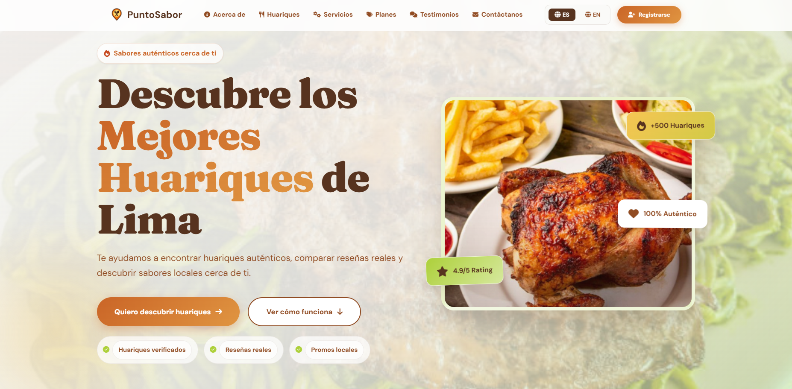

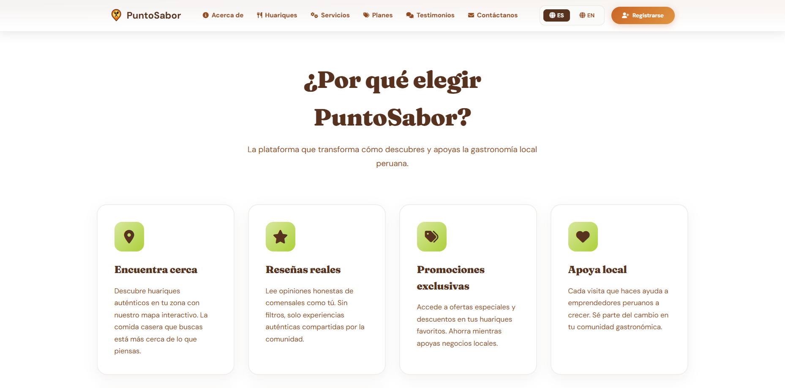

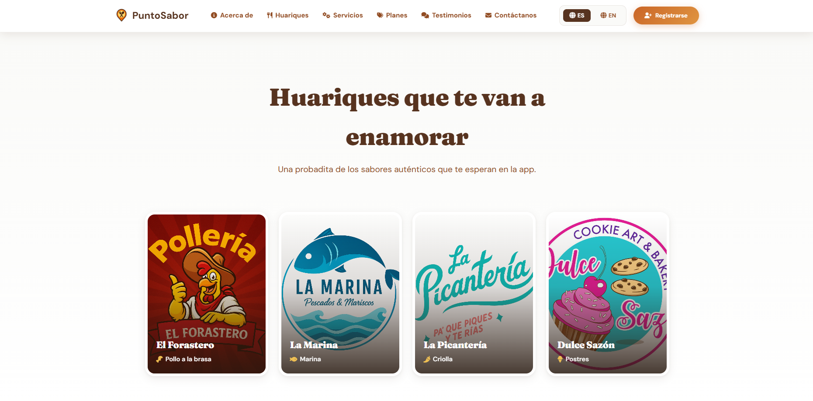

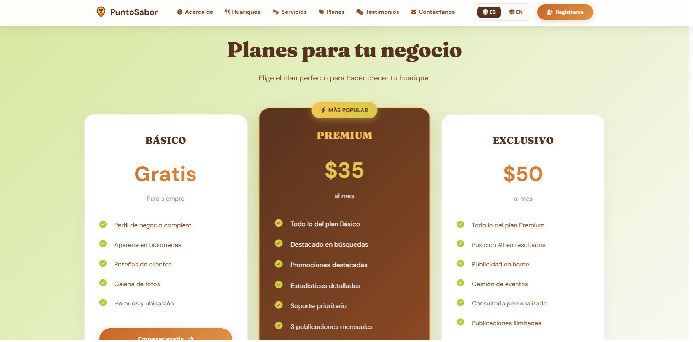

### 5.2.3. Implemented Frontend-Web Application Evidence

El FrontEnd fue realizado teniendo en cuenta los modelos hechos en los wireframes y mock-ups e igualmente se tomaron en cuenta las historias de usuarios.

link: https://punto-sabor-front.vercel.app

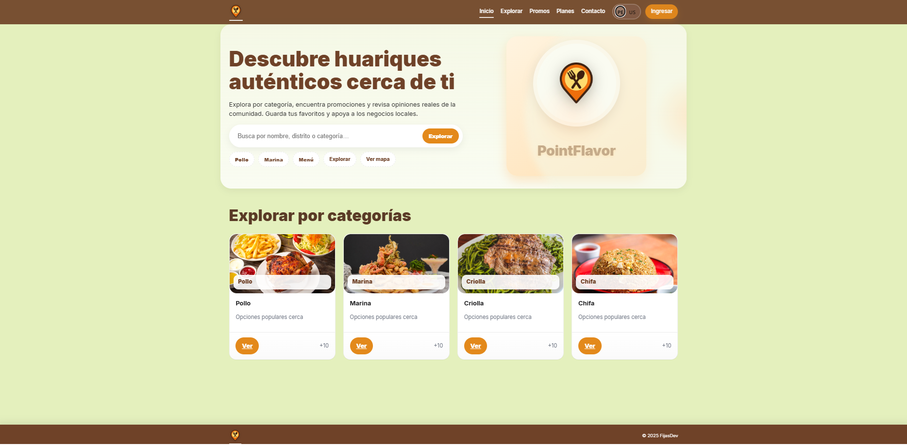

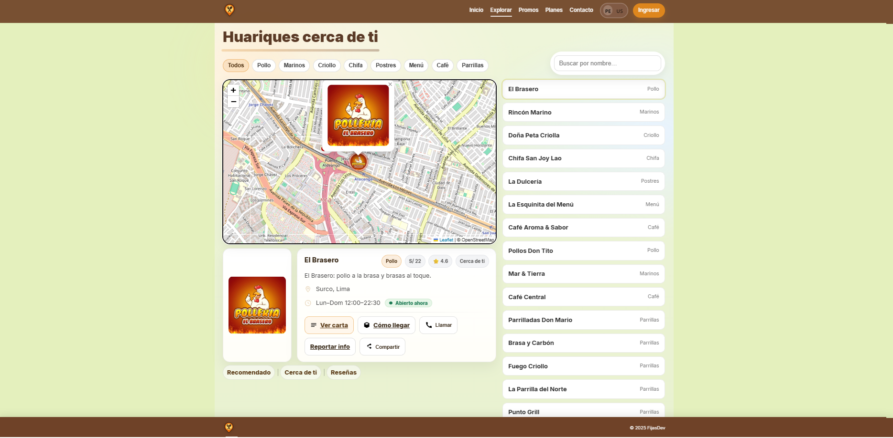

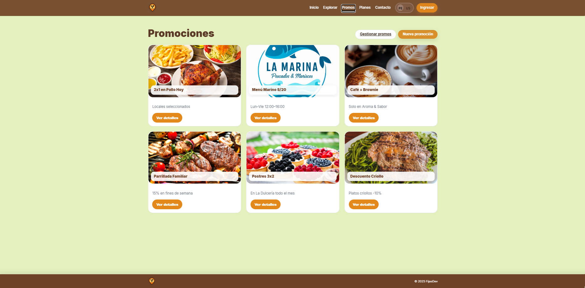

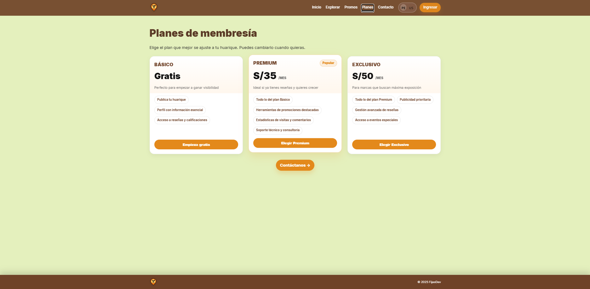

### 5.2.4. Acuerdo de Servicio - SaaS

El presente Acuerdo de Servicio establece los derechos, obligaciones y restricciones aplicables a los usuarios de **PuntoSabor**, plataforma tecnológica desarrollada por el equipo **HuariApp** en el marco de un proyecto académico. Su objetivo es garantizar transparencia en el uso del servicio, tanto para los usuarios que buscan huariques (Exploradores Gastronómicos) como para los propietarios que registran y gestionan su negocio (Dueños de Huarique). Este documento se integra públicamente en la sección "Términos y Condiciones" del Landing Page, enlazada desde el pie de página (footer) del sitio, así como desde el flujo de registro de la aplicación móvil (`TermsConditionsScreen` en AppFlutter), unificando y ampliando el contenido ya esbozado en dicha pantalla con el detalle completo de derechos, obligaciones, planes de membresía y política de cancelación que exige este acuerdo. Su redacción sigue los principios de responsabilidad ética y profesional del código de ética de la ingeniería de software de ACM/IEEE y del Colegio de Ingenieros del Perú (CIP), priorizando la claridad hacia el usuario por sobre el interés unilateral de la plataforma.

**1. Aceptación del Acuerdo**

Al crear una cuenta, registrar un huarique o utilizar cualquier funcionalidad de PuntoSabor (web, aplicación móvil o landing page), el usuario declara haber leído, entendido y aceptado los términos aquí descritos. Si el usuario no está de acuerdo con alguna disposición, debe abstenerse de utilizar la plataforma.

**2. Descripción del Servicio**

PuntoSabor es una plataforma que conecta a Exploradores Gastronómicos con huariques (negocios de comida tradicional), permitiendo la búsqueda geolocalizada de locales, la publicación y consulta de reseñas, la gestión de perfiles de negocio, y el acceso a planes de membresía para incrementar la visibilidad de un huarique dentro de la plataforma.

**3. Cuentas de Usuario**

- 3.1. Para acceder a las funcionalidades personalizadas de la plataforma, el usuario debe registrar una cuenta con un correo electrónico válido y una contraseña, la cual se almacena de forma cifrada y nunca en texto plano.
- 3.2. El usuario es responsable de mantener la confidencialidad de sus credenciales y de toda actividad realizada desde su cuenta.
- 3.3. El usuario puede solicitar la eliminación de su cuenta en cualquier momento desde la sección de perfil, lo cual cierra su sesión de forma permanente.
**4. Derechos y Obligaciones del Explorador Gastronómico**

- 4.1. El explorador puede buscar, filtrar y visualizar huariques, guardar favoritos, publicar reseñas y calificaciones, y configurar sus preferencias de recomendación.
- 4.2. Las reseñas publicadas deben reflejar experiencias reales del usuario y no deben contener lenguaje ofensivo, contenido falso o información que perjudique injustamente a un negocio. PuntoSabor se reserva el derecho de moderar o retirar reseñas que incumplan esta condición.
- 4.3. El explorador puede reportar información incorrecta sobre un huarique (horarios, ubicación, datos de contacto), reporte que será revisado por el equipo antes de reflejarse como cambio en la plataforma.
**5. Derechos y Obligaciones del Dueño de Huarique**

- 5.1. El dueño puede registrar uno o más huariques, incluyendo nombre, categoría, ubicación, horarios, fotografías y descripción del negocio.
- 5.2. El dueño es responsable de la veracidad de la información publicada sobre su negocio (precios, horarios de atención, disponibilidad de delivery/takeaway/dine-in).
- 5.3. El dueño puede responder a las reseñas recibidas y recibir notificaciones cuando su huarique reciba nuevas calificaciones o comentarios.
- 5.4. El dueño puede optar por un plan de membresía (ver sección 6) para acceder a beneficios adicionales de visibilidad.
**6. Planes de Membresía y Pagos**

PuntoSabor ofrece tres planes dirigidos a los Dueños de Huarique:

| Plan | Precio | Beneficios principales |
|---|---|---|
| **Básico** | Gratis | Perfil de negocio completo, aparición en búsquedas, reseñas de clientes, galería de fotos, horarios y ubicación. |
| **Premium** | $35/mes (15 días de prueba gratuita) | Todo lo del plan Básico, destacado en búsquedas, promociones destacadas, estadísticas detalladas, soporte prioritario, 3 publicaciones mensuales. |
| **Exclusivo** | $50/mes | Todo lo del plan Premium, posición #1 en resultados, publicidad en home, gestión de eventos, consultoría personalizada, publicaciones ilimitadas. |

- 6.1. Los pagos de los planes Premium y Exclusivo se procesan mediante tarjeta o billetera digital dentro de la plataforma, y generan un comprobante descargable por parte del dueño.
- 6.2. **Cancelación:** el dueño puede cancelar su membresía en cualquier momento desde su panel. Al cancelar, el plan permanece activo con todos sus beneficios hasta el final del periodo ya pagado; al concluir dicho periodo, la suscripción no se renueva automáticamente y el perfil del negocio vuelve a las condiciones del plan Básico.
- 6.3. **Reembolsos:** PuntoSabor no realiza reembolsos parciales ni totales por cancelaciones realizadas dentro de un periodo de facturación ya iniciado.
- 6.4. El incumplimiento de pago de un periodo vigente puede resultar en la suspensión de los beneficios del plan contratado hasta la regularización del mismo.
**7. Contenido Generado por el Usuario**

Al publicar reseñas, fotografías o cualquier otro contenido en PuntoSabor, el usuario otorga a la plataforma una licencia no exclusiva para mostrar dicho contenido dentro del servicio, con el único fin de operar y promocionar la plataforma. El usuario mantiene la titularidad de su contenido y puede solicitar su eliminación.

**8. Privacidad y Protección de Datos**

El tratamiento de los datos personales de los usuarios se rige según lo descrito en la Política de Privacidad de PuntoSabor, disponible en el mismo footer del Landing Page, cumpliendo con los principios de la Ley N° 29733, Ley de Protección de Datos Personales del Perú.

**9. Limitación de Responsabilidad**

PuntoSabor actúa como intermediario tecnológico entre exploradores y huariques; no participa directamente en la preparación de alimentos ni en la atención presencial de los negocios listados, por lo que no es responsable de la calidad del servicio, higiene o experiencia brindada por cada huarique. La plataforma tampoco garantiza la disponibilidad ininterrumpida del servicio, al tratarse de un producto en desarrollo continuo dentro de un contexto académico.

**10. Modificaciones al Acuerdo**

PuntoSabor podrá actualizar este Acuerdo de Servicio en cualquier momento para reflejar cambios en la plataforma o en la normativa aplicable. Las modificaciones relevantes serán comunicadas mediante un aviso visible en el Landing Page y/o la aplicación.

**11. Legislación Aplicable**

Este Acuerdo se rige por las leyes de la República del Perú. Cualquier controversia derivada de su interpretación o cumplimiento será resuelta conforme a la legislación peruana vigente.

**12. Contacto**

Para consultas relacionadas con este Acuerdo de Servicio, el usuario puede escribir a **contacto@puntosabor.com** o comunicarse al **+51 963 179 684**.

### 5.2.5. Implemented Native-Mobile Application Evidence

La aplicación móvil de PuntoSabor fue desarrollada de forma incremental a lo largo de tres sprints:
 
**Sprint 1 — Pantallas core:**
- Login (correo y contraseña)
- Home con búsqueda, filtro por categorías y huariques destacados
- Detalle de huarique (categoría, dirección, teléfono, horario, descripción, valoración)
- Registro de reseñas (calificación + comentario)
- Marcado de favoritos
**Sprint 2 — Integración real con backend público (Railway):**
- Autenticación con JWT (login + registro con auto-login)
- Descubrimiento de huariques consumiendo `GET /huariques` (datos reales, ya no locales)
- Gestión del propietario: crear/editar huarique (`POST`/`PATCH /huariques`)
- Preferencias de usuario (`GET`/`PUT /preferences`)
- Notificaciones (`GET /notifications`, `PATCH /notifications/{id}/read`)
- Recuperación de contraseña (`POST /auth/forgot-password`)
- Suscripción a membresías (`GET /plans`, `POST /subscriptions`)
- Gestión de promociones del propietario (CRUD completo)
- Reporte de información incorrecta (`POST /reports`)
- Sugerencias personalizadas (`GET /huariques/suggestions`)
Durante esta etapa se detectaron y corrigieron bugs de contrato entre app y backend (verbo HTTP incorrecto en edición, falta de `categoryId`, ausencia de token tras registro).
 
**Sprint 3 — Cierre funcional:**
- Visualización de horario verificado del huarique
- Estado abierto/cerrado según horario
- Flujo de pago de suscripción (membresías)
- Comprobantes de pago
- Promociones destacadas con mayor visibilidad en los listados
**Evidencia de ejecución (emulador Android):**
 
| Funcionalidad | Evidencia |
|---|---|
| Login / Registro con JWT | Capturas de autenticación contra `/auth/login` y `/users` |
| Home con datos reales | Búsqueda, categorías y huariques destacados |
| Detalle + reseñas | Lectura y publicación de reseñas vía API |
| Gestión del propietario | Creación y edición de huarique conectada al backend |
| Horarios y estado | Visualización de horario y estado abierto/cerrado |
| Membresías y comprobantes | Flujo de suscripción y comprobante de pago |
| Promociones | Visualización de promociones destacadas |
 
**Repositorios:**
- App (nativa/Kotlin, Sprint 1-2): `HuariqueHub/HuariqueHub-App`
- App (Flutter, cross-platform): `HuariqueHub/HuariqueHub-AppFlutter`
---

### 5.2.6. Implemented RESTful API and/or Serverless Backend Evidence

El backend de PuntoSabor está desarrollado en **.NET 8 / C#**, desplegado al **100% en Railway** (contenedor Docker + base de datos MySQL 8), accesible públicamente.
 
| Servicio | Endpoints principales | Estado |
|---|---|---|
| Auth | `POST /auth/login`, `POST /auth/forgot-password` | Integrado |
| Users | `POST /users`, `GET /users`, `GET/PATCH/DELETE /auth/users/{id}` | Integrado |
| Huariques | `GET /huariques`, `GET /huariques/{id}`, `POST`, `PATCH`, `DELETE /huariques/{id}`, `GET /huariques/suggestions` | Integrado |
| Categories | `GET /categories` | Integrado |
| Reviews | `GET /reviews`, `POST /reviews` | Integrado |
| Preferences | `GET /preferences`, `PUT /preferences` | Integrado |
| Notifications | `GET /notifications`, `PATCH /notifications/{id}/read` | Integrado |
| Plans / Subscriptions | `GET /plans`, `GET/POST /subscriptions` | Integrado |
| Promos | `GET/POST/PATCH/DELETE /promos`, `POST /promos/{id}/use` | Integrado |
| Reports | `POST /reports` | Integrado |
 
**Evidencia de despliegue:**
- Backend público: https://huariquehub-backend.up.railway.app
- Repositorio: https://github.com/HuariqueHub/HuariqueHub-Backend
---

### 5.2.7. RESTful API documentation

La documentación de la API está publicada mediante **Swagger/OpenAPI**, accesible directamente desde el navegador:
 
**Swagger:** https://huariquehub-backend.up.railway.app/swagger
 
Esta documentación cubre todos los servicios integrados durante los tres sprints: huariques, usuarios, categorías, reseñas, preferencias, notificaciones, planes, suscripciones, promociones y reportes — permitiendo consultar contratos, parámetros y respuestas de cada endpoint.

### 5.2.8. Team Collaboration Insights

Durante este sprint, el equipo mantuvo un flujo de trabajo colaborativo bajo un enfoque Git-Flow, utilizando GitHub como repositorio central de la documentación. La evidencia de commits firmados y verificados (Verified) refleja una distribución de tareas clara entre los integrantes, cada uno enfocado en distintos artefactos del diseño del producto.

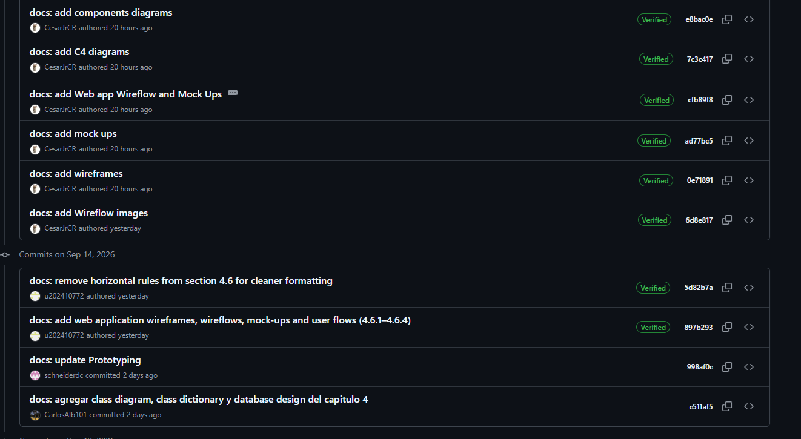

## 5.3. Video About-the-Product

En esta sección se presenta la primera versión del video About-the-Product de PuntoSabor, orientado a los visitantes del Landing Page y usuarios potenciales de la aplicación.

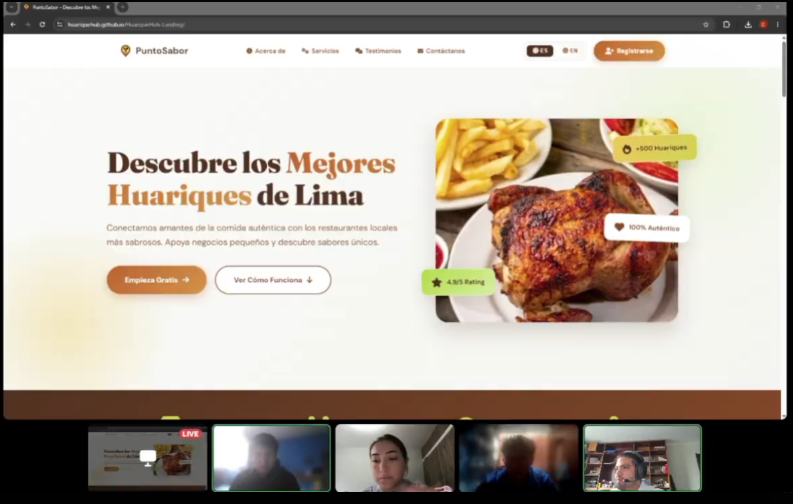

**URL del video:** https://drive.google.com/drive/folders/1Iqb5Lz3YxKQMyos2Oyqczd73CZMvspKV?usp=drive_link

**Duración:** 2 minutos

# Capítulo VI: Product Verification & Validation

## 6.1. Testing Suites & Validation

### 6.1.1. Core Entities Unit Tests

### 6.1.2. Core Integration Tests

### 6.1.3. Core Behavior-Driven Development

### 6.1.4. Core System Tests

## 6.2. Static testing & Verification

### 6.2.1. Static Code Analysis

#### 6.2.1.1. Coding standard & Code conventions

#### 6.2.1.2. Code Quality & Code Security

### 6.2.2. Reviews

## 6.3. Validation Interviews

### 6.3.1. Diseño de Entrevistas

### 6.3.2. Registro de Entrevistas

### 6.3.3. Evaluaciones según heurísticas

## 6.4. Auditoría de Experiencias de Usuario

### 6.4.1. Auditoría realizada

#### 6.4.1.1. Información del grupo auditado

#### 6.4.1.2. Cronograma de auditoría realizada

#### 6.4.1.3. Contenido de auditoría realizada

### 6.4.2. Auditoría recibida

#### 6.4.2.1. Información del grupo auditor

#### 6.4.2.2. Cronograma de auditoría recibida

#### 6.4.2.3. Contenido de auditoría recibida

#### 6.4.2.4. Resumen de modificaciones para subsanar hallazgos

# Capítulo VII: DevOps Practices

## 7.1. Continuous Integration

### 7.1.1. Tools and Practices

### 7.1.2. Build & Test Suite Pipeline Components

## 7.2. Continuous Delivery

### 7.2.1. Tools and Practices

### 7.2.2. Stages Deployment Pipeline Components

## 7.3. Continuous deployment

### 7.3.1. Tools and Practices

### 7.3.2. Production Deployment Pipeline Components

## 7.4. Continuous Monitoring

### 7.4.1. Tools and Practices

### 7.4.2. Monitoring Pipeline Components

### 7.4.3. Alerting Pipeline Components

### 7.4.4. Notification Pipeline Components

# Capítulo VIII: Experiment-Driven Development

## 8.1. Experiment Planning

### 8.1.1. As-Is Summary

### 8.1.2. Raw Material: Assumptions, Knowledge Gaps, Ideas, Claims

### 8.1.3. Experiment-Ready Questions

### 8.1.4. Question Backlog

### 8.1.5. Experiment Cards

## 8.2. Experiment Design

### 8.2.1. Hypotheses

### 8.2.2. Domain Business Metrics

### 8.2.3. Measures

### 8.2.4. Conditions

### 8.2.5. Scale Calculations and Decisions

### 8.2.6. Methods Selection

### 8.2.7. Data Analytics: Goals, KPIs and Metrics Selection

### 8.2.8. Web and Mobile Tracking Plan

## 8.3. Experimentation

### 8.3.1. To-Be User Stories

### 8.3.2. To-Be Product Backlog

### 8.3.3. Pipeline-supported, Experiment-Driven To-Be Software Platform Lifecycle

#### 8.3.3.1. To-Be Sprint Backlogs

#### 8.3.3.2. Implemented To-Be Landing Page Evidence

#### 8.3.3.3. Implemented To-Be Frontend-Web Application Evidence

#### 8.3.3.4. Implemented To-Be Native-Mobile Application Evidence

#### 8.3.3.5. Implemented To-Be RESTful API and/or Serverless Backend Evidence

#### 8.3.3.6. Team Collaboration Insights

### Matriz de Evaluación Ética y de Impacto

### 8.3.4. To-Be Validation Interviews

#### 8.3.4.1. Diseño de Entrevistas

#### 8.3.4.2. Registro de Entrevistas

## 8.4. Experiment Aftermath & Analysis

### 8.4.1. Analysis and Interpretation of Results

### 8.4.2. Re-scored and Re-prioritized Question Backlog

## 8.5. Continuous Learning

### 8.5.1. Shareback Session Artifacts: Learning Workflow

## 8.6. To-Be Software Platform Pre-launch

### 8.6.1. About-the-Product Intro Video

### 8.6.2. Resumen usando Gees FrameWork

## Conclusiones

## Bibliografía

## Anexos
