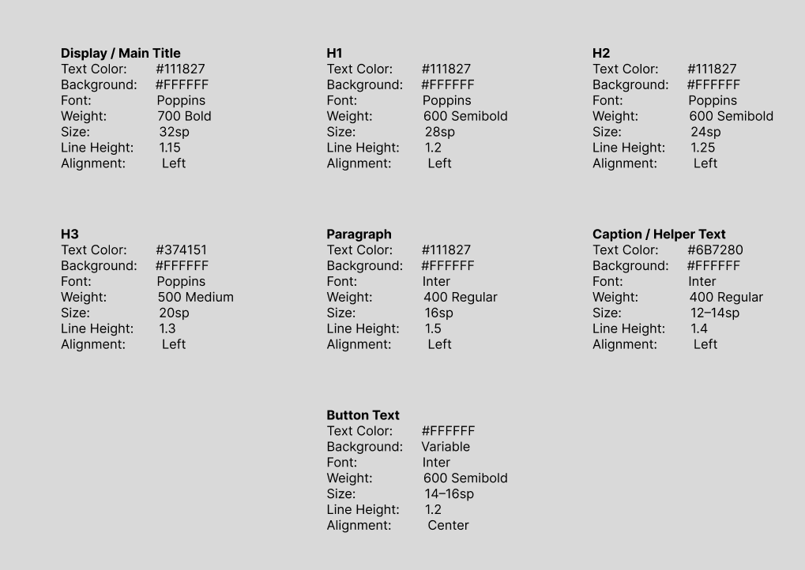
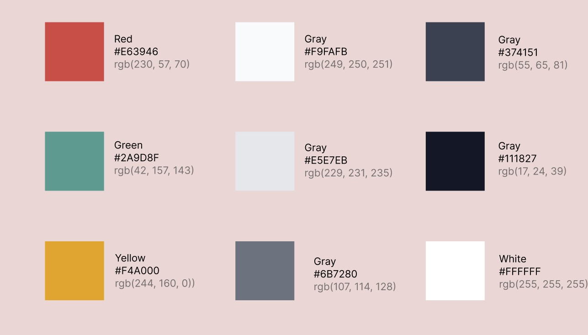
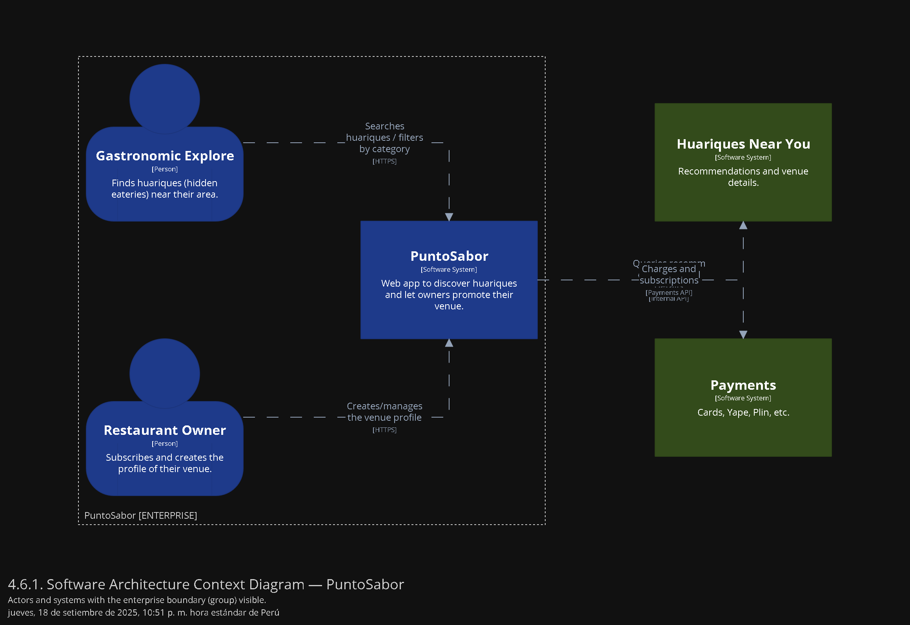
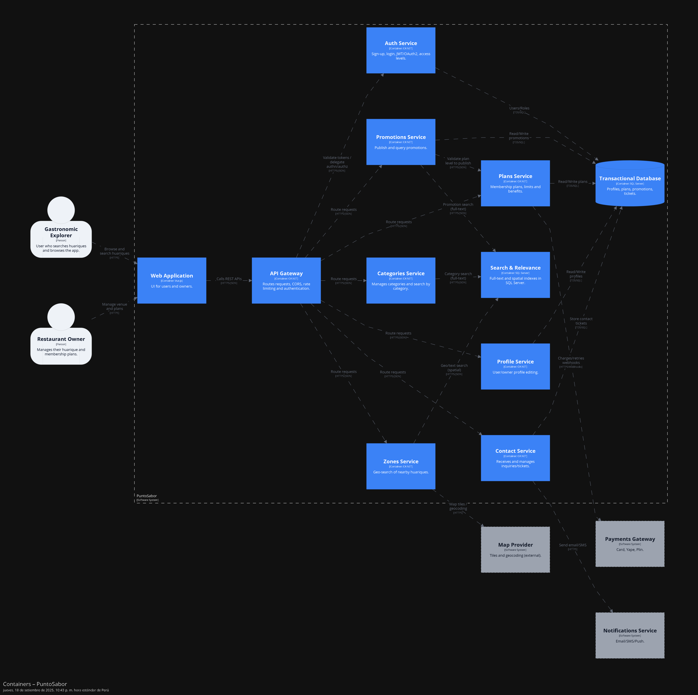

  
  

Universidad Peruana de Ciencias Aplicadas

Carrera de Ingeniería de Software

**1ASI0732**

**Diseño de Experimentos de Ingeniería de Software**

NRC

**9112**

**Informe del Trabajo Final**

Docente

**Lennin Percy Cenas Vasquez**

Equipo

**HuariApp**

Proyecto

**PuntoSabor**

**Integrantes**

| Código | Apellidos y Nombres |
| --- | --- |
| u20241d995 | Cesar Jair Contreras Rojas |
| u202321843 | Delgado Carrasco, Schneider |
| u202312700 | Lopez Goitia, Carlos Alberto |
| u202411282 | Montalván Palomino, Bruno Rodolfo |
| u202410772 | Razuri Alvarez, Matias Francesco |

**Período 202602**

**Setiembre 2026**

---

# Registro de versiones del informe

| Versión | Fecha | Autor | Descripción de modificación |
| --- | --- | --- | --- |
|  |  |  |  |
# Project Report Collaboration Insights

**Repositorio de la documentación del proyecto:** https://github.com/HuariApp/puntosabor-report.git

# Informe de Trabajo Final - HuariApp

# Student Outcome

| Criterio específico | Acciones realizadas | Conclusiones |
| --- | --- | --- |
|  |  |  |

# Capítulo I: Introducción

## 1.1. Startup Profile

### 1.1.1. Descripción de la Startup

### 1.1.2. Perfiles de integrantes del equipo

## 1.2. Solution Profile

### 1.2.1. Antecedentes y problemática

### 1.2.2. Lean UX Process

#### 1.2.2.1. Lean UX Problem Statements

#### 1.2.2.2. Lean UX Assumptions

#### 1.2.2.3. Lean UX Hypothesis Statements

#### 1.2.2.4. Lean UX Canvas

## 1.3. Segmentos objetivo

# Capítulo II: Requirements Elicitation & Analysis

## 2.1. Competidores

### 2.1.1. Análisis competitivo

### 2.1.2. Estrategias y tácticas frente a competidores

## 2.2. Entrevistas

### 2.2.1. Diseño de entrevistas

### 2.2.2. Registro de entrevistas

### 2.2.3. Análisis de entrevistas

## 2.3. Needfinding

### 2.3.1. User Personas

### 2.3.2. User Task Matrix

### 2.3.3. User Journey Mapping

### 2.3.4. Empathy Mapping

### 2.3.5. As-is Scenario Mapping

## 2.4. Ubiquitous Language

# Capítulo III: Requirements Specification

## 3.1. To-Be Scenario Mapping

## 3.2. User Stories

## 3.3. Product Backlog

## 3.4. Impact Mapping

# Capítulo IV: Product Design

## 4.1. Style Guidelines

Los "Style Guidelines" de la aplicación móvil PuntoSabor definen las directrices visuales y de diseño que permiten mantener una experiencia coherente, clara y fácil de usar en todas las pantallas de la app. Estos lineamientos establecen criterios sobre colores, tipografía, espaciado, componentes visuales e identidad gráfica, asegurando que la aplicación sea intuitiva tanto para los usuarios que buscan huariques como para los propietarios que gestionan sus negocios.

### 4.1.1. General Style Guidelines

##### Branding

Para el desarrollo de la identidad visual de PuntoSabor, se definió un estilo orientado a transmitir cercanía, autenticidad y confianza. La marca busca reflejar el valor de los huariques dentro de la gastronomía local, destacándolos como espacios accesibles, tradicionales y con identidad propia.

El logotipo de PuntoSabor representa la idea de descubrimiento gastronómico mediante elementos asociados a la ubicación y la comida local. Su propuesta visual permite que los usuarios relacionen rápidamente la aplicación con la búsqueda de huariques cercanos, recomendaciones confiables y experiencias culinarias auténticas.

La identidad gráfica utiliza una apariencia cálida, amigable y moderna, pensada para conectar tanto con los exploradores gastronómicos como con los propietarios de huariques. De esta manera, PuntoSabor mantiene una imagen coherente con su propósito: facilitar la visibilidad de pequeños negocios gastronómicos mediante una aplicación móvil sencilla y accesible.

##### Typography

Para la tipografía de PuntoSabor, se seleccionó una combinación que prioriza la legibilidad, la modernidad y la claridad dentro de la aplicación móvil. La tipografía Poppins se utiliza principalmente en títulos y encabezados, ya que aporta un estilo amigable y permite resaltar información importante para el usuario.

Para textos descriptivos, botones, formularios y elementos de la interfaz, se emplea Inter, debido a su buena lectura en pantallas móviles y su apariencia ordenada. Esta combinación permite que la app mantenga una experiencia visual coherente, accesible y fácil de navegar.

A continuación, se detallan las tipografías adoptadas para PuntoSabor considerando color, peso, tamaño, interlineado y alineación:

##### Colors

La paleta de colores de PuntoSabor fue definida para transmitir autenticidad, cercanía y dinamismo dentro de la aplicación móvil. Los tonos principales, asociados al rojo, verde y amarillo, buscan representar el sabor, la frescura y la identidad gastronómica local de los huariques.

Estos colores se aplican de forma estratégica en botones, íconos, estados, fondos y elementos destacados de la interfaz, permitiendo guiar la atención del usuario y mantener una experiencia visual amigable, moderna y coherente en todas las pantallas de la app.

##### Spacing

El sistema de espaciado de PuntoSabor está diseñado para mantener una interfaz móvil limpia, ordenada y fácil de navegar. La separación entre elementos permite mejorar la lectura, evitar la saturación visual y facilitar la interacción táctil del usuario.

Para conservar consistencia en las pantallas de la aplicación, se utiliza una escala modular basada en 8dp, adecuada para interfaces móviles. Esta escala permite definir márgenes, paddings y separaciones entre componentes de manera uniforme.

### 4.1.2. Web Style Guidelines

### 4.1.3. Mobile Style Guidelines

#### 4.1.3.1. iOS Mobile Style Guidelines

#### 4.1.3.2. Android Mobile Style Guidelines

## 4.2. Information Architecture

La arquitectura de información de PuntoSabor se diseñó para que los usuarios puedan encontrar fácilmente las funciones principales de la aplicación móvil, como buscar huariques, revisar información del local, consultar reseñas, guardar favoritos y gestionar un negocio.

La organización del contenido busca reducir la carga cognitiva y facilitar una navegación intuitiva, clara y rápida. De esta manera, la aplicación mantiene una experiencia coherente con su propuesta de valor: conectar a los usuarios con huariques auténticos y ayudar a los propietarios a mejorar su visibilidad digital.

### 4.2.1. Organization Systems

En PuntoSabor se aplican distintos sistemas de organización para que la información dentro de la aplicación móvil sea clara, ordenada y fácil de encontrar.

**Organización jerárquica (Visual Hierarchy):**  
En las pantallas principales de la app se prioriza la información más importante para el usuario, como el buscador de huariques, las recomendaciones destacadas, la ubicación cercana y las reseñas. Esto permite que el usuario identifique rápidamente las acciones principales.

**Organización secuencial (Step-by-step):**  
Procesos como el registro de un huarique, la edición de información del negocio o la publicación de datos del local siguen una secuencia paso a paso. De esta manera, los propietarios pueden completar sus tareas sin dificultad.

**Organización por tópicos:**  
Los huariques se agrupan según criterios como tipo de comida, ubicación, rango de precios, valoraciones y promociones. Esto facilita que los usuarios filtren y encuentren opciones según sus preferencias.

**Organización según audiencia:**  
La aplicación considera dos tipos principales de usuarios: exploradores gastronómicos y dueños de huariques. Por ello, las funciones y contenidos se organizan de acuerdo con sus necesidades: búsqueda y descubrimiento para los comensales, y gestión de negocio para los propietarios.

### 4.2.2. Labeling Systems

El sistema de etiquetado de **PuntoSabor** prioriza la claridad, simplicidad y consistencia dentro de la aplicación móvil. Para ello, se utilizan palabras cortas y directas que permiten al usuario comprender rápidamente cada sección o acción disponible.

En la aplicación móvil se consideran etiquetas principales como:

- Inicio
- Explorar
- Huariques
- Favoritos
- Reseñas
- Promociones
- Perfil

Además, los botones de acción utilizan textos claros con verbos directos, como:

- Buscar huariques
- Ver detalles
- Guardar favorito
- Dejar reseña
- Registrar negocio
- Editar información

Estas etiquetas permiten que tanto los exploradores gastronómicos como los propietarios de huariques interactúen con la aplicación de manera sencilla, manteniendo coherencia con los objetivos de la plataforma.

### 4.2.3. SEO Tags and Meta Tags

Para PuntoSabor se han definido elementos SEO orientados principalmente a la Landing Page, ya que esta será el punto de entrada público para atraer usuarios y propietarios interesados en la plataforma. Estos elementos ayudan a mejorar la visibilidad del producto en motores de búsqueda y mantienen coherencia con la propuesta de valor de la marca.

**SEO Tags para Landing Page:**

- **Title:** PuntoSabor | Descubre huariques auténticos cerca de ti.
- **Meta Description:** PuntoSabor conecta a exploradores gastronómicos con huariques auténticos y económicos, ofreciendo reseñas confiables, mapas interactivos y promociones exclusivas.
- **Meta Keywords:** huariques, comida peruana, gastronomía local, reseñas, recomendaciones, restaurantes pequeños, comida auténtica.
- **Author:** HuariqueHub - Startup PuntoSabor.

**ASO Elements para aplicación móvil:**

- **App Title:** PuntoSabor
- **App Subtitle:** Descubre huariques auténticos cerca de ti.
- **App Keywords:** huariques, comida local, restaurantes, comida peruana, reseñas, promociones, gastronomía.
- **App Description:** PuntoSabor es una aplicación móvil que permite descubrir huariques cercanos, consultar reseñas, guardar favoritos y conocer promociones de pequeños negocios gastronómicos locales.

### 4.2.4. Searching Systems

La aplicación móvil de HuariqueHub ofrece sistemas de búsqueda diseñados para que el usuario encuentre lo que necesita sin esfuerzo:

- **Búsqueda en catálogo:** localización de huariques por nombre, tipo de comida o distrito.  
- **Filtros avanzados:** por rango de precios, valoración de usuarios, ubicación geográfica y promociones activas.  
- **Mapa interactivo:** permite aplicar filtros visuales y seleccionar huariques desde su ubicación exacta.  
- **Búsqueda en reseñas:** posibilidad de filtrar comentarios por calificación (positivas/negativas) o por temas (precio, atención, sabor).  
De esta manera se evita que el usuario se sienta perdido entre la cantidad de opciones disponibles y se mejora la eficiencia en la exploración.

### 4.2.5. Navigation Systems

La navegación de PuntoSabor combina claridad, consistencia y adaptabilidad:

- **Landing Page (Desktop):** menú superior con navegación horizontal que permite acceder rápidamente a las secciones principales. Desplegada en GitHub Pages.  
- **Landing Page (Móvil):** menú tipo hamburguesa con navegación vertical, optimizado para pantallas pequeñas.  
- **Aplicación Móvil (Android/Kotlin):** navegación entre pantallas mediante Jetpack Compose Navigation, con acceso a Login, Registro, Home, Detalle de Huarique y otras pantallas core.  
- **CTAs estratégicos:** botones prominentes en el color primario de la paleta para guiar al usuario a acciones críticas como buscar huariques, registrar un negocio o activar una promoción.  

En conjunto, estos sistemas garantizan que los usuarios puedan recorrer la plataforma de forma intuitiva, cumpliendo sus metas sin obstáculos.

## 4.3. Landing Page UI Design

La interfaz de la landing page es clave para el proyecto, pues constituye la primera impresión del producto. Debe ofrecer una experiencia estética y funcional que atraiga de inmediato a los visitantes y los impulse a seguir explorando

### 4.3.1. Landing Page Wireframe

Landing Page para Desktop Web Browser

Landing Page para Mobile Web Browse

### 4.3.2. Landing Page Mock-up

Esta sección presenta y explica los Mock-ups del Landing Page, tanto en su versión para Desktop Web Browser como Mobile Web Browser. En la propuesta y la explicación debe evidenciarse la aplicación de los principios, elementos de diseño, diseño inclusivo y arquitectura de información, así como el Design System establecido para los productos digitales.

## 4.4. Mobile Applications UX/UI Design

El diseño de experiencia de usuario (UX) e interfaz de usuario (UI) en aplicaciones móviles se centra en crear una interacción fluida y optimizada para entornos táctiles y dispositivos portátiles. La UX prioriza la usabilidad en movimiento, diseñando arquitecturas de información y flujos de navegación simplificados que responden a los gestos naturales del usuario. Por otro lado, la UI define la identidad visual mediante la creación de componentes adaptables, tipografías legibles y una paleta de colores coherente que garantiza la claridad en pantallas de diversos tamaños. La integración de ambos aspectos permite desarrollar una aplicación intuitiva, estéticamente profesional y capaz de ofrecer una respuesta rápida y eficiente a las necesidades del usuario final.

### 4.4.1. Mobile Applications Wireframes

Representación esquemática de la estructura y flujo de navegación de la aplicación móvil, diseñada para definir la jerarquía de información y la disposición de los elementos antes de su implementación visual.

### 4.4.2. Mobile Applications Wireflow Diagrams

### 4.4.3. Mobile Applications Mock-ups

Representaciones visuales de alta fidelidad que integran la identidad de marca, incluyendo la paleta de colores, tipografía e iconografía final, para simular la apariencia real y estética de la interfaz en dispositivos móviles.

### 4.4.4. Mobile Applications User Flow Diagrams

## 4.5. Mobile Applications Prototyping

### 4.5.1. Android Mobile Applications Prototyping

### 4.5.2. iOS Mobile Applications Prototyping

Prototipo de la aplicación móvil PuntoSabor en figma: https://www.figma.com/proto/lT88eEZFP7G86QwYXq59Lc/PuntoSabor?node-id=479-3247&t=ye1K7Dvu4kkj6fuI-1&scaling=scale-down&content-scaling=fixed&page-id=0%3A1&starting-point-node-id=60%3A349&show-proto-sidebar=1

## 4.6. Web Applications UX/UI Design

### 4.6.1. Web Applications Wireframes

### 4.6.2. Web Applications Wireflow Diagrams

### 4.6.3. Web Applications Mock-ups

### 4.6.4. Web Applications User Flow Diagrams

## 4.7. Web Applications Prototyping

## 4.8. Domain-Driven Software Architecture

### 4.8.1. Software Architecture Context Diagram

El diagrama de contexto muestra a PuntoSabor como sistema central interactuando con sus dos tipos de usuarios principales:

- **PuntoSabor:** sistema principal que conecta a exploradores y dueños de huariques.
- **Explorador gastronómico:** usuario que busca y descubre huariques auténticos.
- **Dueño de restaurante:** usuario que publica su huarique y gestiona su membresía.

### 4.8.2. Software Architecture Container Diagrams

El diagrama de contenedores muestra los componentes internos del sistema PuntoSabor:

- **Aplicación Móvil (Android/Kotlin):** interfaz principal del usuario, construida con Jetpack Compose.
- **Landing Page (HTML/CSS/JS):** sitio estático desplegado en GitHub Pages.
- **Backend API (C#/.NET 8):** servidor de aplicaciones que expone endpoints REST y gestiona la lógica de negocio.
- **Base de datos (MySQL):** almacena usuarios, huariques, reseñas, planes y suscripciones.

### 4.8.3. Software Architecture Components Diagrams

## 4.9. Software Object-Oriented Design

### 4.9.1. Class Diagrams

### 4.9.2. Class Dictionary

## 4.10. Database Design

### 4.10.1. Relational/Non-Relational Database Diagram

# Capítulo V: Product Implementation

## 5.1. Software Configuration Management

### 5.1.1. Software Development Environment Configuration

### 5.1.2. Source Code Management

### 5.1.3. Source Code Style Guide & Conventions

### 5.1.4. Software Deployment Configuration

## 5.2. Product Implementation & Deployment

### 5.2.1. Sprint Backlogs

### 5.2.2. Implemented Landing Page Evidence

### 5.2.3. Implemented Frontend-Web Application Evidence

### 5.2.4. Acuerdo de Servicio - SaaS

### 5.2.5. Implemented Native-Mobile Application Evidence

### 5.2.6. Implemented RESTful API and/or Serverless Backend Evidence

### 5.2.7. RESTful API documentation

### 5.2.8. Team Collaboration Insights

## 5.3. Video About-the-Product

# Capítulo VI: Product Verification & Validation

## 6.1. Testing Suites & Validation

### 6.1.1. Core Entities Unit Tests

### 6.1.2. Core Integration Tests

### 6.1.3. Core Behavior-Driven Development

### 6.1.4. Core System Tests

## 6.2. Static testing & Verification

### 6.2.1. Static Code Analysis

#### 6.2.1.1. Coding standard & Code conventions

#### 6.2.1.2. Code Quality & Code Security

### 6.2.2. Reviews

## 6.3. Validation Interviews

### 6.3.1. Diseño de Entrevistas

### 6.3.2. Registro de Entrevistas

### 6.3.3. Evaluaciones según heurísticas

## 6.4. Auditoría de Experiencias de Usuario

### 6.4.1. Auditoría realizada

#### 6.4.1.1. Información del grupo auditado

#### 6.4.1.2. Cronograma de auditoría realizada

#### 6.4.1.3. Contenido de auditoría realizada

### 6.4.2. Auditoría recibida

#### 6.4.2.1. Información del grupo auditor

#### 6.4.2.2. Cronograma de auditoría recibida

#### 6.4.2.3. Contenido de auditoría recibida

#### 6.4.2.4. Resumen de modificaciones para subsanar hallazgos

# Capítulo VII: DevOps Practices

## 7.1. Continuous Integration

### 7.1.1. Tools and Practices

### 7.1.2. Build & Test Suite Pipeline Components

## 7.2. Continuous Delivery

### 7.2.1. Tools and Practices

### 7.2.2. Stages Deployment Pipeline Components

## 7.3. Continuous deployment

### 7.3.1. Tools and Practices

### 7.3.2. Production Deployment Pipeline Components

## 7.4. Continuous Monitoring

### 7.4.1. Tools and Practices

### 7.4.2. Monitoring Pipeline Components

### 7.4.3. Alerting Pipeline Components

### 7.4.4. Notification Pipeline Components

# Capítulo VIII: Experiment-Driven Development

## 8.1. Experiment Planning

### 8.1.1. As-Is Summary

### 8.1.2. Raw Material: Assumptions, Knowledge Gaps, Ideas, Claims

### 8.1.3. Experiment-Ready Questions

### 8.1.4. Question Backlog

### 8.1.5. Experiment Cards

## 8.2. Experiment Design

### 8.2.1. Hypotheses

### 8.2.2. Domain Business Metrics

### 8.2.3. Measures

### 8.2.4. Conditions

### 8.2.5. Scale Calculations and Decisions

### 8.2.6. Methods Selection

### 8.2.7. Data Analytics: Goals, KPIs and Metrics Selection

### 8.2.8. Web and Mobile Tracking Plan

## 8.3. Experimentation

### 8.3.1. To-Be User Stories

### 8.3.2. To-Be Product Backlog

### 8.3.3. Pipeline-supported, Experiment-Driven To-Be Software Platform Lifecycle

#### 8.3.3.1. To-Be Sprint Backlogs

#### 8.3.3.2. Implemented To-Be Landing Page Evidence

#### 8.3.3.3. Implemented To-Be Frontend-Web Application Evidence

#### 8.3.3.4. Implemented To-Be Native-Mobile Application Evidence

#### 8.3.3.5. Implemented To-Be RESTful API and/or Serverless Backend Evidence

#### 8.3.3.6. Team Collaboration Insights

### Matriz de Evaluación Ética y de Impacto

### 8.3.4. To-Be Validation Interviews

#### 8.3.4.1. Diseño de Entrevistas

#### 8.3.4.2. Registro de Entrevistas

## 8.4. Experiment Aftermath & Analysis

### 8.4.1. Analysis and Interpretation of Results

### 8.4.2. Re-scored and Re-prioritized Question Backlog

## 8.5. Continuous Learning

### 8.5.1. Shareback Session Artifacts: Learning Workflow

## 8.6. To-Be Software Platform Pre-launch

### 8.6.1. About-the-Product Intro Video

### 8.6.2. Resumen usando Gees FrameWork

## Conclusiones

## Bibliografía

## Anexos
