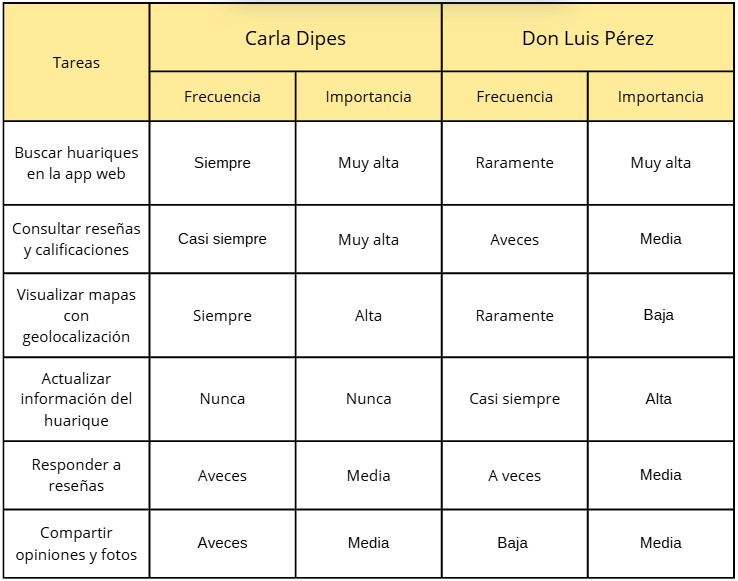
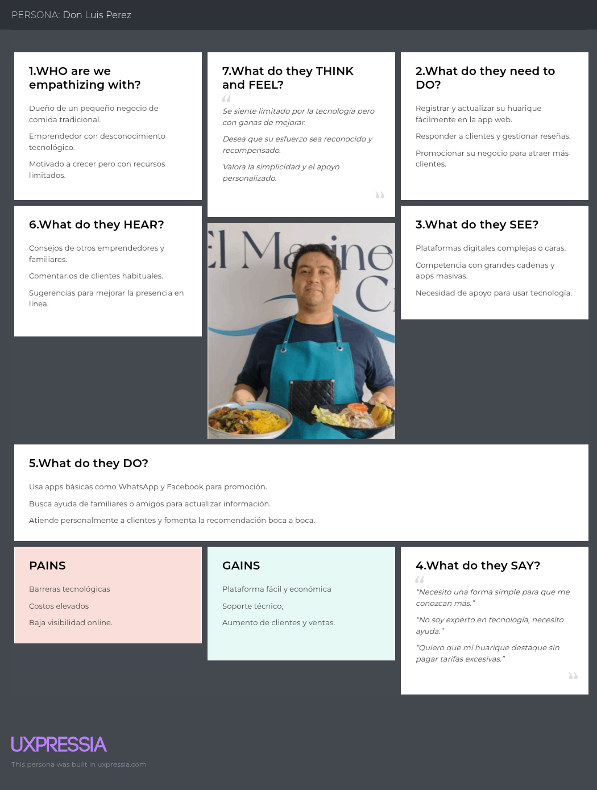

  
  

Universidad Peruana de Ciencias Aplicadas

Carrera de Ingeniería de Software

**1ASI0732**

**Diseño de Experimentos de Ingeniería de Software**

NRC

**9112**

**Informe del Trabajo Final**

Docente

**Lennin Percy Cenas Vasquez**

Equipo

**HuariApp**

Proyecto

**PuntoSabor**

**Integrantes**

| Código | Apellidos y Nombres |
| --- | --- |
| u20241d995 | Cesar Jair Contreras Rojas |
| u202321843 | Delgado Carrasco, Schneider |
| u202312700 | Lopez Goitia, Carlos Alberto |
| u202411282 | Montalván Palomino, Bruno Rodolfo |
| u202410772 | Razuri Alvarez, Matias Francesco |

**Período 202602**

**Setiembre 2026**

---

# Registro de versiones del informe

| Versión | Fecha | Autor | Descripción de modificación |
| --- | --- | --- | --- |
|  |  |  |  |
# Project Report Collaboration Insights

**Repositorio de la documentación del proyecto:** https://github.com/HuariApp/puntosabor-report.git

# Informe de Trabajo Final - HuariApp

# Student Outcome

| Criterio específico | Acciones realizadas | Conclusiones |
| --- | --- | --- |
|  |  |  |

# Capítulo I: Introducción

## 1.1. Startup Profile

### 1.1.1. Descripción de la Startup

### 1.1.2. Perfiles de integrantes del equipo

## 1.2. Solution Profile

### 1.2.1. Antecedentes y problemática

### 1.2.2. Lean UX Process

#### 1.2.2.1. Lean UX Problem Statements

#### 1.2.2.2. Lean UX Assumptions

#### 1.2.2.3. Lean UX Hypothesis Statements

#### 1.2.2.4. Lean UX Canvas

## 1.3. Segmentos objetivo

# Capítulo II: Requirements Elicitation & Analysis

## 2.1. Competidores

### 2.1.1. Análisis competitivo

### 2.1.2. Estrategias y tácticas frente a competidores

## 2.2. Entrevistas

### 2.2.1. Diseño de entrevistas

Segmento 1: Exploradores Gastronómicos (Usuarios de la app móvil)

Objetivo: Entender sus motivaciones, comportamientos y expectativas al usar una app móvil para descubrir comida local auténtica.

Preguntas Segmento 1:
- ¿Con qué frecuencia usas aplicaciones móvil para buscar lugares para comer fuera de lo común?
- ¿Cómo sueles descubrir huariques o lugares de comida poco conocidos en la móvil?
- ¿Qué aspectos valoras más al elegir un lugar para comer usando una app móvil (precio, ubicación, reseñas, fotos, etc.)?
- ¿Qué dificultades has tenido al usar apps móvil para buscar lugares de comida local?
- ¿Qué te motivaría a usar una app móvil dedicada exclusivamente a huariques?
- ¿Qué funcionalidades en la app móvil considerarías imprescindibles para usarla con regularidad?
- ¿Qué preocupaciones o barreras tendrías al usar una app móvil para descubrir huariques?

Segmento 2: Dueños y Administradores de Huariques (Usuarios que usan la app móvil para gestionar su huarique).

Objetivo: Entender lo que necesita y espera al utilizar la aplicación móvil para gestionar y publicitar sus huariques.

Preguntas Segmento 2:
- ¿Actualmente usas alguna plataforma móvil o digital para promocionar tu huarique? ¿Cuál?
- ¿Qué retos has enfrentado al tratar de gestionar tu negocio a través de plataformas digitales?
- ¿Qué tan cómodo te sientes usando aplicaciones móvil para actualizar la información de tu negocio?
- ¿Qué características te harían decidirte a usar una app móvil especializada para huariques?
- ¿Qué tipo de soporte o facilidades esperarías al usar esta app móvil para gestionar tu perfil o negocio?
- ¿Qué modelo de tarifas o membresías considerarías justo para usar esta plataforma?
- ¿Qué resultados te gustaría ver después de usar esta aplicación móvil para promocionar tu huarique?

### 2.2.2. Registro de entrevistas

**Segmento #1: Exploradores Gastronómicos (Usuarios de la app móvil)**

- Entrevista 1:

| Campo | Detalle |
| --- | --- |
| **Nombre entrevistado** | - |
| **Edad** | - |
| **Departamento** | - |
| **Inicio del video** | - |
| **Fin del video** | - |
| **Link del video** | - |
| **Foto entrevista** | - |
| **Resumen** | - |

- Entrevista 2:

| Campo | Detalle |
| --- | --- |
| **Nombre entrevistado** | - |
| **Edad** | - |
| **Departamento** | - |
| **Inicio del video** | - |
| **Fin del video** | - |
| **Link del video** | - |
| **Foto entrevista** | - |
| **Resumen** | - |

- Entrevista 3:

| Campo | Detalle |
| --- | --- |
| **Nombre entrevistado** | - |
| **Edad** | - |
| **Departamento** | - |
| **Inicio del video** | - |
| **Fin del video** | - |
| **Link del video** | - |
| **Foto entrevista** | - |
| **Resumen** | - |

**Segmento #2: Dueños y Administradores de Huariques (Usuarios que usan la app móvil para gestionar su huarique)**

- Entrevista 1:

| Campo | Detalle |
| --- | --- |
| **Nombre entrevistado** | Katerin |
| **Edad** | 33 años |
| **Departamento** | Comas |
| **Inicio del video** | 00:00 |
| **Fin del video** | 9:00 |
| **Link del video** | https://drive.google.com/drive/folders/1ZdixRXBDLk5fCKho-r2dA9DhSVKnbbb2?usp=drive_link |
| **Foto entrevista** |  |
| **Resumen** | La entrevistada comentó que utiliza principalmente Instagram, Facebook y WhatsApp para promocionar su negocio y comunicarse con sus clientes. Indicó que una de sus principales dificultades es encontrar tiempo para mantener actualizadas varias plataformas al mismo tiempo. Considera importante que una aplicación para huariques sea sencilla de utilizar y permita gestionar información como horarios, precios, fotografías, menú y promociones. También valoraría funciones como reseñas, estadísticas sobre las visitas al negocio, mapas para facilitar la ubicación y soporte para resolver dudas. Respecto al modelo de pago, considera conveniente contar con una versión gratuita y una membresía opcional con beneficios adicionales. Finalmente, espera que una aplicación de este tipo le permita obtener mayor visibilidad, atraer nuevos clientes y aumentar el alcance de sus promociones. |

- Entrevista 2:

| Campo | Detalle |
| --- | --- |
| **Nombre entrevistado** | - |
| **Edad** | - |
| **Departamento** | - |
| **Inicio del video** | - |
| **Fin del video** | - |
| **Link del video** | - |
| **Foto entrevista** | - |
| **Resumen** | - |

- Entrevista 3:

| Campo | Detalle |
| --- | --- |
| **Nombre entrevistado** | - |
| **Edad** | - |
| **Departamento** | - |
| **Inicio del video** | - |
| **Fin del video** | - |
| **Link del video** | - |
| **Foto entrevista** | - |
| **Resumen** | - |

### 2.2.3. Análisis de entrevistas

**Segmento #1: Exploradores Gastronómicos (Usuarios de la app móvil)**

**Segmento #2: Dueños y Administradores de Huariques**

## 2.3. Needfinding

### 2.3.1. User Personas

Se han creado dos perfiles de usuario o personas representativas para entender con mayor precisión las motivaciones, necesidades y conductas de los usuarios principales de PuntoSabor. Estos perfiles resumen los rasgos, metas y desafíos comunes de los segmentos principales, lo que simplifica el desarrollo de la plataforma al diseñarla con enfoque en el usuario y tomar decisiones estratégicas.

- Persona 2: Don Luis, dueño de huarique tradicional
Don Luis representa a los dueños de huariques y a los emprendedores pequeños que buscan una forma simple de dar a conocer su negocio. No tiene mucha experiencia con tecnología, por lo que necesita herramientas fáciles de usar y que no impliquen gastos altos.

### 2.3.2. User Task Matrix

Los perfiles de usuario en PuntoSabor presentan diferencias notables en sus tareas habituales, dependiendo de las necesidades y el rol de cada uno. Como exploradora gastronómica, Carla Dípes emplea la aplicación móvil de manera continua y activa para buscar huariques, leer reseñas y utilizar la función de mapas con geolocalización. Para ella, estas actividades son fundamentales para su experiencia. Por otro lado, Don Luis Pérez, propietario de huarique, no suele emplear la aplicación para buscar o ver mapas; su interés principal es actualizar la información de su huarique, tarea que lleva a cabo con frecuencia y considera esencial. Los dos individuos se comunican de vez en cuando utilizando la función de responder reseñas y compartir fotografías u opiniones, aunque Don Luis lo hace con menos frecuencia, pero sigue siendo significativo en términos de importancia.

Coincidencias:
- Ambos utilizan, en menor medida, la función de responder reseñas, considerándola de importancia media.

- Carla tiene una frecuencia más alta que los demás en lo que respecta a compartir fotos y opiniones, aunque todos comparten una actitud media hacia la importancia de hacerlo.

- Para los dos perfiles, las funciones que tienen que ver con la interacción social y la comunidad son de importancia media.
  
Diferencias:
- Carla usa con frecuencia la búsqueda de huariques y el mapa, mientras que Don Luis casi no utiliza estas funciones debido a su enfoque más administrativo.

- La actualización de la información de su huarique es una tarea que Carla no lleva a cabo, pero Don Luis invierte más tiempo y la considera importante.

- Carla presenta un alto nivel de interacción con funciones de exploración, mientras que Don Luis tiene una participación menor en este aspecto.

### 2.3.3. User Journey Mapping

Segmento 1

Con el uso de este artefacto se analizará y entenderá cómo los usuarios del segmento 1 (Exploradores Gastronómicos) llevan a cabo sus tareas con el fin de lograr sus metas desde su punto de vista. Este segmento está constituido por individuos que persiguen vivencias gastronómicas auténticas y asequibles, indagando en huariques menos conocidos y apreciando los datos fidedignos suministrados por medio de imágenes, mapas de localización y reseñas.

Segmento 2

Este artefacto permitirá explicar y entender la manera en que los usuarios del segmento 2 (dueños y administradores de huariques) llevan a cabo sus actividades para lograr sus metas desde su punto de vista. Este segmento está conformado por pequeños empresarios que buscan promover su empresa, incrementar su visibilidad y captar nuevos clientes a través de una plataforma fácil de administrar y accesible, sin requerir conocimientos técnicos sofisticados.

### 2.3.4. Empathy Mapping

Los siguientes mapas de empatía corresponden a los dos perfiles principales de usuarios de PuntoSabor: Carla Dípes, la exploradora de la gastronomía, y Don Luis Pérez, propietario de un huarique tradicional. Estos mapas posibilitan entender a fondo sus sentimientos, pensamientos, necesidades y conductas, lo que contribuye a que el diseño esté orientado hacia el usuario.

- Segmento 1:

La carta de empatía de Carla revela que es una clienta que desea experiencias culinarias locales únicas y autenticidad. Considera que es fácil hallar información fiable y se siente frustrada por la abundancia de opciones genéricas en otras plataformas.

- Segmento 2:

El mapa de empatía de Don Luis muestra a un empresario con restricciones tecnológicas, que requiere una herramienta simple para administrar su huarique y expandir su clientela. Busque apoyo y soluciones asequibles que le permitan tener presencia en línea sin altos costos.

### 2.3.5. As-is Scenario Mapping

**As-is Scenario Mapping**
Segmento 1

Con este artefacto, se ha desarrollado el As-is Scenario Mapping para la primera franja (Exploradores Gastronómicos). Este panorama muestra la manera en que los usuarios que desean descubrir huariques llevan a cabo sus actividades hoy en día, los obstáculos a los que se enfrentan al buscar alternativas económicas y auténticas, además de las sensaciones y percepciones que sienten en cada fase de su recorrido.

Segmento 2

Con este instrumento se ha realizado el As-is Scenario Mapping para el segundo grupo (los propietarios y administradores de huariques). Esta situación muestra la manera en que los emprendedores de pequeña escala administran hoy en día la promoción y organización de sus negocios, destacando las limitaciones tecnológicas, los procesos manuales y las emociones relacionadas con su necesidad de atraer nuevos clientes y obtener más visibilidad.

## 2.4. Ubiquitous Language

En esta parte se muestra el glosario de términos fundamentales del ámbito de PuntoSabor, que están escritos en inglés y acompañados de su traducción al español entre paréntesis. Cada definición tiene como objetivo que la comunicación entre todos los miembros del equipo y los interesados sea coherente y clara, así como eliminar ambigüedades y alinear el lenguaje de la empresa.

Glosario:

- Huarique (Huarique): Restaurante peruano tradicional, que normalmente es familiar o local, famoso por su cocina auténtica, accesible y casera. Es el núcleo de la propuesta de PuntoSabor.

- Gastronomic Explorer (Explorador culinario): Persona interesada en descubrir nuevas experiencias gastronómicas, especialmente huariques auténticos, económicos y poco conocidos.

- Huarique Owner (Propietario de Huarique): Persona encargada de administrar un huarique, que incluye la elaboración de los platos, la atención al cliente y la gestión general del negocio.

- Review (reseña): Opinión o valoración escrita por un consumidor acerca de su vivencia en un huarique, que contiene observaciones sobre la calidad de los platos, el servicio y el ambiente.

- Recommendation (Recomendación): Recomendación hecha por un cliente para que otros visitantes tengan la oportunidad de conocer o probar un huarique específico.

- Favorite (Favorito): Huarique es un cliente que recuerda o enfatiza como favorito debido a la calidad de su experiencia, y al que desea volver a visitar o sugerir.

- Culinary Tradition (Tradición Culinaria): Conjunto de hábitos, recetas y prácticas culinarias típicas de los huariques, que enriquecen culturalmente la vivencia gastronómica.

- Community Interaction (Interacción Comunitaria): Interacción entre los clientes y los propietarios de huariques a través del intercambio de experiencias, reseñas, sugerencias y conversaciones que aumentan la confianza y el reconocimiento de sus empresas.
  
- Membership (Membresía): Plan o suscripción que permite a los propietarios obtener mayor visibilidad y beneficios dentro de la plataforma.

# Capítulo III: Requirements Specification

## 3.1. To-Be Scenario Mapping

## 3.2. User Stories

## 3.3. Product Backlog

## 3.4. Impact Mapping

# Capítulo IV: Product Design

## 4.1. Style Guidelines

### 4.1.1. General Style Guidelines

### 4.1.2. Web Style Guidelines

### 4.1.3. Mobile Style Guidelines

#### 4.1.3.1. iOS Mobile Style Guidelines

#### 4.1.3.2. Android Mobile Style Guidelines

## 4.2. Information Architecture

### 4.2.1. Organization Systems

### 4.2.2. Labeling Systems

### 4.2.3. SEO Tags and Meta Tags

### 4.2.4. Searching Systems

### 4.2.5. Navigation Systems

## 4.3. Landing Page UI Design

### 4.3.1. Landing Page Wireframe

### 4.3.2. Landing Page Mock-up

## 4.4. Mobile Applications UX/UI Design

### 4.4.1. Mobile Applications Wireframes

### 4.4.2. Mobile Applications Wireflow Diagrams

### 4.4.3. Mobile Applications Mock-ups

### 4.4.4. Mobile Applications User Flow Diagrams

## 4.5. Mobile Applications Prototyping

### 4.5.1. Android Mobile Applications Prototyping

### 4.5.2. iOS Mobile Applications Prototyping

## 4.6. Web Applications UX/UI Design

### 4.6.1. Web Applications Wireframes

### 4.6.2. Web Applications Wireflow Diagrams

### 4.6.3. Web Applications Mock-ups

### 4.6.4. Web Applications User Flow Diagrams

## 4.7. Web Applications Prototyping

## 4.8. Domain-Driven Software Architecture

### 4.8.1. Software Architecture Context Diagram

### 4.8.2. Software Architecture Container Diagrams

### 4.8.3. Software Architecture Components Diagrams

## 4.9. Software Object-Oriented Design

### 4.9.1. Class Diagrams

### 4.9.2. Class Dictionary

## 4.10. Database Design

### 4.10.1. Relational/Non-Relational Database Diagram

# Capítulo V: Product Implementation

## 5.1. Software Configuration Management

### 5.1.1. Software Development Environment Configuration

### 5.1.2. Source Code Management

### 5.1.3. Source Code Style Guide & Conventions

### 5.1.4. Software Deployment Configuration

## 5.2. Product Implementation & Deployment

### 5.2.1. Sprint Backlogs

### 5.2.2. Implemented Landing Page Evidence

### 5.2.3. Implemented Frontend-Web Application Evidence

### 5.2.4. Acuerdo de Servicio - SaaS

### 5.2.5. Implemented Native-Mobile Application Evidence

### 5.2.6. Implemented RESTful API and/or Serverless Backend Evidence

### 5.2.7. RESTful API documentation

### 5.2.8. Team Collaboration Insights

## 5.3. Video About-the-Product

# Capítulo VI: Product Verification & Validation

## 6.1. Testing Suites & Validation

### 6.1.1. Core Entities Unit Tests

### 6.1.2. Core Integration Tests

### 6.1.3. Core Behavior-Driven Development

### 6.1.4. Core System Tests

## 6.2. Static testing & Verification

### 6.2.1. Static Code Analysis

#### 6.2.1.1. Coding standard & Code conventions

#### 6.2.1.2. Code Quality & Code Security

### 6.2.2. Reviews

## 6.3. Validation Interviews

### 6.3.1. Diseño de Entrevistas

### 6.3.2. Registro de Entrevistas

### 6.3.3. Evaluaciones según heurísticas

## 6.4. Auditoría de Experiencias de Usuario

### 6.4.1. Auditoría realizada

#### 6.4.1.1. Información del grupo auditado

#### 6.4.1.2. Cronograma de auditoría realizada

#### 6.4.1.3. Contenido de auditoría realizada

### 6.4.2. Auditoría recibida

#### 6.4.2.1. Información del grupo auditor

#### 6.4.2.2. Cronograma de auditoría recibida

#### 6.4.2.3. Contenido de auditoría recibida

#### 6.4.2.4. Resumen de modificaciones para subsanar hallazgos

# Capítulo VII: DevOps Practices

## 7.1. Continuous Integration

### 7.1.1. Tools and Practices

### 7.1.2. Build & Test Suite Pipeline Components

## 7.2. Continuous Delivery

### 7.2.1. Tools and Practices

### 7.2.2. Stages Deployment Pipeline Components

## 7.3. Continuous deployment

### 7.3.1. Tools and Practices

### 7.3.2. Production Deployment Pipeline Components

## 7.4. Continuous Monitoring

### 7.4.1. Tools and Practices

### 7.4.2. Monitoring Pipeline Components

### 7.4.3. Alerting Pipeline Components

### 7.4.4. Notification Pipeline Components

# Capítulo VIII: Experiment-Driven Development

## 8.1. Experiment Planning

### 8.1.1. As-Is Summary

### 8.1.2. Raw Material: Assumptions, Knowledge Gaps, Ideas, Claims

### 8.1.3. Experiment-Ready Questions

### 8.1.4. Question Backlog

### 8.1.5. Experiment Cards

## 8.2. Experiment Design

### 8.2.1. Hypotheses

### 8.2.2. Domain Business Metrics

### 8.2.3. Measures

### 8.2.4. Conditions

### 8.2.5. Scale Calculations and Decisions

### 8.2.6. Methods Selection

### 8.2.7. Data Analytics: Goals, KPIs and Metrics Selection

### 8.2.8. Web and Mobile Tracking Plan

## 8.3. Experimentation

### 8.3.1. To-Be User Stories

### 8.3.2. To-Be Product Backlog

### 8.3.3. Pipeline-supported, Experiment-Driven To-Be Software Platform Lifecycle

#### 8.3.3.1. To-Be Sprint Backlogs

#### 8.3.3.2. Implemented To-Be Landing Page Evidence

#### 8.3.3.3. Implemented To-Be Frontend-Web Application Evidence

#### 8.3.3.4. Implemented To-Be Native-Mobile Application Evidence

#### 8.3.3.5. Implemented To-Be RESTful API and/or Serverless Backend Evidence

#### 8.3.3.6. Team Collaboration Insights

### Matriz de Evaluación Ética y de Impacto

### 8.3.4. To-Be Validation Interviews

#### 8.3.4.1. Diseño de Entrevistas

#### 8.3.4.2. Registro de Entrevistas

## 8.4. Experiment Aftermath & Analysis

### 8.4.1. Analysis and Interpretation of Results

### 8.4.2. Re-scored and Re-prioritized Question Backlog

## 8.5. Continuous Learning

### 8.5.1. Shareback Session Artifacts: Learning Workflow

## 8.6. To-Be Software Platform Pre-launch

### 8.6.1. About-the-Product Intro Video

### 8.6.2. Resumen usando Gees FrameWork

## Conclusiones

## Bibliografía

## Anexos
