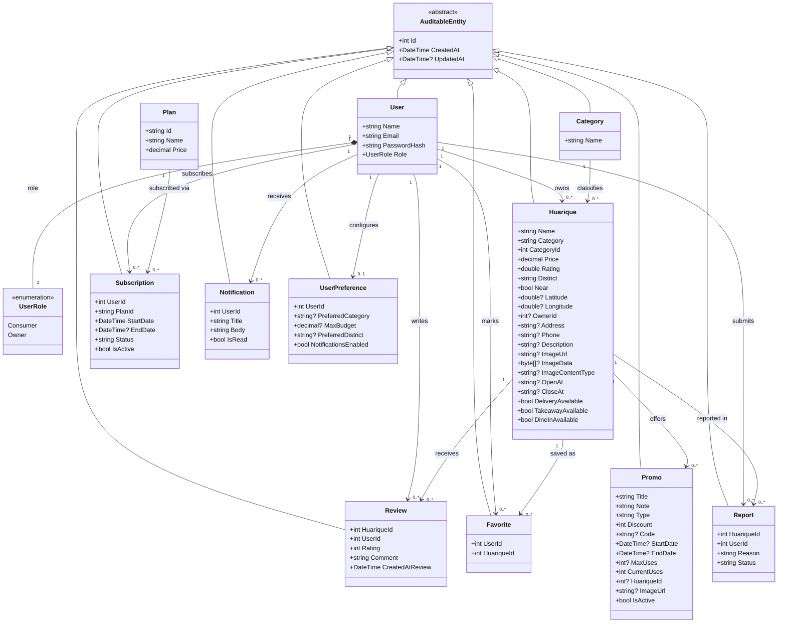
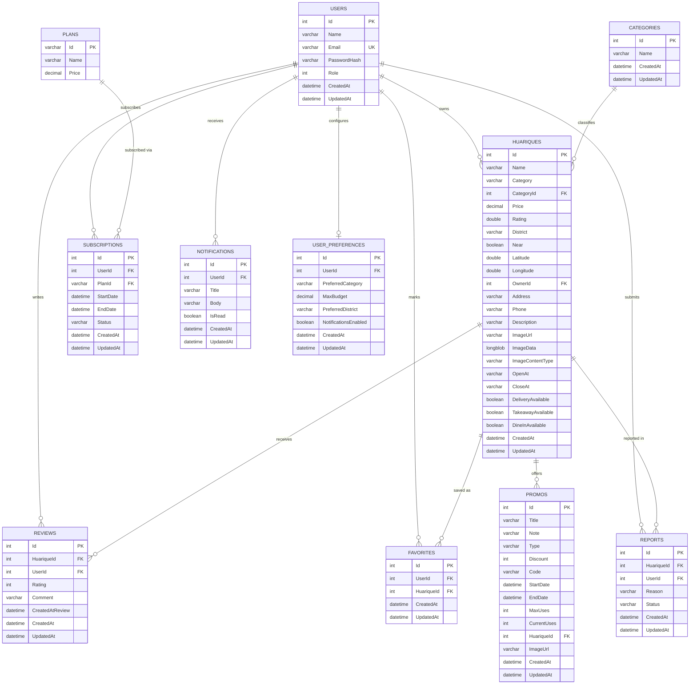

  
  

Universidad Peruana de Ciencias Aplicadas

Carrera de Ingeniería de Software

**1ASI0732**

**Diseño de Experimentos de Ingeniería de Software**

NRC

**9112**

**Informe del Trabajo Final**

Docente

**Lennin Percy Cenas Vasquez**

Equipo

**HuariApp**

Proyecto

**PuntoSabor**

**Integrantes**

| Código | Apellidos y Nombres |
| --- | --- |
| u20241d995 | Cesar Jair Contreras Rojas |
| u202321843 | Delgado Carrasco, Schneider |
| u202312700 | Lopez Goitia, Carlos Alberto |
| u202411282 | Montalván Palomino, Bruno Rodolfo |
| u202410772 | Razuri Alvarez, Matias Francesco |

**Período 202602**

**Setiembre 2026**

---

# Registro de versiones del informe

| Versión | Fecha | Autor | Descripción de modificación |
| --- | --- | --- | --- |
|  |  |  |  |
# Project Report Collaboration Insights

**Repositorio de la documentación del proyecto:** https://github.com/HuariApp/puntosabor-report.git

# Informe de Trabajo Final - HuariApp

# Student Outcome

| Criterio específico | Acciones realizadas | Conclusiones |
| --- | --- | --- |
|  |  |  |

# Capítulo I: Introducción

## 1.1. Startup Profile

### 1.1.1. Descripción de la Startup

### 1.1.2. Perfiles de integrantes del equipo

## 1.2. Solution Profile

### 1.2.1. Antecedentes y problemática

### 1.2.2. Lean UX Process

#### 1.2.2.1. Lean UX Problem Statements

#### 1.2.2.2. Lean UX Assumptions

#### 1.2.2.3. Lean UX Hypothesis Statements

#### 1.2.2.4. Lean UX Canvas

## 1.3. Segmentos objetivo

# Capítulo II: Requirements Elicitation & Analysis

## 2.1. Competidores

### 2.1.1. Análisis competitivo

### 2.1.2. Estrategias y tácticas frente a competidores

## 2.2. Entrevistas

### 2.2.1. Diseño de entrevistas

### 2.2.2. Registro de entrevistas

### 2.2.3. Análisis de entrevistas

## 2.3. Needfinding

### 2.3.1. User Personas

### 2.3.2. User Task Matrix

### 2.3.3. User Journey Mapping

### 2.3.4. Empathy Mapping

### 2.3.5. As-is Scenario Mapping

## 2.4. Ubiquitous Language

# Capítulo III: Requirements Specification

## 3.1. To-Be Scenario Mapping

## 3.2. User Stories

## 3.3. Product Backlog

## 3.4. Impact Mapping

# Capítulo IV: Product Design

## 4.1. Style Guidelines

Los "Style Guidelines" de la aplicación móvil PuntoSabor definen las directrices visuales y de diseño que permiten mantener una experiencia coherente, clara y fácil de usar en todas las pantallas de la app. Estos lineamientos establecen criterios sobre colores, tipografía, espaciado, componentes visuales e identidad gráfica, asegurando que la aplicación sea intuitiva tanto para los usuarios que buscan huariques como para los propietarios que gestionan sus negocios.

### 4.1.1. General Style Guidelines

##### Branding

Para el desarrollo de la identidad visual de PuntoSabor, se definió un estilo orientado a transmitir cercanía, autenticidad y confianza. La marca busca reflejar el valor de los huariques dentro de la gastronomía local, destacándolos como espacios accesibles, tradicionales y con identidad propia.

El logotipo de PuntoSabor representa la idea de descubrimiento gastronómico mediante elementos asociados a la ubicación y la comida local. Su propuesta visual permite que los usuarios relacionen rápidamente la aplicación con la búsqueda de huariques cercanos, recomendaciones confiables y experiencias culinarias auténticas.

La identidad gráfica utiliza una apariencia cálida, amigable y moderna, pensada para conectar tanto con los exploradores gastronómicos como con los propietarios de huariques. De esta manera, PuntoSabor mantiene una imagen coherente con su propósito: facilitar la visibilidad de pequeños negocios gastronómicos mediante una aplicación móvil sencilla y accesible.

##### Typography

Cada plataforma de PuntoSabor adopta una combinación tipográfica acorde a su contexto de uso:

| Plataforma | Fuente de títulos | Fuente de cuerpo | Fuente: verificado en |
|---|---|---|---|
| Landing (web marketing) | Fraunces (serif editorial) | DM Sans | `css/style.css`, `index.html` (Google Fonts) |
| Front (web app / dashboard) | Inter (Poppins referenciado en el CSS del logo, pero no cargado como recurso - cae en fallback) | Inter | `src/style.css` |
| App Android nativo (Kotlin) | System Serif (equivalente a Fraunces/Instrument Serif) | Roboto (sistema) | `ui/theme/Type.kt` |
| AppFlutter (iOS + Android) | Roboto | Roboto | `core/theme/app_theme.dart` (`fontFamily: 'Roboto'`) |

El par **Fraunces + DM Sans** se usa en superficies "editoriales" orientadas a storytelling de marca como (Landing), mientras que las apps operativas (Front, AppFlutter, App nativo) priorizan **tipografías de sistema (Roboto/Inter)** por rendimiento, legibilidad en pantallas pequeñas y consistencia con los componentes nativos de cada plataforma.

##### Colors

La paleta de PuntoSabor se basa en una **familia de colores cálidos (naranja/marrón/terracota)**, con una variación tonal propia en cada plataforma:
 
| Uso | Landing | Front | App Android nativo | AppFlutter |
|---|---|---|---|---|
| Acento primario | Cocoa `#CA6527` | Naranja `#E3891B` | Naranja `#C5481E` | Naranja `#E8571A` |
| Acento secundario/oscuro | Russet `#914C23` | Marrón `#6F4228` | Marrón `#382B1F` | Naranja oscuro `#C04010` |
| Texto/marca oscura | Seal Brown `#57331F` | — (texto `#1D1D1F`) | Marrón `#382B1F` | Marrón `#3B1F0A` |
| Fondo principal | Light `#FAFAF8` | Verde oliva claro `#E4F0BD` | Crema `#FAF7F2` | Blanco cálido `#FAF7F4` |
| Estado de alerta/error | — | — | Rojo `#B84028` | Rojo `#D32F2F` |
| Estado destacado (rating/estrellas) | Saffron `#F6C553` | — | Amarillo `#FFC107` | Amarillo `#FFC107` |

##### Spacing

El sistema de espaciado de PuntoSabor está diseñado para mantener una interfaz móvil limpia, ordenada y fácil de navegar. La separación entre elementos permite mejorar la lectura, evitar la saturación visual y facilitar la interacción táctil del usuario.

Para conservar consistencia en las pantallas de la aplicación, se utiliza una escala modular basada en 8dp, adecuada para interfaces móviles. Esta escala permite definir márgenes, paddings y separaciones entre componentes de manera uniforme.

### 4.1.2. Web Style Guidelines

Para las interfaces web responsive de PuntoSabor, definimos un sistema de diseño adaptable que se ajusta de forma fluida entre dispositivos móviles y de escritorio, diferenciando dos contextos: la landing page de marketing y la plataforma/dashboard web.

En la landing page trabajamos con un enfoque mobile-first, escalonando el diseño en cinco puntos de quiebre (1200px, 1024px, 900px, 768px y 480px) para asegurar una lectura cómoda en cualquier tamaño de pantalla, sobre un ancho máximo de contenido de 1400px. En la plataforma web (dashboard), en cambio, optamos por un grid de 12 columnas con tres puntos de quiebre estructurales principales (1024px, 920px y 640px) -complementados con algunos ajustes puntuales por componente en otros anchos intermedios-, sobre un ancho máximo de 1200px. En ambos casos el contenido se centra en pantalla para evitar líneas de texto o layouts demasiado extendidos en monitores grandes. En la plataforma web además incorporamos espaciado fluido mediante clamp(), de modo que los márgenes y separaciones entre elementos crecen o se reducen suavemente según el ancho de pantalla, sin saltos bruscos entre breakpoints.

A nivel de componentes, en la plataforma web (dashboard) usamos un radio de borde estándar de 18px para cards, paneles y botones grandes, reforzando una apariencia suave y moderna. Aplicamos sombras en dos niveles de profundidad: una sutil para el estado de reposo y una más pronunciada para hover o elevación, lo que ayuda a comunicar interactividad. La barra de navegación se mantiene fija en la parte superior con un efecto de desenfoque de fondo sobre un color marrón semitransparente, y las transiciones de hover en botones, enlaces y cards son rápidas (entre 0.12s y 0.3s) para que la interfaz se sienta ágil.

En la landing page, en cambio, los radios de borde varían según el tipo de elemento: 8px en cards, 12px en inputs, y formas tipo píldora (50px/999px) en botones - una decisión que refuerza el carácter más editorial y cálido de esta superficie. Las sombras también se trabajan en tres niveles de intensidad, pero con un tinte cálido (en tonos marrón) en lugar de negro puro, coherente con la identidad visual de la marca. La iconografía se resuelve con FontAwesome, y se respeta la preferencia de accesibilidad prefers-reduced-motion, reduciendo animaciones para usuarios que así lo configuren en su sistema.

### 4.1.3. Mobile Style Guidelines

Para las aplicaciones móviles, la app desarrollada en Flutter es la que concentra el desarrollo activo del producto, ya que cubre iOS y Android desde una sola base de código. De forma complementaria, existe un prototipo nativo en Android (Kotlin + Jetpack Compose) que documentamos como referencia histórica del proceso de diseño, aunque no es la versión que se sigue desarrollando.

#### 4.1.3.1. iOS Mobile Style Guidelines

Para iOS, decidimos no implementar componentes Cupertino: mantenemos **Material Design 3 de forma consistente tanto en iOS como en Android**, priorizando que la marca se vea y se sienta igual en ambos sistemas operativos por sobre replicar al detalle las convenciones nativas de Apple (Human Interface Guidelines).

Aun así, cuidamos que los elementos se sientan naturales dentro de ese entorno: usamos bordes redondeados generosos (`12px` en botones e inputs, hasta `20-24px` en elementos destacados), botones de ancho completo con una altura mínima de `52px` -que cumple holgadamente el mínimo táctil recomendado de 44pt de Apple- y dejamos que el manejo de las áreas seguras (safe areas) lo resuelva automáticamente el `Scaffold` de Flutter, sin necesidad de ajustes manuales adicionales. En cuanto a tipografía, optamos por Roboto en lugar de San Francisco, un trade-off consciente en favor de mantener una única fuente cross-platform.

#### 4.1.3.2. Android Mobile Style Guidelines

Para Android trabajamos sobre Material Design 3, generando todo el esquema de color de forma dinámica a partir de un color semilla (el naranja de marca), de modo que la escala tonal completa de la app se deriva automáticamente de esa decisión inicial. La barra superior (AppBar) usa un fondo marrón oscuro con texto blanco y sin elevación, buscando una estética flat y moderna.

En los componentes, mantenemos consistencia con el resto del sistema: botones con radio de 12px y altura mínima de 52px, texto en 16sp con peso semibold; cards con elevación baja (2) y radio de 14px; e inputs con bordes de 12px de radio, que cambian a color naranja primario con mayor grosor cuando están enfocados.

El prototipo nativo en Kotlin/Compose sigue esta misma lógica de diseño para sus componentes base (inputs con 12dp de radio, igual que en Flutter), aunque con su propia variación tonal (más hacia terracota y marrón oscuro, según se detalla en la tabla de colores del apartado 4.1.1), tipografía serif en los títulos, y un contenedor tipo card que envuelve todo el formulario de login/registro con un radio mayor (24dp) y elevación propia — un patrón visual que la versión en Flutter no replica, ya que esta última presenta los campos directamente sobre el fondo de la pantalla, sin card contenedora. Mantenemos esta documentación como referencia del proceso exploratorio de diseño, dado que el desarrollo activo del producto continúa en la app Flutter.

## 4.2. Information Architecture

La arquitectura de información de PuntoSabor se diseñó para que los usuarios puedan encontrar fácilmente las funciones principales de la aplicación móvil, como buscar huariques, revisar información del local, consultar reseñas, guardar favoritos y gestionar un negocio.

La organización del contenido busca reducir la carga cognitiva y facilitar una navegación intuitiva, clara y rápida. De esta manera, la aplicación mantiene una experiencia coherente con su propuesta de valor: conectar a los usuarios con huariques auténticos y ayudar a los propietarios a mejorar su visibilidad digital.

### 4.2.1. Organization Systems

En PuntoSabor se aplican distintos sistemas de organización para que la información dentro de la aplicación móvil sea clara, ordenada y fácil de encontrar.

**Organización jerárquica (Visual Hierarchy):**  
En las pantallas principales de la app se prioriza la información más importante para el usuario, como el buscador de huariques, las recomendaciones destacadas, la ubicación cercana y las reseñas. Esto permite que el usuario identifique rápidamente las acciones principales.

**Organización secuencial (Step-by-step):**  
Procesos como el registro de un huarique, la edición de información del negocio o la publicación de datos del local siguen una secuencia paso a paso. De esta manera, los propietarios pueden completar sus tareas sin dificultad.

**Organización por tópicos:**  
Los huariques se agrupan según criterios como tipo de comida, ubicación, rango de precios, valoraciones y promociones. Esto facilita que los usuarios filtren y encuentren opciones según sus preferencias.

**Organización según audiencia:**  
La aplicación considera dos tipos principales de usuarios: exploradores gastronómicos y dueños de huariques. Por ello, las funciones y contenidos se organizan de acuerdo con sus necesidades: búsqueda y descubrimiento para los comensales, y gestión de negocio para los propietarios.

### 4.2.2. Labeling Systems

El sistema de etiquetado de **PuntoSabor** prioriza la claridad, simplicidad y consistencia dentro de la aplicación móvil. Para ello, se utilizan palabras cortas y directas que permiten al usuario comprender rápidamente cada sección o acción disponible.

En la aplicación móvil se consideran etiquetas principales como:

- Inicio
- Explorar
- Huariques
- Favoritos
- Reseñas
- Promociones
- Perfil

Además, los botones de acción utilizan textos claros con verbos directos, como:

- Buscar huariques
- Ver detalles
- Guardar favorito
- Dejar reseña
- Registrar negocio
- Editar información

Estas etiquetas permiten que tanto los exploradores gastronómicos como los propietarios de huariques interactúen con la aplicación de manera sencilla, manteniendo coherencia con los objetivos de la plataforma.

### 4.2.3. SEO Tags and Meta Tags

Para PuntoSabor se han definido elementos SEO orientados principalmente a la Landing Page, ya que esta será el punto de entrada público para atraer usuarios y propietarios interesados en la plataforma. Estos elementos ayudan a mejorar la visibilidad del producto en motores de búsqueda y mantienen coherencia con la propuesta de valor de la marca.

**SEO Tags para Landing Page:**

- **Title:** PuntoSabor | Descubre huariques auténticos cerca de ti.
- **Meta Description:** PuntoSabor conecta a exploradores gastronómicos con huariques auténticos y económicos, ofreciendo reseñas confiables, mapas interactivos y promociones exclusivas.
- **Meta Keywords:** huariques, comida peruana, gastronomía local, reseñas, recomendaciones, restaurantes pequeños, comida auténtica.
- **Author:** HuariqueHub - Startup PuntoSabor.

**ASO Elements para aplicación móvil:**

- **App Title:** PuntoSabor
- **App Subtitle:** Descubre huariques auténticos cerca de ti.
- **App Keywords:** huariques, comida local, restaurantes, comida peruana, reseñas, promociones, gastronomía.
- **App Description:** PuntoSabor es una aplicación móvil que permite descubrir huariques cercanos, consultar reseñas, guardar favoritos y conocer promociones de pequeños negocios gastronómicos locales.

### 4.2.4. Searching Systems

La aplicación móvil de HuariqueHub ofrece sistemas de búsqueda diseñados para que el usuario encuentre lo que necesita sin esfuerzo:

- **Búsqueda en catálogo:** localización de huariques por nombre, tipo de comida o distrito.  
- **Filtros avanzados:** por rango de precios, valoración de usuarios, ubicación geográfica y promociones activas.  
- **Mapa interactivo:** permite aplicar filtros visuales y seleccionar huariques desde su ubicación exacta.  
- **Búsqueda en reseñas:** posibilidad de filtrar comentarios por calificación (positivas/negativas) o por temas (precio, atención, sabor).  
De esta manera se evita que el usuario se sienta perdido entre la cantidad de opciones disponibles y se mejora la eficiencia en la exploración.

### 4.2.5. Navigation Systems

La navegación de PuntoSabor combina claridad, consistencia y adaptabilidad:

- **Landing Page (Desktop):** menú superior con navegación horizontal que permite acceder rápidamente a las secciones principales. Desplegada en GitHub Pages.  
- **Landing Page (Móvil):** menú tipo hamburguesa con navegación vertical, optimizado para pantallas pequeñas.  
- **Aplicación Móvil (Android/Kotlin):** navegación entre pantallas mediante Jetpack Compose Navigation, con acceso a Login, Registro, Home, Detalle de Huarique y otras pantallas core.  
- **CTAs estratégicos:** botones prominentes en el color primario de la paleta para guiar al usuario a acciones críticas como buscar huariques, registrar un negocio o activar una promoción.  

En conjunto, estos sistemas garantizan que los usuarios puedan recorrer la plataforma de forma intuitiva, cumpliendo sus metas sin obstáculos.

## 4.3. Landing Page UI Design

La interfaz de la landing page es clave para el proyecto, pues constituye la primera impresión del producto. Debe ofrecer una experiencia estética y funcional que atraiga de inmediato a los visitantes y los impulse a seguir explorando

### 4.3.1. Landing Page Wireframe

Landing Page para Desktop Web Browser

Landing Page para Mobile Web Browse

### 4.3.2. Landing Page Mock-up

Esta sección presenta y explica los Mock-ups del Landing Page, tanto en su versión para Desktop Web Browser como Mobile Web Browser. En la propuesta y la explicación debe evidenciarse la aplicación de los principios, elementos de diseño, diseño inclusivo y arquitectura de información, así como el Design System establecido para los productos digitales.

## 4.4. Mobile Applications UX/UI Design

El diseño de experiencia de usuario (UX) e interfaz de usuario (UI) en aplicaciones móviles se centra en crear una interacción fluida y optimizada para entornos táctiles y dispositivos portátiles. La UX prioriza la usabilidad en movimiento, diseñando arquitecturas de información y flujos de navegación simplificados que responden a los gestos naturales del usuario. Por otro lado, la UI define la identidad visual mediante la creación de componentes adaptables, tipografías legibles y una paleta de colores coherente que garantiza la claridad en pantallas de diversos tamaños. La integración de ambos aspectos permite desarrollar una aplicación intuitiva, estéticamente profesional y capaz de ofrecer una respuesta rápida y eficiente a las necesidades del usuario final.

### 4.4.1. Mobile Applications Wireframes

Representación esquemática de la estructura y flujo de navegación de la aplicación móvil, diseñada para definir la jerarquía de información y la disposición de los elementos antes de su implementación visual.

### 4.4.2. Mobile Applications Wireflow Diagrams

**Segmento 1**

**Segmento 2**

### 4.4.3. Mobile Applications Mock-ups

Representaciones visuales de alta fidelidad que integran la identidad de marca, incluyendo la paleta de colores, tipografía e iconografía final, para simular la apariencia real y estética de la interfaz en dispositivos móviles.

### 4.4.4. Mobile Applications User Flow Diagrams

## 4.5. Mobile Applications Prototyping

### 4.5.1. Android Mobile Applications Prototyping

Prototipo de la aplicación móvil PuntoSabor en figma:
https://www.figma.com/proto/lT88eEZFP7G86QwYXq59Lc/PuntoSabor?node-id=570-2838&t=T0bd28Ud2NsPdeny-1&scaling=scale-down&content-scaling=fixed&page-id=0%3A1&starting-point-node-id=570%3A3528&show-proto-sidebar=1

### 4.5.2. iOS Mobile Applications Prototyping

Prototipo de la aplicación móvil PuntoSabor en figma: 
https://www.figma.com/proto/lT88eEZFP7G86QwYXq59Lc/PuntoSabor?node-id=483-3288&t=4X6zOIJLPjQSTqRs-1&scaling=scale-down&content-scaling=fixed&page-id=0%3A1&starting-point-node-id=479%3A3247&show-proto-sidebar=1

## 4.6. Web Applications UX/UI Design

El diseño de la aplicación web de PuntoSabor se desarrolló optimizando la experiencia de usuario para pantallas de escritorio, utilizando Vue con la biblioteca de componentes PrimeVue y siguiendo la identidad gráfica de la marca: tipografía Poppins/Inter, paleta marrón `#5C2E00` / naranja `#E8920A` / verde claro `#D8E8B0`, y espaciado modular de 8dp. Las decisiones de diseño responden a los dos segmentos objetivo: el **Explorador** (usuario que busca huariques) y el **Propietario** (dueño que gestiona su negocio).

**Figma — Web Applications UX/UI Design (Wireframes, Wireflows, Mock-ups y User Flows):** [https://www.figma.com/design/AKqMCrB8xN4vMEqAGNSIfO/Untitled?node-id=10-2271&t=AivyibA2a90zkzyR-1]

### 4.6.1. Web Applications Wireframes

Los wireframes representan la estructura y jerarquía visual de cada vista en escala de grises, sin aplicar color ni imágenes reales, con el fin de validar la arquitectura de información y la disposición de los componentes antes de la etapa de diseño visual.

### 4.6.2. Web Applications Wireflow Diagrams

**Segmento 1**

**Segmento 2**

### 4.6.3. Web Applications Mock-ups

Los mock-ups de alta fidelidad aplican la paleta de color oficial, la tipografía Poppins/Inter, los componentes de PrimeVue y contenido visual representativo, reflejando la apariencia final de la aplicación web tal como fue implementada.

### 4.6.4. Web Applications User Flow Diagrams

Los User Flow Diagrams presentan los mock-ups de alta fidelidad conectados mediante rutas de navegación, especificando el **happy path** (ruta esperada en azul/negro) y los **unhappy paths** (rutas alternativas en rojo ante errores o condiciones distintas). Se elaboró un User Flow por cada uno de los 15 User Goals identificados.

**User Flow 01 — Registro y Sign In de usuario (US15 / EP07)**
User goal: El usuario se autentica o crea una cuenta nueva para acceder a funciones personalizadas de PuntoSabor.

| Paso | Pantalla | Acción | Resultado |
|------|----------|--------|-----------|
| 1 | Home | Clic en "Sign in" del navbar | Navega a Sign In |
| 2 | Sign In | Ingresa credenciales válidas → clic "Sign in" | Redirige a Home con sesión activa y toast "Bienvenido" |
| 2b | Sign In | Credenciales incorrectas | Muestra error en el formulario, permite reintentar |
| 3 | Sign In | Clic en "Sign up" | Navega a Register |
| 4 | Register | Completa datos → "Create account" | Cuenta creada, redirige a Home autenticado |
| 4b | Register | Datos inválidos o email ya registrado | Error por campo, formulario no se envía |

---

**User Flow 02 — Búsqueda y filtrado de huariques (US01 / EP01)**
User goal: El usuario explorador aplica filtros de categoría, precio y distrito para obtener la lista de huariques que coinciden.

| Paso | Pantalla | Acción | Resultado |
|------|----------|--------|-----------|
| 1 | Home | Clic en "Explore" del navbar | Navega a Explore |
| 2 | Explore | Selecciona chip de categoría | Lista y mapa se actualizan filtrando esa categoría |
| 2b | Explore | Categoría sin resultados | Estado vacío "No results found" con sugerencia de ampliar filtro |
| 3 | Explore | Escribe en el buscador | Lista se filtra en tiempo real por nombre |
| 4 | Explore | Clic en ítem de la lista | Tarjeta de detalle aparece en zona inferior |

**User Flow 03 — Visualizar huarique en mapa e ir al detalle (US02 / EP01)**
User goal: El usuario hace clic en un marcador del mapa, ve el popup con info básica y navega al perfil completo del huarique.

| Paso | Pantalla | Acción | Resultado |
|------|----------|--------|-----------|
| 1 | Explore | Visualiza mapa con marcadores | Marcadores visibles por categoría |
| 2 | Explore | Clic en marcador del mapa | Popup flotante con nombre, categoría y rating |
| 3 | Explore | Clic en popup | Tarjeta de detalle aparece en zona inferior |
| 3b | Explore | Marcador sin datos disponibles | Popup con mensaje "Info no disponible" |
| 4 | Explore | Clic en "View menu" o "Directions" | Abre menú o dirección en mapa externo |

---

**User Flow 04 — Ver detalle de huarique y publicar reseña (US07 / EP03)**
User goal: El usuario autenticado lee las reseñas de un huarique y publica la suya con calificación por estrellas y comentario.

| Paso | Pantalla | Acción | Resultado |
|------|----------|--------|-----------|
| 1 | Explore | Selecciona un huarique | Tarjeta de detalle con rating, horario y descripción |
| 2 | Detalle | Clic en sección de reseñas | Despliega reseñas existentes |
| 3 | Detalle | Usuario autenticado escribe reseña y calificación → "Publicar" | Reseña publicada, rating actualizado |
| 3b | Detalle | Usuario no autenticado intenta publicar | Redirige a Sign In, luego retorna al detalle |
| 3c | Detalle | Reseña vacía o sin calificación | Error de validación, no se envía |

**User Flow 05 — Registro de huarique / propietario (US04 / EP02)**
User goal: El propietario registra su huarique con datos básicos (nombre, dirección, categoría, horario, foto) para aparecer en la plataforma.

| Paso | Pantalla | Acción | Resultado |
|------|----------|--------|-----------|
| 1 | Home (autenticado) | Accede al panel de propietario | Navega al dashboard del propietario |
| 2 | Panel propietario | Clic en "Registrar huarique" | Abre formulario de registro |
| 3 | Formulario | Completa todos los campos → "Guardar" | Huarique registrado y visible en Explore |
| 3b | Formulario | Campos inválidos o vacíos | Errores resaltados por campo, no se envía |
| 4 | Panel propietario | Confirmación exitosa | Toast de confirmación, huarique aparece en el panel |

**User Flow 06 — Ver planes y suscribirse (EP10 / EP02)**
User goal: El dueño del huarique compara los planes disponibles y se suscribe al que mejor se adapta a sus necesidades y presupuesto.

| Paso | Pantalla | Acción | Resultado |
|------|----------|--------|-----------|
| 1 | Cualquier vista | Clic en "Plans" del navbar | Navega a Membership Plans |
| 2 | Plans | Revisa las tres opciones (Basic, Premium, Exclusive) | Visualiza features y precios comparativos |
| 3 | Plans | Clic en CTA del plan elegido (autenticado) | Inicia flujo de suscripción |
| 3b | Plans | Usuario no autenticado hace clic en CTA | Redirige a Sign In, luego retorna a Plans |
| 4 | Plans | Clic en "Contact us →" | Navega a Contact para consulta personalizada |

**User Flow 07 — Guardar y gestionar huariques favoritos (EP01 / EP07)**
User goal: El usuario guarda un huarique como favorito desde su detalle y consulta después su lista personalizada de favoritos.

| Paso | Pantalla | Acción | Resultado |
|------|----------|--------|-----------|
| 1 | Detalle | Clic en ícono de favorito (autenticado) | Huarique guardado en favoritos, ícono activado |
| 1b | Detalle | Usuario no autenticado intenta guardar | Redirige a Sign In |
| 2 | Perfil | Accede a sección "Favoritos" | Lista de huariques guardados |
| 3 | Favoritos | Clic en un huarique | Navega al detalle |
| 3b | Favoritos | Lista vacía | Estado vacío con sugerencia de explorar |

**User Flow 08 — Ver y editar perfil de usuario (EP07)**
User goal: El usuario actualiza su nombre, foto de perfil y preferencias de cuenta desde la sección de perfil.

| Paso | Pantalla | Acción | Resultado |
|------|----------|--------|-----------|
| 1 | Navbar (autenticado) | Clic en avatar / nombre | Navega a perfil de usuario |
| 2 | Perfil | Clic en "Editar perfil" | Habilita campos editables |
| 3 | Perfil edición | Modifica datos → "Guardar" | Cambios guardados, toast de confirmación |
| 3b | Perfil edición | Datos inválidos | Error por campo, no se guarda |

**User Flow 09 — Crear y publicar promoción (EP10)**
User goal: El dueño crea una promoción (2x1, descuento, combo) que aparece en la sección Promos visible para todos los exploradores.

| Paso | Pantalla | Acción | Resultado |
|------|----------|--------|-----------|
| 1 | Panel propietario | Clic en "Crear promoción" | Abre formulario de promoción |
| 2 | Formulario | Completa título, descripción, imagen y vigencia → "Publicar" | Promo publicada y visible en Promos |
| 2b | Formulario | Campos incompletos | Error por campo, no se publica |
| 3 | Promos | Promo aparece en grid de exploradores | Acceso público a "See details" |

**User Flow 10 — Enviar mensaje de contacto (EP04)**
User goal: El visitante completa el formulario de la sección Contact y recibe confirmación de que su mensaje fue enviado correctamente.

| Paso | Pantalla | Acción | Resultado |
|------|----------|--------|-----------|
| 1 | Cualquier vista | Clic en "Contact" del navbar | Navega a Contact Us |
| 2 | Contact | Completa nombre, email y mensaje → "Send" | Mensaje enviado, toast de confirmación |
| 2b | Contact | Campos vacíos o email inválido | Error por campo, no se envía |

**User Flow 11 — Buscar huarique por nombre (US01 / EP01)**
User goal: El usuario escribe el nombre de un huarique en el buscador principal del Home y accede directamente a su perfil en Explore.

| Paso | Pantalla | Acción | Resultado |
|------|----------|--------|-----------|
| 1 | Home | Escribe nombre en buscador hero → "Explore" | Navega a Explore con resultados filtrados |
| 2 | Explore | Lista muestra huariques que coinciden con el nombre | Selecciona uno de la lista |
| 2b | Explore | Sin coincidencias | Estado vacío "No results found" |
| 3 | Explore | Clic en ítem | Tarjeta de detalle visible |

**User Flow 12 — Consultar horario y estado del huarique (EP09)**
User goal: El usuario verifica si el huarique está abierto en este momento y consulta su horario semanal completo antes de ir.

| Paso | Pantalla | Acción | Resultado |
|------|----------|--------|-----------|
| 1 | Explore | Selecciona huarique de la lista | Tarjeta de detalle con badge "Open now" o "Closed" |
| 2 | Detalle | Clic en "Ver horario" | Modal con horario completo Lun–Dom |
| 2b | Detalle | Horario no cargado | Mensaje "Horario no disponible" |

**User Flow 13 — Editar información del huarique / propietario (US04 / EP02)**
User goal: El propietario actualiza la descripción, foto u horario de su huarique ya publicado desde su panel de dueño.

| Paso | Pantalla | Acción | Resultado |
|------|----------|--------|-----------|
| 1 | Panel propietario | Clic en "Editar huarique" | Abre formulario pre-llenado con datos actuales |
| 2 | Formulario edición | Modifica campos → "Guardar" | Cambios guardados, toast "Información actualizada" |
| 2b | Formulario edición | Campos inválidos | Error por campo, no se guarda |
| 3 | Explore | Perfil del huarique refleja los cambios | Información actualizada visible para exploradores |

**User Flow 14 — Ver recomendaciones personalizadas (EP08)**
User goal: El usuario autenticado visualiza huariques sugeridos en el Home según sus preferencias e historial de visitas.

| Paso | Pantalla | Acción | Resultado |
|------|----------|--------|-----------|
| 1 | Home (autenticado) | Sección "Para ti" visible en el Home | Grid de huariques recomendados |
| 2 | Home | Clic en tarjeta recomendada | Navega al detalle del huarique con badge "Recomendado para ti" |
| 2b | Home | Sin preferencias configuradas | Sección muestra huariques populares generales |

**User Flow 15 — Cerrar sesión / Sign out (EP07)**
User goal: El usuario autenticado finaliza su sesión de forma segura desde cualquier pantalla confirmando la acción.

| Paso | Pantalla | Acción | Resultado |
|------|----------|--------|-----------|
| 1 | Cualquier vista | Clic en avatar → "Sign out" | Diálogo de confirmación de cierre de sesión |
| 2 | Diálogo | Confirma "Cerrar sesión" | Sesión cerrada, redirige a Home sin sesión |
| 2b | Diálogo | Clic en "Cancelar" | Diálogo se cierra, sesión sigue activa |

## 4.7. Web Applications Prototyping

## 4.8. Domain-Driven Software Architecture

Esta sección presenta la arquitectura de software de PuntoSabor utilizando el modelo C4, el cual permite representar el sistema en distintos niveles de abstracción. Se inicia con el diagrama de contexto, que ubica a PuntoSabor dentro de su entorno y sus principales actores, para luego profundizar en el diagrama de contenedores, que detalla los componentes tecnológicos (aplicación móvil, backend, base de datos) y cómo interactúan entre sí para soportar el modelo de negocio.

### 4.8.1. Software Architecture Context Diagram

El diagrama de contexto muestra a PuntoSabor como sistema central interactuando con sus dos tipos de usuarios principales:

- **PuntoSabor:** sistema principal que conecta a exploradores y dueños de huariques.
- **Explorador gastronómico:** usuario que busca y descubre huariques auténticos.
- **Dueño de restaurante:** usuario que publica su huarique y gestiona su membresía.

### 4.8.2. Software Architecture Container Diagrams

El diagrama de contenedores muestra los componentes internos del sistema PuntoSabor:

### 4.8.3. Software Architecture Components Diagrams

## 4.9. Software Object-Oriented Design

### 4.9.1. Class Diagrams

El siguiente diagrama de clases representa el modelo de dominio del backend de PuntoSabor, implementado en ASP.NET Core con Entity Framework Core. Todas las entidades principales heredan de la clase abstracta `AuditableEntity`, que centraliza los campos de auditoría (`Id`, `CreatedAt`, `UpdatedAt`). Se identifican las relaciones entre `User` (usuarios exploradores y dueños), `Huarique` (locales gastronómicos), `Category`, `Review`, `Favorite`, `Promo`, `Report`, `UserPreference`, y el módulo de membresías compuesto por `Plan` y `Subscription`.

**Notas sobre el diseño:**

- `User.Role` distingue entre dos tipos de usuario (`Consumer` y `Owner`) dentro de la misma entidad, en lugar de usar herencia, ya que un usuario puede cambiar de rol sin perder su historial (reseñas, favoritos, suscripciones).
- `Huarique.OwnerId` es opcional (`int?`) porque un huarique puede registrarse antes de asociarse formalmente a un dueño verificado.
- `Plan` no hereda de `AuditableEntity`: su identificador es un `string` (slug del plan, p. ej. `"premium"`) en lugar de un `int` autogenerado, ya que los planes son un catálogo fijo definido por el negocio, no registros creados dinámicamente por usuarios.
- `Subscription.IsActive` y `Promo.IsActive` son propiedades calculadas (no almacenadas en base de datos), derivadas de las fechas de vigencia y el estado, evitando inconsistencias entre el estado guardado y la fecha actual.

### 4.9.2. Class Dictionary

A continuación se describe cada clase del modelo de dominio junto con sus atributos, tipo de dato y una breve descripción de su propósito.

**AuditableEntity** *(clase abstracta)*

| Atributo | Tipo | Descripción |
| --- | --- | --- |
| Id | int | Identificador único autogenerado del registro. |
| CreatedAt | DateTime | Fecha y hora de creación del registro (UTC). |
| UpdatedAt | DateTime? | Fecha y hora de la última actualización del registro; nulo si nunca fue modificado. |

**User**

| Atributo | Tipo | Descripción |
| --- | --- | --- |
| Name | string | Nombre visible del usuario dentro de la plataforma. |
| Email | string | Correo electrónico único, utilizado como credencial de autenticación. |
| PasswordHash | string | Contraseña del usuario cifrada con BCrypt; nunca se almacena en texto plano. |
| Role | UserRole | Rol asignado al usuario: `Consumer` (explorador) u `Owner` (dueño de huarique). |

**UserRole** *(enumeración)*

| Valor | Descripción |
| --- | --- |
| Consumer | Usuario explorador que busca, reseña y guarda huariques como favoritos. |
| Owner | Usuario propietario que registra y gestiona uno o más huariques. |

**Huarique**

| Atributo | Tipo | Descripción |
| --- | --- | --- |
| Name | string | Nombre comercial del huarique mostrado a los exploradores. |
| Category | string | Nombre de la categoría gastronómica (denormalizado para lecturas rápidas). |
| CategoryId | int | Identificador de la categoría asociada (`Category`). |
| Price | decimal | Precio referencial o ticket promedio del huarique. |
| Rating | double | Calificación promedio calculada a partir de las reseñas recibidas. |
| District | string | Distrito donde se ubica el huarique. |
| Near | bool | Indica si el huarique se muestra como cercano según la ubicación del usuario. |
| Latitude | double? | Coordenada de latitud, usada para mapas y cálculo de rutas. |
| Longitude | double? | Coordenada de longitud, usada para mapas y cálculo de rutas. |
| OwnerId | int? | Identificador del usuario dueño del huarique; nulo si aún no fue reclamado. |
| Address | string? | Dirección textual del local. |
| Phone | string? | Número de contacto del huarique. |
| Description | string? | Descripción libre del negocio, redactada por el dueño. |
| ImageUrl | string? | URL externa de una imagen representativa del huarique. |
| ImageData | byte[]? | Contenido binario de una imagen almacenada directamente en la base de datos (LONGBLOB). |
| ImageContentType | string? | Tipo MIME de `ImageData` (p. ej. `image/jpeg`). |
| OpenAt | string? | Hora de apertura del local. |
| CloseAt | string? | Hora de cierre del local. |
| DeliveryAvailable | bool | Indica si el huarique ofrece servicio de delivery. |
| TakeawayAvailable | bool | Indica si el huarique ofrece servicio para llevar. |
| DineInAvailable | bool | Indica si el huarique permite consumo en el local. |

**Category**

| Atributo | Tipo | Descripción |
| --- | --- | --- |
| Name | string | Nombre de la categoría gastronómica (p. ej. "Pollería", "Marina"). |

**Review**

| Atributo | Tipo | Descripción |
| --- | --- | --- |
| HuariqueId | int | Identificador del huarique reseñado. |
| UserId | int | Identificador del usuario autor de la reseña. |
| Rating | int | Calificación numérica otorgada por el usuario (rango típico 1 a 5). |
| Comment | string | Comentario escrito describiendo la experiencia del usuario. |
| CreatedAtReview | DateTime | Fecha y hora en la que se registró la reseña. |

**Favorite**

| Atributo | Tipo | Descripción |
| --- | --- | --- |
| UserId | int | Identificador del usuario que marcó el huarique como favorito. |
| HuariqueId | int | Identificador del huarique guardado como favorito. |

**Plan**

| Atributo | Tipo | Descripción |
| --- | --- | --- |
| Id | string | Identificador del plan de membresía (slug fijo, p. ej. `"premium"`). |
| Name | string | Nombre comercial del plan. |
| Price | decimal | Precio del plan de membresía. |

**Subscription**

| Atributo | Tipo | Descripción |
| --- | --- | --- |
| UserId | int | Identificador del usuario suscrito. |
| PlanId | string | Identificador del plan contratado (`Plan`). |
| Plan | Plan? | Propiedad de navegación hacia el plan asociado. |
| StartDate | DateTime | Fecha de inicio de la suscripción. |
| EndDate | DateTime? | Fecha de finalización de la suscripción; nulo si no tiene vencimiento. |
| Status | string | Estado de la suscripción: `active`, `cancelled` o `expired`. |
| IsActive | bool | Propiedad calculada que indica si la suscripción está vigente según `Status` y `EndDate`. |

**Promo**

| Atributo | Tipo | Descripción |
| --- | --- | --- |
| Title | string | Título de la promoción mostrado al usuario. |
| Note | string | Nota o condición adicional de la promoción. |
| Type | string | Tipo de promoción: `2x1`, `descuento`, `menu`, `happy-hour` u `otro`. |
| Discount | int | Porcentaje de descuento; cero si no aplica. |
| Code | string? | Código de canje opcional de la promoción. |
| StartDate | DateTime? | Fecha desde la cual la promoción está activa. |
| EndDate | DateTime? | Fecha en la que la promoción expira. |
| MaxUses | int? | Número máximo de usos permitidos; nulo significa ilimitado. |
| CurrentUses | int | Número de veces que la promoción ha sido utilizada. |
| HuariqueId | int? | Identificador del huarique al que pertenece la promoción. |
| ImageUrl | string? | URL opcional del banner promocional. |
| IsActive | bool | Propiedad calculada que indica si la promoción está vigente según fechas y usos disponibles. |

**Notification**

| Atributo | Tipo | Descripción |
| --- | --- | --- |
| UserId | int | Identificador del usuario que recibe la notificación. |
| Title | string | Título breve que resume el contenido de la notificación. |
| Body | string | Mensaje detallado de la notificación. |
| IsRead | bool | Indica si el usuario ya leyó la notificación. |

**Report**

| Atributo | Tipo | Descripción |
| --- | --- | --- |
| HuariqueId | int | Identificador del huarique reportado. |
| UserId | int | Identificador del usuario que envía el reporte. |
| Reason | string | Descripción de la información incorrecta encontrada en el huarique. |
| Status | string | Estado del reporte: `pending` o `reviewed`. |

**UserPreference**

| Atributo | Tipo | Descripción |
| --- | --- | --- |
| UserId | int | Identificador del usuario propietario de las preferencias. |
| PreferredCategory | string? | Categoría de cocina preferida por el usuario. |
| MaxBudget | decimal? | Presupuesto máximo por persona que el usuario está dispuesto a gastar. |
| PreferredDistrict | string? | Distrito preferido para recibir recomendaciones. |
| NotificationsEnabled | bool | Indica si el usuario tiene activadas las notificaciones. |

## 4.10. Database Design

PuntoSabor utiliza una base de datos relacional MySQL, gestionada mediante Entity Framework Core con el enfoque `Database.EnsureCreated()` (sin migraciones formales). Debido a esto, la mayoría de las relaciones entre entidades se implementan como columnas enteras de referencia (p. ej. `HuariqueId`, `UserId`) sin claves foráneas físicas impuestas por el motor de base de datos, salvo en los casos donde el equipo definió explícitamente la relación mediante Fluent API. A continuación se presenta el diagrama relacional y el detalle de las restricciones aplicadas.

### 4.10.1. Relational/Non-Relational Database Diagram

**Restricciones e índices aplicados por EF Core (Fluent API):**

| Tabla | Restricción | Descripción |
| --- | --- | --- |
| `Plans` | Clave primaria `Id` (string, máx. 50 caracteres) | El plan usa un identificador tipo slug en lugar de un entero autoincremental. |
| `Subscriptions` | FK real `PlanId` → `Plans.Id`, `OnDelete: Restrict` | Es la única relación con clave foránea físicamente impuesta; impide eliminar un plan que tenga suscripciones asociadas. |
| `Favorites` | Índice único compuesto (`UserId`, `HuariqueId`) | Evita que un mismo usuario marque el mismo huarique como favorito más de una vez. |
| `UserPreferences` | Índice único en `UserId` | Garantiza una única fila de preferencias por usuario (relación 1 a 1 con `Users`). |
| `Huariques.ImageData` | Tipo de columna `LONGBLOB` | Permite almacenar la imagen del huarique directamente en la base de datos en lugar de un storage externo. |

**Nota sobre integridad referencial:** columnas como `Huariques.OwnerId`, `Huariques.CategoryId`, `Reviews.HuariqueId`, `Reviews.UserId`, `Reports.HuariqueId`, `Reports.UserId`, `Promos.HuariqueId` y `Notifications.UserId` se comportan como claves foráneas a nivel lógico/de negocio, pero **no** están declaradas como Foreign Key constraints en el motor MySQL, ya que el modelo de dominio no define propiedades de navegación (`ICollection<T>` u objetos relacionados) para esas entidades, y el proyecto no usa migraciones formales de EF Core. La consistencia de estos datos depende de la lógica de validación en los Controllers del backend, no de restricciones a nivel de base de datos.

# Capítulo V: Product Implementation

## 5.1. Software Configuration Management

### 5.1.1. Software Development Environment Configuration

### 5.1.2. Source Code Management

### 5.1.3. Source Code Style Guide & Conventions

### 5.1.4. Software Deployment Configuration

## 5.2. Product Implementation & Deployment

### 5.2.1. Sprint Backlogs

### 5.2.2. Implemented Landing Page Evidence

### 5.2.3. Implemented Frontend-Web Application Evidence

### 5.2.4. Acuerdo de Servicio - SaaS

### 5.2.5. Implemented Native-Mobile Application Evidence

### 5.2.6. Implemented RESTful API and/or Serverless Backend Evidence

### 5.2.7. RESTful API documentation

### 5.2.8. Team Collaboration Insights

## 5.3. Video About-the-Product

# Capítulo VI: Product Verification & Validation

## 6.1. Testing Suites & Validation

### 6.1.1. Core Entities Unit Tests

### 6.1.2. Core Integration Tests

### 6.1.3. Core Behavior-Driven Development

### 6.1.4. Core System Tests

## 6.2. Static testing & Verification

### 6.2.1. Static Code Analysis

#### 6.2.1.1. Coding standard & Code conventions

#### 6.2.1.2. Code Quality & Code Security

### 6.2.2. Reviews

## 6.3. Validation Interviews

### 6.3.1. Diseño de Entrevistas

### 6.3.2. Registro de Entrevistas

### 6.3.3. Evaluaciones según heurísticas

## 6.4. Auditoría de Experiencias de Usuario

### 6.4.1. Auditoría realizada

#### 6.4.1.1. Información del grupo auditado

#### 6.4.1.2. Cronograma de auditoría realizada

#### 6.4.1.3. Contenido de auditoría realizada

### 6.4.2. Auditoría recibida

#### 6.4.2.1. Información del grupo auditor

#### 6.4.2.2. Cronograma de auditoría recibida

#### 6.4.2.3. Contenido de auditoría recibida

#### 6.4.2.4. Resumen de modificaciones para subsanar hallazgos

# Capítulo VII: DevOps Practices

## 7.1. Continuous Integration

### 7.1.1. Tools and Practices

### 7.1.2. Build & Test Suite Pipeline Components

## 7.2. Continuous Delivery

### 7.2.1. Tools and Practices

### 7.2.2. Stages Deployment Pipeline Components

## 7.3. Continuous deployment

### 7.3.1. Tools and Practices

### 7.3.2. Production Deployment Pipeline Components

## 7.4. Continuous Monitoring

### 7.4.1. Tools and Practices

### 7.4.2. Monitoring Pipeline Components

### 7.4.3. Alerting Pipeline Components

### 7.4.4. Notification Pipeline Components

# Capítulo VIII: Experiment-Driven Development

## 8.1. Experiment Planning

### 8.1.1. As-Is Summary

### 8.1.2. Raw Material: Assumptions, Knowledge Gaps, Ideas, Claims

### 8.1.3. Experiment-Ready Questions

### 8.1.4. Question Backlog

### 8.1.5. Experiment Cards

## 8.2. Experiment Design

### 8.2.1. Hypotheses

### 8.2.2. Domain Business Metrics

### 8.2.3. Measures

### 8.2.4. Conditions

### 8.2.5. Scale Calculations and Decisions

### 8.2.6. Methods Selection

### 8.2.7. Data Analytics: Goals, KPIs and Metrics Selection

### 8.2.8. Web and Mobile Tracking Plan

## 8.3. Experimentation

### 8.3.1. To-Be User Stories

### 8.3.2. To-Be Product Backlog

### 8.3.3. Pipeline-supported, Experiment-Driven To-Be Software Platform Lifecycle

#### 8.3.3.1. To-Be Sprint Backlogs

#### 8.3.3.2. Implemented To-Be Landing Page Evidence

#### 8.3.3.3. Implemented To-Be Frontend-Web Application Evidence

#### 8.3.3.4. Implemented To-Be Native-Mobile Application Evidence

#### 8.3.3.5. Implemented To-Be RESTful API and/or Serverless Backend Evidence

#### 8.3.3.6. Team Collaboration Insights

### Matriz de Evaluación Ética y de Impacto

### 8.3.4. To-Be Validation Interviews

#### 8.3.4.1. Diseño de Entrevistas

#### 8.3.4.2. Registro de Entrevistas

## 8.4. Experiment Aftermath & Analysis

### 8.4.1. Analysis and Interpretation of Results

### 8.4.2. Re-scored and Re-prioritized Question Backlog

## 8.5. Continuous Learning

### 8.5.1. Shareback Session Artifacts: Learning Workflow

## 8.6. To-Be Software Platform Pre-launch

### 8.6.1. About-the-Product Intro Video

### 8.6.2. Resumen usando Gees FrameWork

## Conclusiones

## Bibliografía

## Anexos
