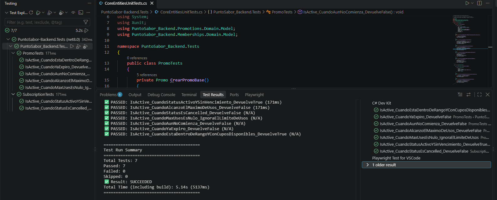
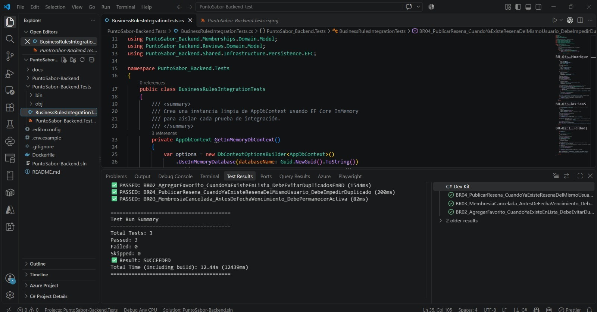
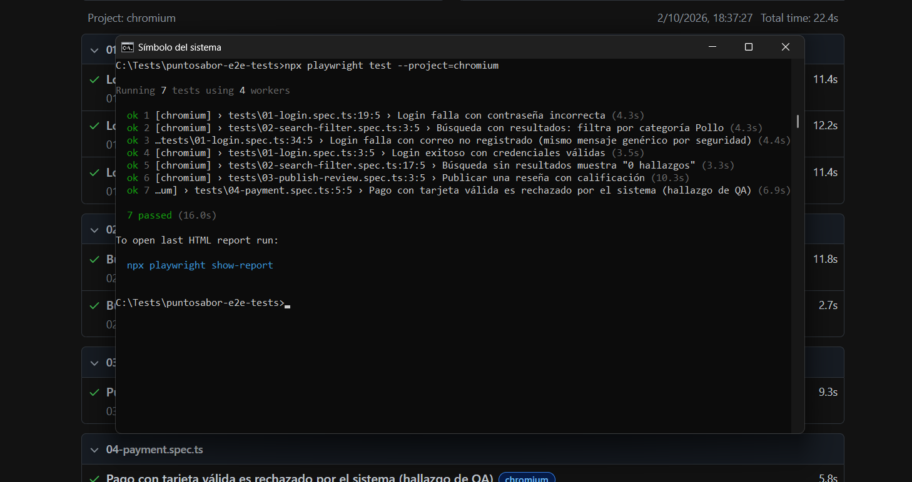
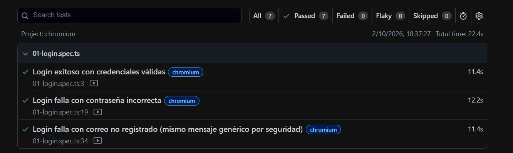
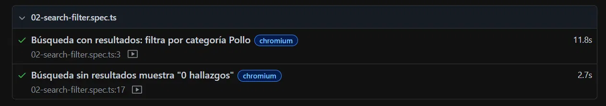
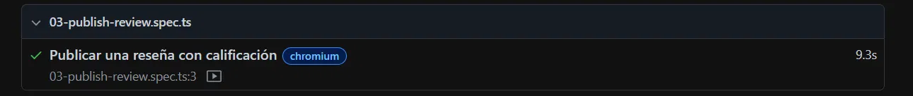
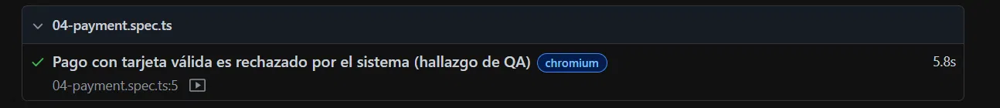
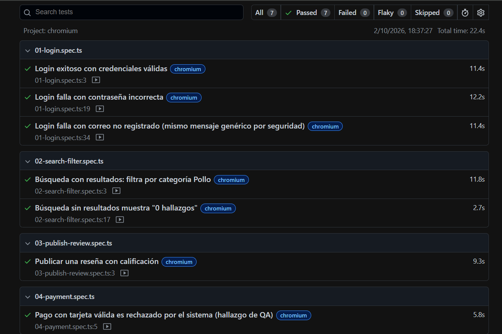
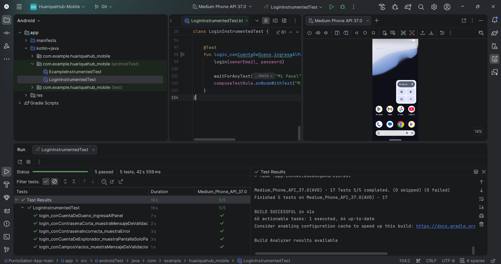

<div align="center">
  
  


Universidad Peruana de Ciencias Aplicadas

Carrera de Ingeniería de Software

**1ASI0732**

**Diseño de Experimentos de Ingeniería de Software**

NRC

**9112**

**Informe del Trabajo Final**

Docente

**Lennin Percy Cenas Vasquez**

Equipo

**HuariApp**

Proyecto

**PuntoSabor**

**Integrantes**

| Código | Apellidos y Nombres |
| --- | --- |
| u20241d995 | Cesar Jair Contreras Rojas |
| u202321843 | Delgado Carrasco, Schneider |
| u202312700 | Lopez Goitia, Carlos Alberto |
| u202411282 | Montalván Palomino, Bruno Rodolfo |
| u202410772 | Razuri Alvarez, Matias Francesco |

**Período 202602**

**Setiembre 2026**

</div>

---

# Registro de versiones del informe

| Versión | Fecha | Autor | Descripción de modificación |
| --- | --- | --- | --- |
|  |  |  |  |
# Project Report Collaboration Insights

**Repositorio de la documentación del proyecto:** https://github.com/HuariApp/puntosabor-report.git

# Informe de Trabajo Final - HuariApp

# Student Outcome

| Criterio específico | Acciones realizadas | Conclusiones |
| --- | --- | --- |
|  |  |  |

# Capítulo I: Introducción

## 1.1. Startup Profile

### 1.1.1. Descripción de la Startup

### 1.1.2. Perfiles de integrantes del equipo

## 1.2. Solution Profile

### 1.2.1. Antecedentes y problemática

### 1.2.2. Lean UX Process

#### 1.2.2.1. Lean UX Problem Statements

#### 1.2.2.2. Lean UX Assumptions

#### 1.2.2.3. Lean UX Hypothesis Statements

#### 1.2.2.4. Lean UX Canvas

## 1.3. Segmentos objetivo

# Capítulo II: Requirements Elicitation & Analysis

## 2.1. Competidores

### 2.1.1. Análisis competitivo

### 2.1.2. Estrategias y tácticas frente a competidores

## 2.2. Entrevistas

### 2.2.1. Diseño de entrevistas

### 2.2.2. Registro de entrevistas

### 2.2.3. Análisis de entrevistas

## 2.3. Needfinding

### 2.3.1. User Personas

### 2.3.2. User Task Matrix

### 2.3.3. User Journey Mapping

### 2.3.4. Empathy Mapping

### 2.3.5. As-is Scenario Mapping

## 2.4. Ubiquitous Language

# Capítulo III: Requirements Specification

## 3.1. To-Be Scenario Mapping

## 3.2. User Stories

## 3.3. Product Backlog

## 3.4. Impact Mapping

# Capítulo IV: Product Design

## 4.1. Style Guidelines

### 4.1.1. General Style Guidelines

### 4.1.2. Web Style Guidelines

### 4.1.3. Mobile Style Guidelines

#### 4.1.3.1. iOS Mobile Style Guidelines

#### 4.1.3.2. Android Mobile Style Guidelines

## 4.2. Information Architecture

### 4.2.1. Organization Systems

### 4.2.2. Labeling Systems

### 4.2.3. SEO Tags and Meta Tags

### 4.2.4. Searching Systems

### 4.2.5. Navigation Systems

## 4.3. Landing Page UI Design

### 4.3.1. Landing Page Wireframe

### 4.3.2. Landing Page Mock-up

## 4.4. Mobile Applications UX/UI Design

### 4.4.1. Mobile Applications Wireframes

### 4.4.2. Mobile Applications Wireflow Diagrams

### 4.4.3. Mobile Applications Mock-ups

### 4.4.4. Mobile Applications User Flow Diagrams

## 4.5. Mobile Applications Prototyping

### 4.5.1. Android Mobile Applications Prototyping

### 4.5.2. iOS Mobile Applications Prototyping

## 4.6. Web Applications UX/UI Design

### 4.6.1. Web Applications Wireframes

### 4.6.2. Web Applications Wireflow Diagrams

### 4.6.3. Web Applications Mock-ups

### 4.6.4. Web Applications User Flow Diagrams

## 4.7. Web Applications Prototyping

## 4.8. Domain-Driven Software Architecture

### 4.8.1. Software Architecture Context Diagram

### 4.8.2. Software Architecture Container Diagrams

### 4.8.3. Software Architecture Components Diagrams

## 4.9. Software Object-Oriented Design

### 4.9.1. Class Diagrams

### 4.9.2. Class Dictionary

## 4.10. Database Design

### 4.10.1. Relational/Non-Relational Database Diagram

# Capítulo V: Product Implementation

## 5.1. Software Configuration Management

### 5.1.1. Software Development Environment Configuration

### 5.1.2. Source Code Management

### 5.1.3. Source Code Style Guide & Conventions

### 5.1.4. Software Deployment Configuration

## 5.2. Product Implementation & Deployment

### 5.2.1. Sprint Backlogs

### 5.2.2. Implemented Landing Page Evidence

### 5.2.3. Implemented Frontend-Web Application Evidence

### 5.2.4. Acuerdo de Servicio - SaaS

### 5.2.5. Implemented Native-Mobile Application Evidence

### 5.2.6. Implemented RESTful API and/or Serverless Backend Evidence

### 5.2.7. RESTful API documentation

### 5.2.8. Team Collaboration Insights

## 5.3. Video About-the-Product

# Capítulo VI: Product Verification & Validation

## 6.1. Testing Suites & Validation

### 6.1.1. Core Entities Unit Tests

Se implementaron pruebas unitarias para las entidades del dominio que concentran 
lógica de negocio propia, aislándolas de la base de datos y de servicios externos. 
Se priorizaron las propiedades calculadas `Promo.IsActive` y `Subscription.IsActive`, 
que determinan la vigencia de promociones y membresías respectivamente.

**Framework:** xUnit (.NET 8)
**Patrón aplicado:** AAA (Arrange-Act-Assert / Preparar-Ejecutar-Verificar)

| # | Clase | Comportamiento probado |
|---|---|---|
| 1 | `Promo` | `IsActive` true cuando está dentro de rango y con cupos disponibles |
| 2 | `Promo` | `IsActive` false cuando ya expiró |
| 3 | `Promo` | `IsActive` false cuando aún no comienza |
| 4 | `Promo` | `IsActive` false cuando se agotaron los cupos |
| 5 | `Promo` | `IsActive` ignora el límite cuando `MaxUses` es nulo |
| 6 | `Subscription` | `IsActive` true si está activa y sin vencimiento |
| 7 | `Subscription` | `IsActive` false si el status es `cancelled` |

Las 7 pruebas se ejecutaron satisfactoriamente (7/7 superadas, 0 con error):



**Repositorio:** https://github.com/HuariqueHub/PuntoSabor-Backend (carpeta `PuntoSabor-Backend.Tests`)

| Repository | Branch | Commit Id | Commit Message | Commited on |
|---|---|---|---|---|
| PuntoSabor-Backend | feature/unit-tests-core-entities | `c421528` | `test: add unit tests for Promo and Subscription IsActive` | 05/10/2026 |

### 6.1.2. Core Integration Tests

Se implementaron pruebas de integración para validar las reglas de negocio clave (*Business Rules*) que involucran la interacción directa con la base de datos relacional y las restricciones de integridad entre entidades. Las pruebas se ejecutaron sobre un motor de base de datos en memoria (**SQLite In-Memory**), permitiendo validar persistencia, unicidad y consultas complejas en un entorno aislado, controlado y de rápida ejecución.

**Framework:** xUnit (.NET 8)  
**Motor DB de Prueba:** Microsoft.Data.Sqlite (In-Memory)  
**Patrón aplicado:** AAA (Arrange-Act-Assert / Preparar-Ejecutar-Verificar)

| # | Regla de Negocio | Comportamiento probado |
|---|---|---|
| 1 | `BR-01` | Prevención de reseñas duplicadas: lanza `InvalidOperationException` si el mismo usuario intenta publicar más de una reseña en el mismo huarique. |
| 2 | `BR-02` | Control de cancelación SaaS: verifica que una membresía con estado `cancelled` permanezca con beneficios activos (`IsActive = true`) hasta alcanzar su fecha de vencimiento (`EndDate`). |
| 3 | `BR-03` | Límite único de favoritos: garantiza que la combinación `UserId` y `HuariqueId` no se duplique en la base de datos al intentar agregar un favorito existente. |
| 4 | `BR-04` | Control de cupos en promociones: verifica que una promoción con `CurrentUses` igual a `MaxUses` pase automáticamente a `IsActive = false` y sea excluida del listado de promociones vigentes. |

Las 4 pruebas de integración se ejecutaron satisfactoriamente (4/4 superadas, 0 con error):



**Repositorio:** https://github.com/HuariqueHub/PuntoSabor-Backend (carpeta `PuntoSabor-Backend.Tests`)

| Repository | Branch | Commit Id | Commit Message | Commited on |
|---|---|---|---|---|
| PuntoSabor-Backend | main | `afb5b57` | `test: add integration tests for core business rules (BR-01 to BR-04)` | 06/10/2026 |

### 6.1.3. Core Behavior-Driven Development

Para esta sección se seleccionaron 10 escenarios de prueba basados en el enfoque **Behavior-Driven Development**, formalizando los criterios de aceptación ya definidos en las User Stories de la sección 3.2, siguiendo la estructura estándar **Given / When / Then**. Se priorizó al menos un escenario representativo por cada Epic relevante del proyecto, cubriendo los distintos roles involucrados como Usuario explorador, Dueño de huarique, Sistema y Visitante. Se emplea Scenario Outline con tablas Examples cuando varios casos comparten la misma estructura, siguiendo las buenas prácticas de BDD para que los escenarios sean directamente automatizables.

### Escenario 1 — Registrar e iniciar sesión de forma segura
**User Story:** US15 | **Epic:** EP07 — Autenticación y gestión de cuenta
 
```gherkin
Feature: Autenticación de usuario
  Como usuario
  Quiero crear una cuenta e iniciar sesión con credenciales seguras
  Para acceder a mi perfil y a las funciones personalizadas de PuntoSabor
 
  Scenario Outline: Inicio de sesión con distintas credenciales
    Given que existe una cuenta registrada con el correo "carla.dipes@gmail.com" y contraseña "Sazon2026!"
    When el usuario ingresa el correo "<correo>" y la contraseña "<contrasena>"
    Then el sistema responde con "<resultado>"
 
    Examples:
      | correo                  | contrasena   | resultado                                  |
      | carla.dipes@gmail.com   | Sazon2026!   | acceso concedido y redirección a Home      |
      | carla.dipes@gmail.com   | ClaveMala123 | mensaje de error "Credenciales incorrectas"|
      | nuevo@gmail.com         | Sazon2026!   | mensaje de error "Usuario no registrado"   |
```
---
 
### Escenario 2 — Filtrar huariques
**User Story:** US01 | **Epic:** EP01 — Descubrimiento de huariques
 
```gherkin
Feature: Filtrado de huariques
  Como usuario
  Quiero filtrar huariques por tipo de comida y rango de precio
  Para encontrar opciones acordes a mis preferencias
 
  Background:
    Given que existen los siguientes huariques registrados:
      | nombre          | categoria  | distrito      | precio |
      | El Costeño      | Marina     | San Miguel    | 25     |
      | Sabor Norteño   | Pollería   | Jesús María   | 18     |
      | La Brasa de Oro | Pollería   | Lince         | 22     |
 
  Scenario Outline: Búsqueda combinando categoría y precio máximo
    When el usuario filtra por categoría "<categoria>" y precio máximo "<precio_max>"
    Then el sistema muestra únicamente "<resultado_esperado>"
 
    Examples:
      | categoria | precio_max | resultado_esperado          |
      | Marina    | 30         | El Costeño                  |
      | Pollería  | 20         | Sabor Norteño                |
      | Criolla   | 50         | ningún resultado encontrado |
```
 
---
### Escenario 3 — Visualizar huariques en mapa
**User Story:** US02 | **Epic:** EP01 — Descubrimiento de huariques
 
```gherkin
Feature: Visualización en mapa
  Como usuario
  Quiero visualizar la ubicación de los huariques en un mapa
  Para identificar fácilmente cómo llegar a ellos
 
  Scenario: Selección de un marcador en el mapa
    Given que el huarique "El Costeño" está ubicado en el distrito San Miguel con calificación 4.5
    And su marcador es visible en el mapa de la sección Explore
    When el usuario hace clic sobre el marcador de "El Costeño"
    Then el sistema muestra un popup con el nombre "El Costeño", la dirección registrada y la calificación "4.5"
```
 
---
 
### Escenario 4 — Registrar un nuevo huarique
**User Story:** US04 | **Epic:** EP02 — Gestión de huariques
 
```gherkin
Feature: Registro de huarique
  Como dueño
  Quiero registrar un nuevo huarique con información básica
  Para que aparezca en la plataforma
 
  Scenario Outline: Registro de huarique con datos completos o incompletos
    Given que el dueño "Luis Pérez" completa el formulario con nombre "<nombre>", categoría "<categoria>" y dirección "<direccion>"
    When envía el formulario de registro
    Then el sistema responde con "<resultado>"
 
    Examples:
      | nombre      | categoria | direccion                  | resultado                                           |
      | Don Luis    | Criolla   | Jr. Las Magnolias 452      | huarique registrado y visible en Explore            |
      | Don Luis    | Criolla   | (vacío)                    | mensaje "Completa la dirección antes de continuar"  |
      | (vacío)     | Criolla   | Jr. Las Magnolias 452      | mensaje "El nombre del huarique es obligatorio"     |
```
 
---
 
### Escenario 5 — Publicar reseñas
**User Story:** US07 | **Epic:** EP03 — Reseñas y calificaciones
 
```gherkin
Feature: Publicación de reseñas
  Como usuario
  Quiero publicar una reseña y calificación sobre un huarique
  Para compartir mi experiencia con otros usuarios
 
  Scenario: Publicación exitosa de una reseña
    Given que el usuario "Carla Dipes" visitó el huarique "El Costeño" y no lo ha reseñado antes
    When publica la reseña "Excelente ceviche, muy fresco" con calificación de 5 estrellas
    Then el sistema agrega la reseña al perfil de "El Costeño"
    And el rating promedio del huarique se recalcula incluyendo la nueva calificación
 
  Scenario: Intento de reseña duplicada
    Given que "Carla Dipes" ya publicó una reseña sobre "El Costeño"
    When intenta publicar una segunda reseña sobre el mismo huarique
    Then el sistema muestra el mensaje "Ya has reseñado este huarique" y no crea un registro nuevo
```
 
---
 
### Escenario 6 — Moderar reseñas inapropiadas
**User Story:** US08 | **Epic:** EP03 — Reseñas y calificaciones
 
```gherkin
Feature: Moderación automática de reseñas
  Como sistema
  Quiero detectar reseñas con lenguaje ofensivo
  Para evitar contenido ofensivo dentro de la plataforma
 
  Scenario Outline: Moderación según el contenido de la reseña
    When un usuario intenta publicar la reseña "<texto_reseña>"
    Then el sistema responde con "<resultado>"
 
    Examples:
      | texto_reseña                                   | resultado                                  |
      | "La comida llegó fría pero el sabor es bueno"  | reseña publicada sin restricciones          |
      | "Este lugar es una basura y el dueño un [insulto]" | reseña bloqueada y marcada para revisión |
```
 
---
 
### Escenario 7 — Convertir visitante en usuario registrado desde la Landing Page
**User Story:** US09 / US10 | **Epic:** EP04 — Landing Page
 
```gherkin
Feature: Conversión de visitante a usuario registrado
  Como visitante
  Quiero conocer los beneficios de PuntoSabor y registrarme sin fricción
  Para empezar a usar la plataforma como explorador o como dueño de huarique
 
  Scenario: El visitante revisa los planes y decide registrarse como dueño
    Given que el visitante accede a la landing page y revisa la sección "Planes para tu negocio"
    When hace clic en "Empezar gratis" del plan Básico
    Then el sistema abre el modal de registro con el rol "Dueño" preseleccionado
 
  Scenario: El visitante envía una consulta sin completar todos los campos
    Given que el visitante abre el formulario de contacto
    When envía el formulario dejando el campo "correo" vacío
    Then el sistema muestra el mensaje "Completa tu correo para poder contactarte" y no envía la consulta
```
 
---
 
### Escenario 8 — Seleccionar planes de membresía
**User Story:** US23 | **Epic:** EP10 — Membresías, pagos y promociones
 
```gherkin
Feature: Selección de plan de membresía
  Como dueño
  Quiero elegir entre planes de membresía con distintos beneficios
  Para aumentar la visibilidad de mi huarique
 
  Scenario Outline: Activación de un plan de membresía
    Given que el dueño "Luis Pérez" tiene actualmente el plan "<plan_actual>"
    When selecciona y confirma el plan "<plan_nuevo>" con precio "<precio>"
    Then el sistema activa el plan "<plan_nuevo>" para su huarique
 
    Examples:
      | plan_actual | plan_nuevo | precio |
      | Básico      | Premium    | $35    |
      | Premium     | Exclusivo  | $50    |
```
 
---
 
### Escenario 9 — Pagar suscripción
**User Story:** US24 | **Epic:** EP10 — Membresías, pagos y promociones
 
```gherkin
Feature: Pago de suscripción
  Como dueño
  Quiero pagar mi membresía mediante tarjeta o billetera digital
  Para mantener activo mi plan
 
  Scenario Outline: Resultado del pago según los datos ingresados
    Given que el dueño selecciona el plan "Premium" con precio "$35"
    When ingresa los datos de pago "<datos_tarjeta>"
    Then el sistema responde con "<resultado>"
 
    Examples:
      | datos_tarjeta                                | resultado                                              |
      | tarjeta 4111 1111 1111 1111, vigente, CVV 123 | pago registrado y suscripción Premium activada         |
      | tarjeta 4111 1111 1111 1111, vencida 01/24    | mensaje "Tarjeta vencida" y suscripción no activada    |
      | número de tarjeta incompleto                  | mensaje "Verifica los datos de tu tarjeta"             |
```
 
---
 
### Escenario 10 — Reportar y corregir información incorrecta
**User Story:** US21 | **Epic:** EP09 — Información y estado del huarique
 
```gherkin
Feature: Reporte de información incorrecta
  Como usuario
  Quiero reportar datos incorrectos de un huarique
  Para contribuir a mantener actualizada la información
 
  Scenario: Un usuario registra un reporte sobre un horario incorrecto
    Given que el huarique "Sabor Norteño" muestra el horario "08:00 - 16:00"
    When el usuario reporta que "el horario real es 08:00 - 20:00" con motivo "Horario desactualizado"
    Then el sistema crea el reporte con estado "pending" asociado a "Sabor Norteño"
 
  Scenario: El equipo revisa y corrige el reporte previamente registrado
    Given que existe un reporte en estado "pending" sobre el huarique "Sabor Norteño" indicando el horario correcto "08:00 - 20:00"
    When el equipo revisa el reporte y actualiza el horario del huarique
    Then el estado del reporte cambia a "reviewed"
    And el perfil de "Sabor Norteño" muestra el horario "08:00 - 20:00" a los usuarios
```

### 6.1.4. Core System Tests

Para esta sección se automatizaron 4 de los 10 escenarios definidos en el
documento BDD (6.1.3), con un total de 7 casos de prueba, priorizando los
flujos más críticos del sistema: autenticación, búsqueda, publicación de
contenido y pagos. Se utilizó **Playwright** como framework de automatización,
combinando el grabador (Codegen) para capturar las interacciones reales sobre
el Front desplegado en producción (`https://punto-sabor-front.vercel.app`) con
verificaciones (`expect`) escritas manualmente para validar los resultados
esperados. El código de las pruebas está en la carpeta `e2e-tests/` del
repositorio del Front.

### Configuración del entorno

Las pruebas se ejecutan con `npx playwright test --project=chromium`.



### Escenario 1 — Autenticación

Se probaron 3 casos: login exitoso, contraseña incorrecta y correo no
registrado.



### Escenario 2 — Búsqueda y filtrado

Se probaron 2 casos: la búsqueda "Pollo" muestra resultados de esa categoría y
una búsqueda sin coincidencias muestra "0 hallazgos".



### Escenario 5 — Publicación de reseñas

El usuario inicia sesión, elige el rol Explorer, busca "Pollo", publica una
reseña de 5 estrellas con comentario y se verifica que aparece en el listado
del huarique.



### Escenario 9 — Pago de suscripción



La prueba recorre el flujo grabado completo (inicio de sesión, elección de rol,
planes, "Choose Premium", datos de tarjeta y pago) y verifica el mensaje
"Payment Successful!", la activación de la membresía y el ID de transacción.
Requiere una cuenta sin suscripción previa.

**Observación:** si la cuenta ya tiene una suscripción activa, el pago falla en
la versión desplegada al momento de las pruebas (`PATCH` no soportado por el
backend, HTTP 405); la corrección se encuentra en revisión (PR #1 del Front).

### Evidencia de ejecución



Adicionalmente, se automatizó el flujo de autenticación de la aplicación
móvil (5 casos) con Jetpack Compose UI Test, sobre el emulador de Android
Studio.

Se automatizó el flujo de autenticación de la app para dueños con
**Jetpack Compose UI Test**, ejecutado en el emulador de Android Studio
(Medium Phone, API 37) contra el backend desplegado en Railway. El código está
en `app/src/androidTest/` del repositorio de la app.

| N.° | Caso | Resultado esperado |
|---|---|---|
| 1 | Campos vacíos | Muestra "Por favor completa todos los campos" |
| 2 | Contraseña corta | Muestra "La contraseña debe tener al menos 6 caracteres" |
| 3 | Contraseña incorrecta | Muestra el error de credenciales del backend |
| 4 | Cuenta de explorador | Muestra "Esta app es para dueños" |
| 5 | Cuenta de dueño | Navega al panel "Mi Panel" |



## 6.2. Static testing & Verification

### 6.2.1. Static Code Analysis

#### 6.2.1.1. Coding standard & Code conventions

#### 6.2.1.2. Code Quality & Code Security

### 6.2.2. Reviews

## 6.3. Validation Interviews

### 6.3.1. Diseño de Entrevistas

### 6.3.2. Registro de Entrevistas

### 6.3.3. Evaluaciones según heurísticas

## 6.4. Auditoría de Experiencias de Usuario

### 6.4.1. Auditoría realizada

#### 6.4.1.1. Información del grupo auditado

#### 6.4.1.2. Cronograma de auditoría realizada

#### 6.4.1.3. Contenido de auditoría realizada

### 6.4.2. Auditoría recibida

#### 6.4.2.1. Información del grupo auditor

#### 6.4.2.2. Cronograma de auditoría recibida

#### 6.4.2.3. Contenido de auditoría recibida

#### 6.4.2.4. Resumen de modificaciones para subsanar hallazgos

# Capítulo VII: DevOps Practices

## 7.1. Continuous Integration

### 7.1.1. Tools and Practices

### 7.1.2. Build & Test Suite Pipeline Components

## 7.2. Continuous Delivery

### 7.2.1. Tools and Practices

### 7.2.2. Stages Deployment Pipeline Components

## 7.3. Continuous deployment

### 7.3.1. Tools and Practices

### 7.3.2. Production Deployment Pipeline Components

## 7.4. Continuous Monitoring

### 7.4.1. Tools and Practices

### 7.4.2. Monitoring Pipeline Components

### 7.4.3. Alerting Pipeline Components

### 7.4.4. Notification Pipeline Components

# Capítulo VIII: Experiment-Driven Development

## 8.1. Experiment Planning

### 8.1.1. As-Is Summary

### 8.1.2. Raw Material: Assumptions, Knowledge Gaps, Ideas, Claims

### 8.1.3. Experiment-Ready Questions

### 8.1.4. Question Backlog

### 8.1.5. Experiment Cards

## 8.2. Experiment Design

### 8.2.1. Hypotheses

### 8.2.2. Domain Business Metrics

### 8.2.3. Measures

### 8.2.4. Conditions

### 8.2.5. Scale Calculations and Decisions

### 8.2.6. Methods Selection

### 8.2.7. Data Analytics: Goals, KPIs and Metrics Selection

### 8.2.8. Web and Mobile Tracking Plan

## 8.3. Experimentation

### 8.3.1. To-Be User Stories

### 8.3.2. To-Be Product Backlog

### 8.3.3. Pipeline-supported, Experiment-Driven To-Be Software Platform Lifecycle

#### 8.3.3.1. To-Be Sprint Backlogs

#### 8.3.3.2. Implemented To-Be Landing Page Evidence

#### 8.3.3.3. Implemented To-Be Frontend-Web Application Evidence

#### 8.3.3.4. Implemented To-Be Native-Mobile Application Evidence

#### 8.3.3.5. Implemented To-Be RESTful API and/or Serverless Backend Evidence

#### 8.3.3.6. Team Collaboration Insights

### Matriz de Evaluación Ética y de Impacto

### 8.3.4. To-Be Validation Interviews

#### 8.3.4.1. Diseño de Entrevistas

#### 8.3.4.2. Registro de Entrevistas

## 8.4. Experiment Aftermath & Analysis

### 8.4.1. Analysis and Interpretation of Results

### 8.4.2. Re-scored and Re-prioritized Question Backlog

## 8.5. Continuous Learning

### 8.5.1. Shareback Session Artifacts: Learning Workflow

## 8.6. To-Be Software Platform Pre-launch

### 8.6.1. About-the-Product Intro Video

### 8.6.2. Resumen usando Gees FrameWork

## Conclusiones

## Bibliografía

## Anexos
