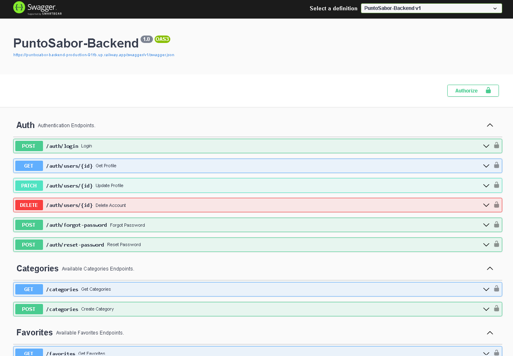

  
  

Universidad Peruana de Ciencias Aplicadas

Carrera de Ingeniería de Software

**1ASI0732**

**Diseño de Experimentos de Ingeniería de Software**

NRC

**9112**

**Informe del Trabajo Final**

Docente

**Lennin Percy Cenas Vasquez**

Equipo

**HuariApp**

Proyecto

**PuntoSabor**

**Integrantes**

| Código | Apellidos y Nombres |
| --- | --- |
| u20241d995 | Cesar Jair Contreras Rojas |
| u202321843 | Delgado Carrasco, Schneider |
| u202312700 | Lopez Goitia, Carlos Alberto |
| u202411282 | Montalván Palomino, Bruno Rodolfo |
| u202410772 | Razuri Alvarez, Matias Francesco |

**Período 202602**

**Setiembre 2026**

---

# Registro de versiones del informe

| Versión | Fecha | Autor | Descripción de modificación |
| --- | --- | --- | --- |
|  |  |  |  |
# Project Report Collaboration Insights

**Repositorio de la documentación del proyecto:** https://github.com/HuariApp/puntosabor-report.git

# Informe de Trabajo Final - HuariApp

# Student Outcome

| Criterio específico | Acciones realizadas | Conclusiones |
| --- | --- | --- |
|  |  |  |

# Capítulo I: Introducción

## 1.1. Startup Profile

### 1.1.1. Descripción de la Startup

### 1.1.2. Perfiles de integrantes del equipo

## 1.2. Solution Profile

### 1.2.1. Antecedentes y problemática

### 1.2.2. Lean UX Process

#### 1.2.2.1. Lean UX Problem Statements

#### 1.2.2.2. Lean UX Assumptions

#### 1.2.2.3. Lean UX Hypothesis Statements

#### 1.2.2.4. Lean UX Canvas

## 1.3. Segmentos objetivo

# Capítulo II: Requirements Elicitation & Analysis

## 2.1. Competidores

### 2.1.1. Análisis competitivo

### 2.1.2. Estrategias y tácticas frente a competidores

## 2.2. Entrevistas

### 2.2.1. Diseño de entrevistas

### 2.2.2. Registro de entrevistas

### 2.2.3. Análisis de entrevistas

## 2.3. Needfinding

### 2.3.1. User Personas

### 2.3.2. User Task Matrix

### 2.3.3. User Journey Mapping

### 2.3.4. Empathy Mapping

### 2.3.5. As-is Scenario Mapping

## 2.4. Ubiquitous Language

# Capítulo III: Requirements Specification

## 3.1. To-Be Scenario Mapping

## 3.2. User Stories

## 3.3. Product Backlog

## 3.4. Impact Mapping

# Capítulo IV: Product Design

## 4.1. Style Guidelines

### 4.1.1. General Style Guidelines

### 4.1.2. Web Style Guidelines

### 4.1.3. Mobile Style Guidelines

#### 4.1.3.1. iOS Mobile Style Guidelines

#### 4.1.3.2. Android Mobile Style Guidelines

## 4.2. Information Architecture

### 4.2.1. Organization Systems

### 4.2.2. Labeling Systems

### 4.2.3. SEO Tags and Meta Tags

### 4.2.4. Searching Systems

### 4.2.5. Navigation Systems

## 4.3. Landing Page UI Design

### 4.3.1. Landing Page Wireframe

### 4.3.2. Landing Page Mock-up

## 4.4. Mobile Applications UX/UI Design

### 4.4.1. Mobile Applications Wireframes

### 4.4.2. Mobile Applications Wireflow Diagrams

### 4.4.3. Mobile Applications Mock-ups

### 4.4.4. Mobile Applications User Flow Diagrams

## 4.5. Mobile Applications Prototyping

### 4.5.1. Android Mobile Applications Prototyping

### 4.5.2. iOS Mobile Applications Prototyping

## 4.6. Web Applications UX/UI Design

### 4.6.1. Web Applications Wireframes

### 4.6.2. Web Applications Wireflow Diagrams

### 4.6.3. Web Applications Mock-ups

### 4.6.4. Web Applications User Flow Diagrams

## 4.7. Web Applications Prototyping

## 4.8. Domain-Driven Software Architecture

### 4.8.1. Software Architecture Context Diagram

### 4.8.2. Software Architecture Container Diagrams

### 4.8.3. Software Architecture Components Diagrams

## 4.9. Software Object-Oriented Design

### 4.9.1. Class Diagrams

### 4.9.2. Class Dictionary

## 4.10. Database Design

### 4.10.1. Relational/Non-Relational Database Diagram

# Capítulo V: Product Implementation

## 5.1. Software Configuration Management

### 5.1.1. Software Development Environment Configuration

### 5.1.2. Source Code Management

### 5.1.3. Source Code Style Guide & Conventions

### 5.1.4. Software Deployment Configuration

## 5.2. Product Implementation & Deployment

### 5.2.1. Sprint Backlogs

### 5.2.2. Implemented Landing Page Evidence

### 5.2.3. Implemented Frontend-Web Application Evidence

### 5.2.4. Acuerdo de Servicio - SaaS

### 5.2.5. Implemented Native-Mobile Application Evidence

### 5.2.6. Implemented RESTful API and/or Serverless Backend Evidence

### 5.2.7. RESTful API documentation

### 5.2.8. Team Collaboration Insights

## 5.3. Video About-the-Product

# Capítulo VI: Product Verification & Validation

## 6.1. Testing Suites & Validation

### 6.1.1. Core Entities Unit Tests

### 6.1.2. Core Integration Tests

### 6.1.3. Core Behavior-Driven Development

### 6.1.4. Core System Tests

## 6.2. Static testing & Verification

### 6.2.1. Static Code Analysis

#### 6.2.1.1. Coding standard & Code conventions

#### 6.2.1.2. Code Quality & Code Security

### 6.2.2. Reviews

## 6.3. Validation Interviews

### 6.3.1. Diseño de Entrevistas

### 6.3.2. Registro de Entrevistas

### 6.3.3. Evaluaciones según heurísticas

## 6.4. Auditoría de Experiencias de Usuario

### 6.4.1. Auditoría realizada

#### 6.4.1.1. Información del grupo auditado

#### 6.4.1.2. Cronograma de auditoría realizada

#### 6.4.1.3. Contenido de auditoría realizada

### 6.4.2. Auditoría recibida

#### 6.4.2.1. Información del grupo auditor

#### 6.4.2.2. Cronograma de auditoría recibida

#### 6.4.2.3. Contenido de auditoría recibida

#### 6.4.2.4. Resumen de modificaciones para subsanar hallazgos

# Capítulo VII: DevOps Practices

En este capítulo se describen las prácticas DevOps consideradas para el desarrollo y mantenimiento de PuntoSabor. Estas prácticas permiten integrar, validar, entregar, desplegar y supervisar los diferentes componentes de la solución de una forma organizada y repetible.

La adopción de DevOps busca reducir los errores producidos durante la integración de los cambios, facilitar la colaboración entre los integrantes del equipo y asegurar que las nuevas versiones del producto puedan ser verificadas antes de ser publicadas. Para ello, se consideran los procesos de Continuous Integration, Continuous Delivery, Continuous Deployment y Continuous Monitoring.

## 7.1. Continuous Integration

Continuous Integration o Integración Continua es una práctica de desarrollo que consiste en integrar frecuentemente los cambios realizados por los integrantes del equipo dentro de un repositorio compartido. De esta manera, los avances pueden ser revisados y validados antes de incorporarse a las ramas principales del proyecto.

En PuntoSabor, esta práctica permite organizar el trabajo realizado por los diferentes integrantes del equipo. Los cambios son gestionados mediante Git y almacenados en GitHub, utilizando ramas independientes para desarrollar los diferentes capítulos antes de integrarlos progresivamente en `develop` y posteriormente en `main`.

### 7.1.1. Tools and Practices

Para el proceso de Continuous Integration de PuntoSabor se utilizan principalmente Git y GitHub. Asimismo, GitHub Actions se considera como herramienta para la automatización de procesos de compilación y pruebas dentro de los repositorios de software del proyecto.

Git se utiliza como sistema de control de versiones para registrar los cambios realizados durante el desarrollo. Esto permite mantener un historial de modificaciones, identificar los aportes realizados por los integrantes del equipo y recuperar versiones anteriores cuando sea necesario.

GitHub funciona como repositorio remoto central del proyecto y permite que los integrantes trabajen de manera colaborativa mediante diferentes ramas. Además, facilita la revisión e integración de cambios mediante Pull Requests.

Actualmente, el repositorio del informe de PuntoSabor se encuentra organizado con las siguientes ramas:

| Rama | Propósito |
|---|---|
| `main` | Contiene la versión principal y estable del informe del proyecto. |
| `develop` | Integra los avances desarrollados por el equipo antes de incorporarlos a `main`. |
| `feature/chapter-1` | Contiene el desarrollo correspondiente al Capítulo I. |
| `feature/chapter-2` | Contiene el desarrollo correspondiente al Capítulo II. |
| `feature/chapter-3` | Contiene el desarrollo correspondiente al Capítulo III. |
| `feature/chapter-4` | Contiene el desarrollo correspondiente al Capítulo IV. |
| `feature/chapter-5` | Contiene el desarrollo correspondiente al Capítulo V. |
| `feature/chapter-6` | Contiene el desarrollo correspondiente al Capítulo VI. |
| `feature/chapter-7` | Contiene el desarrollo correspondiente al Capítulo VII. |
| `feature/chapter-8` | Contiene el desarrollo correspondiente al Capítulo VIII. |

Esta organización permite que cada capítulo pueda desarrollarse de manera independiente sin modificar directamente las ramas principales. Una vez que el contenido de una rama se encuentra terminado y revisado, sus cambios pueden integrarse hacia `develop` y posteriormente hacia `main`.

Asimismo, se utilizan mensajes de commit descriptivos con la finalidad de mantener un historial comprensible de las modificaciones realizadas en cada rama.

Como complemento al proceso de integración, GitHub Actions permite definir workflows que pueden ejecutarse ante eventos determinados del repositorio, como un `push` o un Pull Request. Estos workflows pueden utilizarse para automatizar procesos de compilación, ejecución de pruebas y validación del software antes de realizar una integración.

De esta manera, Continuous Integration permite mantener una estructura organizada de trabajo y detectar posibles problemas antes de incorporar nuevos cambios a una versión estable del proyecto.

### 7.1.2. Build & Test Suite Pipeline Components

El Build & Test Suite Pipeline tiene como objetivo verificar los cambios realizados en los componentes de software de PuntoSabor antes de que estos sean considerados para una versión estable.

El flujo general considerado para PuntoSabor es el siguiente:

`Source Code → Dependency Restore → Build → Automated Tests → Validation → Result`

Los principales componentes del pipeline son:

| Componente | Descripción |
|---|---|
| Source Code | Se obtiene desde GitHub la versión del código correspondiente al cambio que inició el proceso. |
| Environment Setup | Se prepara el entorno necesario para compilar y ejecutar el componente del proyecto. |
| Dependency Restore | Se descargan las dependencias requeridas por la aplicación. |
| Build | Se comprueba que el proyecto pueda compilarse correctamente. |
| Automated Tests | Se ejecutan las pruebas automatizadas disponibles para detectar posibles errores. |
| Validation | Se verifica que las etapas de compilación y pruebas hayan finalizado satisfactoriamente. |
| Pipeline Result | Se registra el resultado final del proceso como exitoso o fallido. |

Para el backend de PuntoSabor desarrollado en .NET 8, el proceso de construcción considera la restauración de las dependencias mediante `dotnet restore` y posteriormente la compilación mediante `dotnet build`.

En el caso de la aplicación móvil Android, Gradle permite administrar las dependencias y realizar el proceso de construcción de la aplicación.

Además, las pruebas de sistema desarrolladas con Playwright permiten automatizar la validación de diferentes flujos funcionales de PuntoSabor, complementando el proceso de verificación previo a una integración.

En caso de que alguna etapa del pipeline presente un error, el cambio deberá ser revisado y corregido antes de continuar con su integración hacia una rama estable.

De esta manera, el Build & Test Suite Pipeline busca asegurar que los cambios incorporados al proyecto mantengan un nivel adecuado de estabilidad y reduzcan la posibilidad de introducir errores durante el proceso de integración.

## 7.2. Continuous Delivery

Continuous Delivery o Entrega Continua es una práctica de DevOps que busca mantener el software en un estado preparado para ser desplegado después de superar diferentes procesos de construcción, pruebas y validación.

A diferencia de Continuous Deployment, en Continuous Delivery la versión del software puede encontrarse lista para ser publicada, pero el despliegue final requiere una decisión o aprobación del equipo antes de realizarse.

En PuntoSabor, esta práctica permite organizar los cambios desarrollados en los diferentes componentes de la solución y verificar que una nueva versión cumpla con las condiciones necesarias antes de ser considerada para su publicación. De esta manera, se busca reducir el riesgo de desplegar funcionalidades con errores y mantener un proceso de entrega controlado.

### 7.2.1. Tools and Practices

Para el proceso de Continuous Delivery de PuntoSabor se consideran las herramientas que actualmente forman parte del desarrollo, control de versiones, pruebas y despliegue del proyecto.

Git es utilizado como sistema de control de versiones, mientras que GitHub funciona como repositorio remoto para almacenar y administrar los cambios realizados por los integrantes del equipo.

Dentro del repositorio del informe, los capítulos son desarrollados en ramas independientes como `feature/chapter-1`, `feature/chapter-2`, hasta `feature/chapter-8`. Posteriormente, los cambios pueden ser integrados hacia la rama `develop` y finalmente hacia `main`.

GitHub también permite utilizar Pull Requests para revisar los cambios antes de incorporarlos a otra rama, facilitando el control de las modificaciones realizadas por los integrantes.

En cuanto a la implementación de PuntoSabor, el backend está desarrollado utilizando .NET 8 y utiliza MySQL 8 para la persistencia de información. El backend se encuentra desplegado mediante Railway y utiliza Docker para la preparación del entorno de ejecución.

Para la verificación del funcionamiento del sistema se cuenta con pruebas automatizadas desarrolladas con Playwright, las cuales permiten validar diferentes flujos de PuntoSabor antes de considerar una versión como preparada para su entrega.

Las principales tecnologías y herramientas consideradas dentro de este proceso son:

| Componente | Tecnología o herramienta |
|---|---|
| Control de versiones | Git |
| Repositorio remoto | GitHub |
| Backend | .NET 8 |
| Base de datos | MySQL 8 |
| Contenedorización del backend | Docker |
| Despliegue del backend | Railway |
| Pruebas automatizadas | Playwright |

Estas herramientas permiten establecer un proceso en el cual los cambios pueden ser revisados, construidos, probados e integrados antes de considerar una nueva versión de PuntoSabor como preparada para su publicación.

### 7.2.2. Stages Deployment Pipeline Components

El proceso de Continuous Delivery de PuntoSabor puede dividirse en diferentes etapas que permiten verificar progresivamente que una nueva versión se encuentre preparada para ser desplegada.

El flujo general considerado es el siguiente:

`Source → Build → Test → Integration → Release Preparation → Approval`

**Source Stage**

El proceso comienza con los cambios realizados por los integrantes del equipo y almacenados en GitHub.

Cada modificación queda registrada mediante commits dentro de la rama correspondiente al trabajo desarrollado. En el caso del informe, por ejemplo, cada capítulo cuenta con una rama independiente antes de ser integrado hacia `develop`.

Este control permite mantener la trazabilidad de los cambios y evitar modificaciones directas sobre la versión principal del proyecto.

**Build Stage**

En esta etapa se verifica que el componente desarrollado pueda construirse correctamente y que sus dependencias se encuentren disponibles.

En el caso del backend desarrollado con .NET 8, se realiza la restauración de las dependencias necesarias y posteriormente la compilación del proyecto.

El objetivo principal de esta etapa es detectar problemas de compilación antes de continuar con las pruebas y la preparación de una nueva versión.

**Test Stage**

Una vez que el proyecto puede ser construido correctamente, se realizan las pruebas correspondientes para comprobar el funcionamiento de las funcionalidades implementadas.

En PuntoSabor se cuenta con pruebas automatizadas desarrolladas utilizando Playwright, las cuales permiten verificar diferentes flujos funcionales del sistema.

Si una prueba presenta errores, los cambios deben ser revisados y corregidos antes de continuar con el proceso de entrega.

**Integration Stage**

Los cambios que han sido revisados pueden ser integrados con el trabajo realizado por los demás integrantes del equipo.

En el repositorio del informe de PuntoSabor, la rama `develop` cumple la función de reunir los avances desarrollados en las diferentes ramas `feature/chapter-X` antes de incorporarlos posteriormente a `main`.

El flujo utilizado puede representarse de la siguiente manera:

`feature/chapter-X → develop → main`

Esta separación permite mantener una versión integrada del trabajo sin modificar directamente la rama principal durante el desarrollo.

**Release Preparation Stage**

Una vez que los cambios han sido integrados y verificados, se prepara la versión que podrá ser utilizada para un futuro despliegue.

En esta etapa se comprueba que el proyecto pueda ejecutarse correctamente, que las pruebas realizadas hayan finalizado de manera satisfactoria y que no existan errores conocidos que impidan continuar con la publicación.

Para el backend de PuntoSabor, Railway constituye la plataforma documentada para alojar la aplicación, mientras que Docker permite mantener una configuración reproducible del entorno donde se ejecuta el servicio.

**Approval Stage**

En Continuous Delivery, el hecho de que una versión se encuentre preparada no significa necesariamente que será desplegada de manera automática.

Antes de realizar la publicación, el equipo puede revisar la versión preparada y decidir si cumple con las condiciones necesarias para llegar al entorno de producción.

El flujo completo puede resumirse de la siguiente manera:

`Changes → Build → Tests → Integration → Release Preparation → Approval`

De esta manera, Continuous Delivery permite mantener los componentes de PuntoSabor preparados para una futura publicación, asegurando previamente que los cambios hayan pasado por procesos de revisión, construcción, pruebas e integración.
## 7.3. Continuous deployment

Continuous Deployment o Despliegue Continuo es una práctica de DevOps orientada a llevar versiones validadas del software hacia un entorno de producción de forma frecuente y controlada.

Esta práctica continúa el proceso iniciado en Continuous Integration y Continuous Delivery. Primero, los cambios desarrollados deben ser revisados, integrados y verificados. Posteriormente, una versión que cumple con las condiciones establecidas puede ser utilizada para actualizar el entorno donde se encuentra ejecutándose la aplicación.

En PuntoSabor, el backend está desarrollado con .NET 8 y se encuentra desplegado en Railway. Además, se utiliza Docker para definir el entorno de ejecución y MySQL 8 para la persistencia de la información.

El objetivo del proceso de despliegue es mantener una versión funcional del backend disponible para los demás componentes de PuntoSabor, reduciendo los errores que pueden producirse al trasladar una nueva versión hacia producción.

### 7.3.1. Tools and Practices

Para el proceso de despliegue de PuntoSabor se consideran las herramientas utilizadas para el control de versiones, organización de ramas, construcción del backend, contenedorización y publicación del servicio.

Git se utiliza como sistema de control de versiones para mantener un historial de los cambios realizados en el proyecto, mientras que GitHub funciona como repositorio remoto donde se almacenan y administran las diferentes versiones.

Para organizar el trabajo, PuntoSabor emplea una estrategia de ramificación basada en GitFlow simplificado. El desarrollo se realiza en ramas independientes como `feature/chapter-1` hasta `feature/chapter-8`, cuyos cambios son posteriormente integrados hacia `develop` y, después de su revisión, pueden incorporarse a `main`.

El flujo utilizado por el equipo puede representarse de la siguiente manera:

`feature/chapter-X → develop → main`

Esta organización permite separar los cambios que todavía se encuentran en desarrollo de la versión principal del proyecto y facilita la trazabilidad de las modificaciones realizadas por los integrantes del equipo.

El backend de PuntoSabor se encuentra desarrollado utilizando .NET 8. Para su ejecución en un entorno controlado se utiliza Docker, permitiendo definir las dependencias y configuraciones requeridas por el servicio.

Railway es la plataforma utilizada para alojar el backend de PuntoSabor. Asimismo, MySQL 8 se utiliza como sistema de gestión de base de datos para almacenar la información utilizada por la plataforma.

Las principales herramientas relacionadas con el proceso de despliegue son:

| Componente | Tecnología o herramienta |
|---|---|
| Control de versiones | Git |
| Repositorio remoto | GitHub |
| Estrategia de ramificación | GitFlow simplificado |
| Backend | .NET 8 |
| Contenedorización | Docker |
| Plataforma de despliegue | Railway |
| Base de datos | MySQL 8 |

Antes de considerar una versión para producción, los cambios deben haber pasado previamente por los procesos de revisión, construcción y pruebas correspondientes.

De esta manera, el proceso general puede representarse como:

`Development → Integration → Validation → Release → Deployment`

Este flujo permite mantener una separación entre el desarrollo de nuevas funcionalidades y la versión que finalmente será utilizada en el entorno de producción.

### 7.3.2. Production Deployment Pipeline Components

El Production Deployment Pipeline representa el conjunto de componentes y etapas necesarias para llevar una versión validada del backend de PuntoSabor hacia su entorno de producción.

El flujo general considerado para este proceso es:

`GitHub → Build → Docker → Railway → MySQL → Production Validation`

Los principales componentes del pipeline son:

| Componente | Descripción |
|---|---|
| Source Control | Git y GitHub permiten mantener e identificar la versión del código considerada para el despliegue. |
| Branch Management | La estrategia GitFlow simplificada permite organizar el trabajo mediante ramas de desarrollo, integración y versión principal. |
| Build | Se comprueba que el backend desarrollado en .NET 8 pueda construirse correctamente. |
| Container Preparation | Docker permite preparar un entorno consistente para la ejecución del backend. |
| Deployment Environment | Railway proporciona el entorno donde se encuentra desplegado el backend de PuntoSabor. |
| Database Service | MySQL 8 proporciona la persistencia de los datos utilizados por el backend. |
| Production Validation | Después del despliegue se verifica que el servicio se encuentre disponible y responda correctamente. |

**Source Control**

El proceso comienza a partir del código almacenado en GitHub. El uso de Git permite identificar los cambios realizados, mantener diferentes versiones y recuperar estados anteriores del proyecto cuando sea necesario.

Antes de considerar una nueva versión para producción, los cambios deben haber sido integrados siguiendo la organización de ramas establecida por el equipo.

**Branch Management**

PuntoSabor utiliza una estrategia basada en GitFlow simplificado para organizar los cambios.

Las ramas `feature/chapter-X` contienen los desarrollos independientes realizados por el equipo. Posteriormente, estos cambios pueden integrarse en `develop`, donde se reúnen los avances antes de incorporarlos finalmente a `main`.

El flujo puede representarse de la siguiente manera:

`feature/chapter-X → develop → main`

De esta forma, `main` mantiene la versión principal del proyecto mientras los cambios en desarrollo permanecen separados hasta completar su revisión.

**Build**

En esta etapa se verifica que el backend desarrollado en .NET 8 pueda construirse correctamente.

El proceso permite identificar errores relacionados con dependencias o problemas de compilación antes de llevar una nueva versión hacia el entorno donde se encuentra desplegado el servicio.

**Container Preparation**

Docker permite preparar el entorno necesario para ejecutar el backend de manera consistente.

Mediante la utilización de un contenedor se pueden definir las dependencias y configuraciones requeridas por la aplicación, reduciendo diferencias entre el entorno de desarrollo y el entorno utilizado para el despliegue.

**Deployment Environment**

Railway es la plataforma utilizada para alojar el backend de PuntoSabor.

En este entorno se ejecuta el servicio encargado de proporcionar los endpoints necesarios para las funcionalidades de la plataforma.

La publicación del backend permite que este pueda ser accedido mediante una dirección pública y responder a las solicitudes realizadas por los componentes que utilizan sus servicios.

**Database Service**

El backend utiliza MySQL 8 como sistema de gestión de base de datos.

Este componente permite almacenar y recuperar la información requerida por las funcionalidades de PuntoSabor, manteniendo la persistencia de los datos utilizados por la aplicación.

**Production Validation**

Después de realizar un despliegue es necesario comprobar que el servicio se encuentre disponible y funcione correctamente.

Esta validación puede incluir la comprobación de la disponibilidad del backend, la conexión con la base de datos y la respuesta de los endpoints principales.

Si se identifica un problema durante esta etapa, el equipo debe revisar la versión desplegada, identificar la causa del error y realizar las correcciones necesarias antes de considerar la versión como estable.

El flujo completo puede representarse de la siguiente manera:

`Validated Version → Build → Docker Container → Railway Deployment → MySQL Connection → Production Validation`

De esta manera, el Production Deployment Pipeline permite organizar las etapas necesarias para llevar una versión validada del backend de PuntoSabor hacia su entorno de producción, manteniendo un proceso controlado y trazable.

## 7.4. Continuous Monitoring

Continuous Monitoring o Monitoreo Continuo es una práctica de DevOps orientada a supervisar el comportamiento de una aplicación después de su despliegue. Su finalidad es comprobar que los servicios continúen disponibles, identificar posibles errores y obtener información que permita al equipo reaccionar ante incidentes.

En PuntoSabor, el monitoreo se centra principalmente en el backend desplegado en Railway. La plataforma permite revisar el estado de los despliegues y consultar los registros generados durante la ejecución del servicio.

Además, la disponibilidad de los endpoints del backend puede comprobarse mediante la interfaz de Swagger, permitiendo verificar que la API se encuentra accesible y responde correctamente.

### 7.4.1. Tools and Practices

Para el monitoreo de PuntoSabor se utilizan principalmente las herramientas disponibles en Railway y las funcionalidades de diagnóstico proporcionadas por el backend.

Railway permite visualizar el estado del servicio desplegado, revisar los despliegues realizados y consultar los logs generados durante la ejecución de la aplicación.

Por otro lado, Swagger permite comprobar de manera directa la disponibilidad de los endpoints expuestos por el backend y realizar solicitudes para verificar su funcionamiento.

Las principales herramientas utilizadas son:

| Herramienta | Uso |
|---|---|
| Railway | Visualización del estado del backend, deployments y logs. |
| Swagger | Verificación de disponibilidad y funcionamiento de los endpoints de la API. |
| GitHub | Seguimiento de las versiones y cambios asociados al código desplegado. |

A continuación, se presenta evidencia del estado del backend de PuntoSabor desplegado en Railway.

**Figura X. Estado del servicio backend de PuntoSabor en Railway.**

Asimismo, se presentan los registros generados durante la ejecución del backend.

**Figura X. Logs de ejecución del backend de PuntoSabor en Railway.**

### 7.4.2. Monitoring Pipeline Components

El Monitoring Pipeline permite obtener información sobre el comportamiento del backend después de su despliegue.

El flujo de monitoreo considerado para PuntoSabor es el siguiente:

`Backend → Railway → Logs → Service Status → Team Review`

Los principales componentes son:

| Componente | Descripción |
|---|---|
| Backend Service | Servicio .NET 8 desplegado y accesible públicamente. |
| Railway Deployment | Entorno encargado de ejecutar el backend. |
| Application Logs | Registros producidos por la aplicación durante su funcionamiento. |
| Service Status | Permite comprobar si el backend se encuentra disponible. |
| Swagger | Permite comprobar el funcionamiento de los endpoints expuestos por la API. |
| Team Review | Los integrantes pueden revisar los registros cuando se presenta algún comportamiento inesperado. |

Railway centraliza la información relacionada con la ejecución del backend. Mediante sus logs es posible revisar el inicio de la aplicación, solicitudes recibidas y posibles errores ocurridos durante la ejecución.

Por otro lado, Swagger permite realizar una validación directa del servicio accediendo a los endpoints disponibles.

A continuación, se muestra la disponibilidad de la API de PuntoSabor mediante Swagger.

**Figura. Verificación del funcionamiento de la API de PuntoSabor mediante Swagger.**

### 7.4.3. Alerting Pipeline Components

El Alerting Pipeline tiene como finalidad detectar situaciones que puedan afectar el funcionamiento normal de la aplicación y facilitar su identificación por parte del equipo de desarrollo.

Actualmente, PuntoSabor utiliza principalmente la revisión del estado del servicio y de los logs disponibles en Railway para identificar posibles problemas en el backend.

Entre las situaciones que deben ser observadas se encuentran:

- Fallos durante el despliegue del backend.
- Errores producidos durante la ejecución de la aplicación.
- Problemas de conexión con la base de datos.
- Respuestas incorrectas de los endpoints.
- Indisponibilidad del servicio desplegado.

El flujo actual puede representarse de la siguiente manera:

`Service Execution → Railway Logs → Error Detection → Team Review`

Cuando se identifica un problema, el equipo puede revisar los registros correspondientes para determinar su causa y realizar posteriormente una corrección en el código fuente.

A continuación, se muestra la sección de deployments de Railway, desde donde es posible identificar el estado de las diferentes versiones desplegadas.

**Figura X. Historial y estado de deployments del backend de PuntoSabor.**

### 7.4.4. Notification Pipeline Components

El Notification Pipeline complementa el proceso de monitoreo al permitir comunicar a los integrantes del equipo la existencia de cambios o incidentes relacionados con el proyecto.

En el estado actual de PuntoSabor, el equipo puede revisar los eventos asociados al repositorio mediante GitHub y los estados de despliegue directamente desde Railway.

El flujo considerado es:

`Event Detection → Platform Status → Team Review → Corrective Action`

Cuando se detecta un problema en el servicio, los integrantes pueden revisar los logs disponibles, identificar el componente afectado y realizar las modificaciones necesarias dentro del repositorio.

Posteriormente, la corrección sigue nuevamente el flujo de desarrollo establecido por el equipo:

`feature/chapter-X → develop → main`

Para futuras iteraciones del proyecto se puede ampliar este proceso incorporando mecanismos automáticos de notificación que informen inmediatamente al equipo cuando se produzca una caída del servicio o un error crítico.

De esta manera, Continuous Monitoring complementa los procesos de integración, entrega y despliegue, permitiendo supervisar el funcionamiento de PuntoSabor una vez que sus servicios se encuentran disponibles.

# Capítulo VIII: Experiment-Driven Development

## 8.1. Experiment Planning

### 8.1.1. As-Is Summary

### 8.1.2. Raw Material: Assumptions, Knowledge Gaps, Ideas, Claims

### 8.1.3. Experiment-Ready Questions

### 8.1.4. Question Backlog

### 8.1.5. Experiment Cards

## 8.2. Experiment Design

### 8.2.1. Hypotheses

### 8.2.2. Domain Business Metrics

### 8.2.3. Measures

### 8.2.4. Conditions

### 8.2.5. Scale Calculations and Decisions

### 8.2.6. Methods Selection

### 8.2.7. Data Analytics: Goals, KPIs and Metrics Selection

### 8.2.8. Web and Mobile Tracking Plan

## 8.3. Experimentation

### 8.3.1. To-Be User Stories

### 8.3.2. To-Be Product Backlog

### 8.3.3. Pipeline-supported, Experiment-Driven To-Be Software Platform Lifecycle

#### 8.3.3.1. To-Be Sprint Backlogs

#### 8.3.3.2. Implemented To-Be Landing Page Evidence

#### 8.3.3.3. Implemented To-Be Frontend-Web Application Evidence

#### 8.3.3.4. Implemented To-Be Native-Mobile Application Evidence

#### 8.3.3.5. Implemented To-Be RESTful API and/or Serverless Backend Evidence

#### 8.3.3.6. Team Collaboration Insights

### Matriz de Evaluación Ética y de Impacto

### 8.3.4. To-Be Validation Interviews

#### 8.3.4.1. Diseño de Entrevistas

#### 8.3.4.2. Registro de Entrevistas

## 8.4. Experiment Aftermath & Analysis

### 8.4.1. Analysis and Interpretation of Results

### 8.4.2. Re-scored and Re-prioritized Question Backlog

## 8.5. Continuous Learning

### 8.5.1. Shareback Session Artifacts: Learning Workflow

## 8.6. To-Be Software Platform Pre-launch

### 8.6.1. About-the-Product Intro Video

### 8.6.2. Resumen usando Gees FrameWork

## Conclusiones

## Bibliografía

## Anexos
